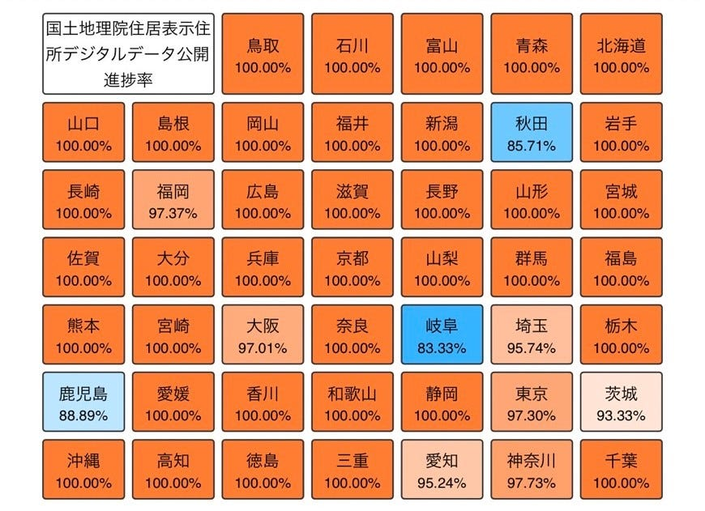
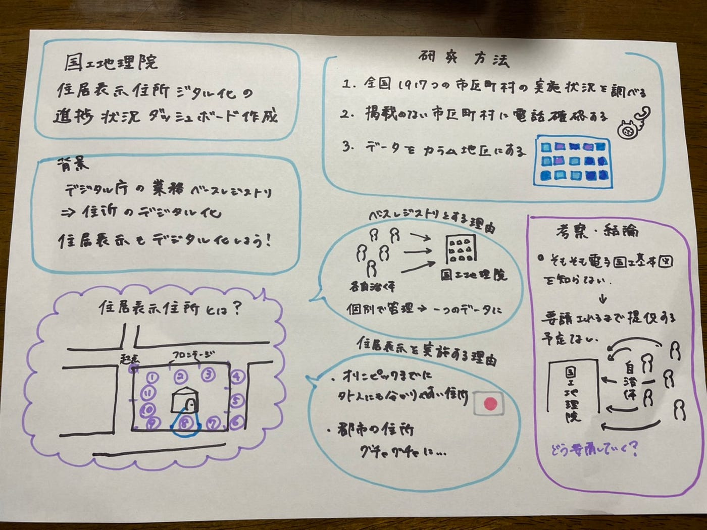

### ゼミ論～国土地理院 住居表示住所デジタル化の進捗ダッシュボード作成～

私のゼミ論では、昨年創設された、デジタル庁の業務に含まれるベースレジストリ整備の中の一つである住所・所在地のデジタル化に対し、2021年度現在全国の市町村で住居表示住所デジタル化が実施されている地域の進捗状況を全国1917つの市町村のウェブサイトから住居表示の実施状況を調べ、一覧にまとめました。住居表示住所とは、住居表示に関する法律（昭和37年5月10日公布、施行）に基づき、建物に新しく番号を付け、住所を分かりやすく表す制度で、昭和半ばから複数の自治体で実施されています。そして、一覧にまとめたデータを最終的にカラム地図としてダッシュボードにまとめました。また、住居表示を実施しているが国土地理院電子国土基本図に掲載されていない自治体に電話確認を取り現状を把握し、さらに国土地理院にも問い合わせし、住居表示が実施されているが国土地理院にデータが提供されていない自治体の理由を確認しました。

[カラム地図メーカー - TabularMaps Maker
Edit descriptionfuruhashilab.github.io](https://furuhashilab.github.io/2021gsc_RanMatsuyama/tabularmaps_test.html#v=1&title=%E3%82%B5%E3%83%B3%E3%83%97%E3%83%AB&value=100.00%25,100.00%25,100.00%25,100.00%25,85.71%25,100.00%25,100.00%25,93.33%25,100.00%25,100.00%25,95.74%25,100.00%25,97.30%25,97.73%25,100.00%25,100.00%25,100.00%25,100.00%25,100.00%25,100.00%25,83.33%25,100.00%25,95.24%25,100.00%25,100.00%25,100.00%25,97.01%25,100.00%25,100.00%25,100.00%25,100.00%25,100.00%25,100.00%25,100.00%25,100.00%25,100.00%25,100.00%25,100.00%25,100.00%25,97.37%25,100.00%25,100.00%25,100.00%25,100.00%25,100.00%25,88.89%25,100.00%25)

進捗状況のデータを集めるにあたって、多くの市区町村に電話確認を行いましたが、ほぼ全ての自治体が国土地理院に住居表示住所デジタルデータが掲載されていることを知らないと言うことが分かり、まずは国土地理院の電子国土基本図の存在を知ってもらう所からということが判明しました。

また、電話確認をしていく中でもしかしたら住居表示住所の実施状況を市区町村のWebsiteにも国土地理院にも掲載している自治体があるのではないかと感じました。。なぜなら、電話確認をしている中でたびたび「住居表示を行ったのは昭和半ばでそれ以降手を付けていない」と言う話を伺ったからです。

今回の研究では、市区町村のwebsiteにも国土地理院の電子国土基本図にも掲載されていない自治体は、未実施扱いとしましたが、確認する必要があると思いました。ただ、該当する自治体の数は1000件近くあり、確認する方法も一軒一軒電話をかけていくしかないため長い道のりとなりそうです。。国土地理院に確認を取りましたが、住居表示の実施状況については各自治体で管理されており、国土地理院もデータを持っていないとのことでした。

発表用スライド

ゼミ論リポジトリ

[GitHub - furuhashilab/2021gsc_RanMatsuyama: 2021年度古橋ゼミ卒論用リポジトリ
You can't perform that action at this time. You signed in with another tab or window. You signed out in another tab or…github.com](https://github.com/furuhashilab/2021gsc_RanMatsuyama)

[ゼミ論本文](https://docs.google.com/document/d/1jxdcqWCkz782NgOn9mQRJyXKcJJsEqjfVW9eAcHrzko/edit?usp=sharing)

グラレコ

