### デジタルファブリケーションを用いた地理空間情報表現手法の検討 〜レーザー加工機を例に〜

私は、前回の_**[中間報告_**](https://medium.com/furuhashilab/%E3%83%87%E3%82%B8%E3%82%BF%E3%83%AB%E3%83%95%E3%82%A1%E3%83%96%E3%83%AA%E3%82%B1%E3%83%BC%E3%82%B7%E3%83%A7%E3%83%B3%E3%81%A8%E7%A9%BA%E9%96%93%E6%83%85%E5%A0%B1%E3%81%AB%E3%82%88%E3%82%8B%E4%BE%A1%E5%80%A4%E5%89%B5%E9%80%A0%E3%81%AE%E4%BB%8A%E5%BE%8C%E3%81%AE%E5%8F%AF%E8%83%BD%E6%80%A7-823541badd8e)、_**[アドベントカレンダー_**](https://medium.com/furuhashilab/%E3%82%A2%E3%83%89%E3%83%99%E3%83%B3%E3%83%88%E3%82%AB%E3%83%AC%E3%83%B3%E3%83%80%E3%83%BC%E5%88%9D%E9%99%A3-119c54f0dce)の記事に引き続き卒業論文として**「デジタルファブリケーションを用いた地理空間情報表現手法の検討 〜レーザー加工機を例に〜」**というテーマで動いている。

様々なアプローチで地理空間情報を扱う古橋研究室でも、私は”ものづくり”に特化し初心者ながら0から学び、価値創造を行おうと動いた。

その上で日常生活の中でも”デジタル”が様々なところでごく自然に溶け込み、便利に機能している現代で、**「地理空間情報を日常生活にさりげなく、」**をサブテーマに掲げ、**”読書”**という**アナログ**で且つ大人から子供までが共通して行う際に活躍する**「栞」**を制作しようと考えた。

この記事ではまず最初に完成品を共有させて頂きたいと思う。

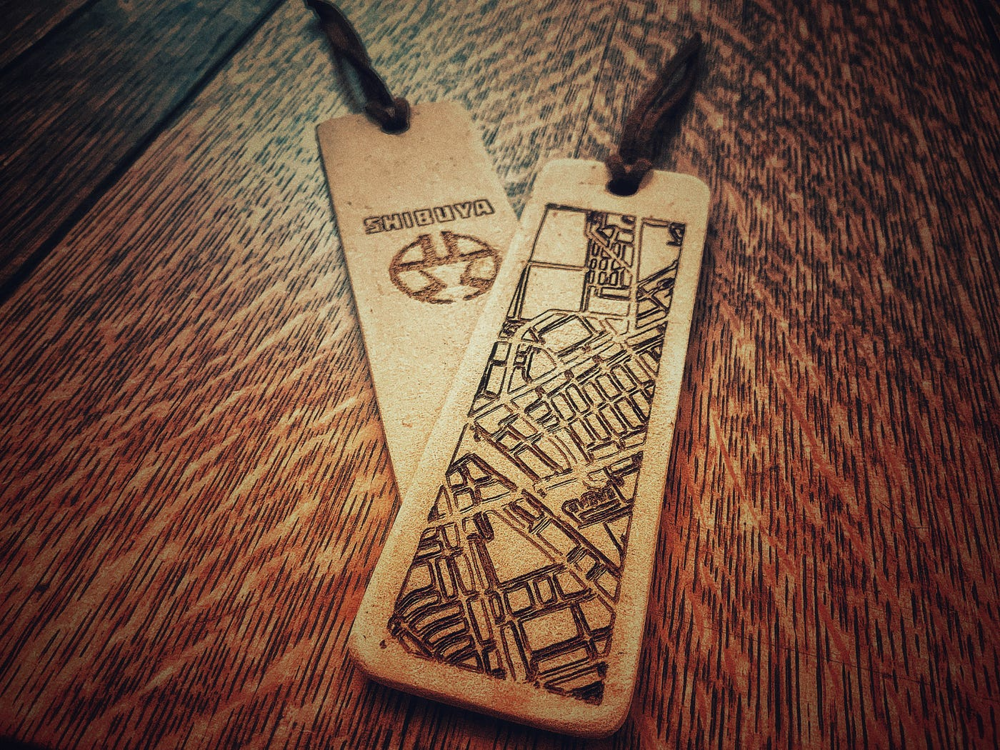

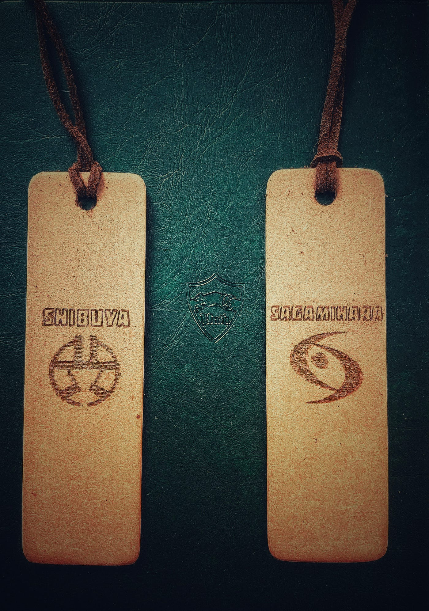

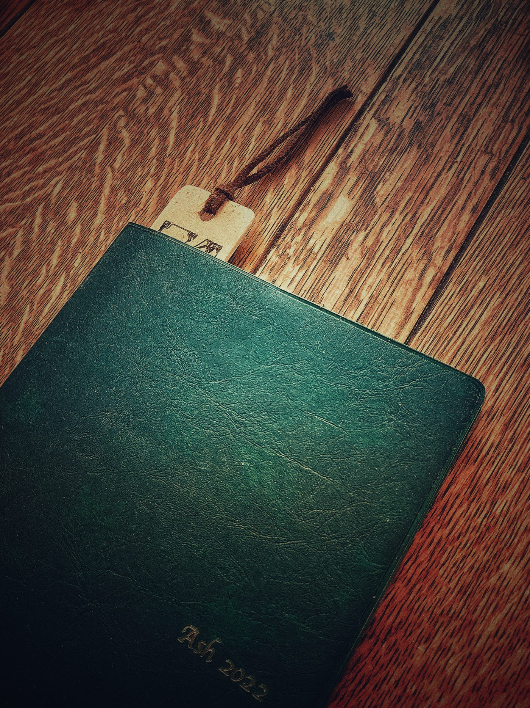

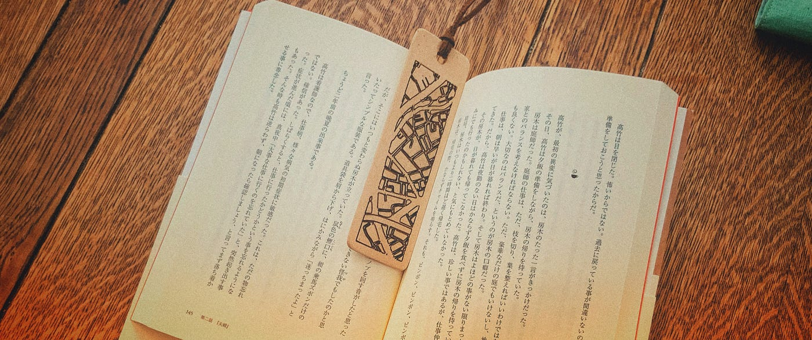

今回行った工程としては大まかに分けて以下の通りである。

#### ・「FABOOL Laser CO2」組立

レーザー加工機は、公式サイトのマニュアルを見ながら一つひとつ組み立てて行った。

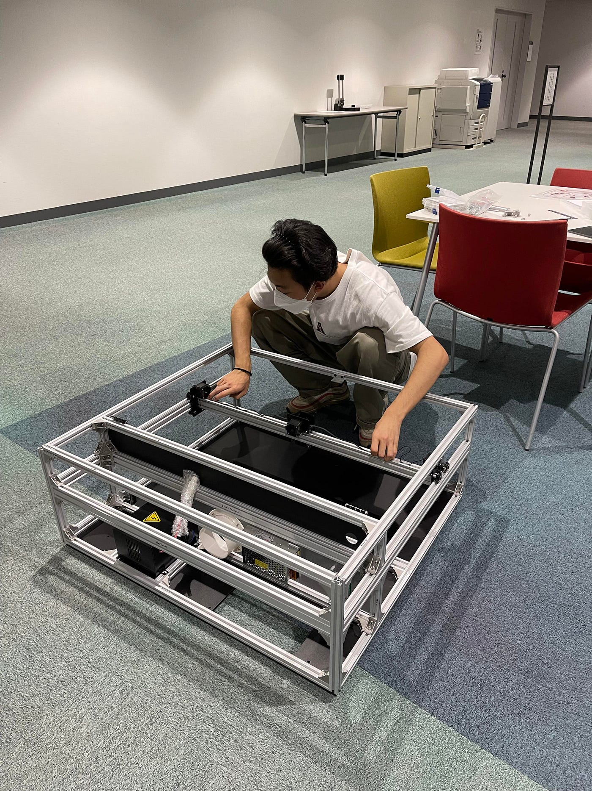

_[アドベントカレンダー_](https://medium.com/furuhashilab/%E3%82%A2%E3%83%89%E3%83%99%E3%83%B3%E3%83%88%E3%82%AB%E3%83%AC%E3%83%B3%E3%83%80%E3%83%BC%E5%88%9D%E9%99%A3-119c54f0dce)での記事の際にもあった通り、非常に時間と労力をかけ地道に組み立てていた。その間、配線が切れてしまうようなトラブルがあったり、

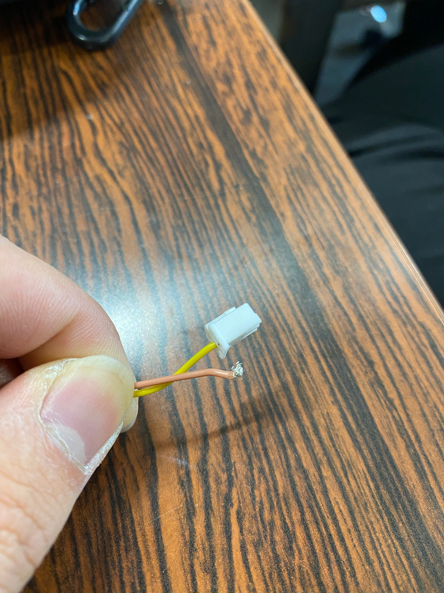

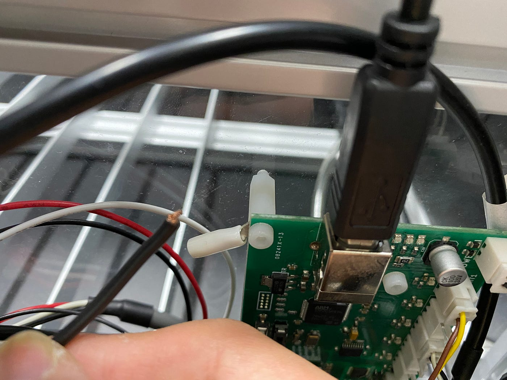

マニュアルの不完全さなどを痛感し非常に苦戦した。

また、レーザーの照準を合わせる工程も不慣れな作業であり非常に苦戦し、一日中かけて合わせることを行った。

#### ・先行事例調査

地理空間情報を使用したデジタルファブリケーションというものは、自分が想定していたより多く既に存在していたのだった。

これも先述の中間報告に少し記述したが、

- _**[日本地図のパズル_**](https://xn--wckwfybb4714bueo2su.com/%E3%83%AC%E3%83%BC%E3%82%B6%E3%83%BC%E5%8A%A0%E5%B7%A5%E6%A9%9F/laserbox/laserbox-%E4%BD%93%E9%A8%93%E8%A8%98%E2%91%A0%E3%80%8C%E6%97%A5%E6%9C%AC%E5%9C%B0%E5%9B%B3%E3%83%91%E3%82%BA%E3%83%AB%E3%80%8D/)

- _**[インテリアとしても価値を見出す3D木製地図_**](https://www.kickstarter.com/projects/indiedesigners/citywood-minimal-3d-wooden-maps)

- _**[小学生向けに提供した木製地図の上にさらにコルクを乗せた３D地図_**](https://internet.watch.impress.co.jp/docs/column/chizu/1083137.html)

等様々な価値ある作品が世界中にある。

そして栞に関しては、

- _**[基盤で作られた回路地図_**](https://www.moeco.jp.net/blog/2020/05/15/150311)

- _**[中国で生産されている世界地図柄のもの_**](https://item.rakuten.co.jp/januarynine/10000281/)

- _**[池袋キャンパス周辺の古今地図がデザインされた栞（立教大学の図書館のキャンペーン）_**](http://library.rikkyo.ac.jp/librarypress/blog/2021/09/15/3605/)

など興味深いものがあった。

これらの先行事例や共有されている知識を基に初心者である自分が制作可能な範囲で制作物のアイデアを考え実行に移した。

#### ・加工素材特性調査

まず最初に_**[smartDIYsの公式サイト_**](https://www.smartdiys.com/fabool-laser-co2/#material)で「FABOOL Laser CO2」の加工可能素材の種類を改めて確認し、そこで比較的購入先に困らなく加工事例が多く共有されている**「木材」**に絞った。

大学の近くにあるホームセンターで最初に購入したのは、**「バルサ材」**である。

バルサ材は、多く流通しており非常に軽量で柔らかい。色は、白色あるいはやや桃色を帯びた淡褐色で加工した際に刻印したところが際立ち目立ち易いのではと思ったのだ。

しかし、パラメータ設定の関係もあったのだが加工した際に焦げ・煤等が激しく付着し扱いづらいと感じてしまったのだ。

これにより、素材を変更し木材にきわめて近い**「MDF板」**を使用し始めた。

MDF板は、木材などの植物繊維を原料としているもので、癖が少なく均質で安価である。この素材も勿論短所があるのだが、レーザー加工する上ではあまり気にならなかった。

#### ・データ作成

レーザー加工をするには、加工機だけでなく加工するデータも勿論必要だ。

大まかな段階としては、

- **地理空間情報データ元を決め**

- **そこからIllustratorに落とし込み、栞の形とデザインを成形し、svg形式で保存。**

- **そのデータをsmartDIYsの専用ソフトにエクスポートしレーザー加工実施。**

である。この工程も一つひとつ地道な作業で、地理空間情報のデータをいかにIllustratorで成形するかが非常に苦労した。

データ元は、「まち歩きマップメーカー」で挑戦していたのだが、うまくIllustrator、専用ソフトでデータが反映されず、最終的には「Maputnik」からスクリーンショットを撮り、データを引っ張った。

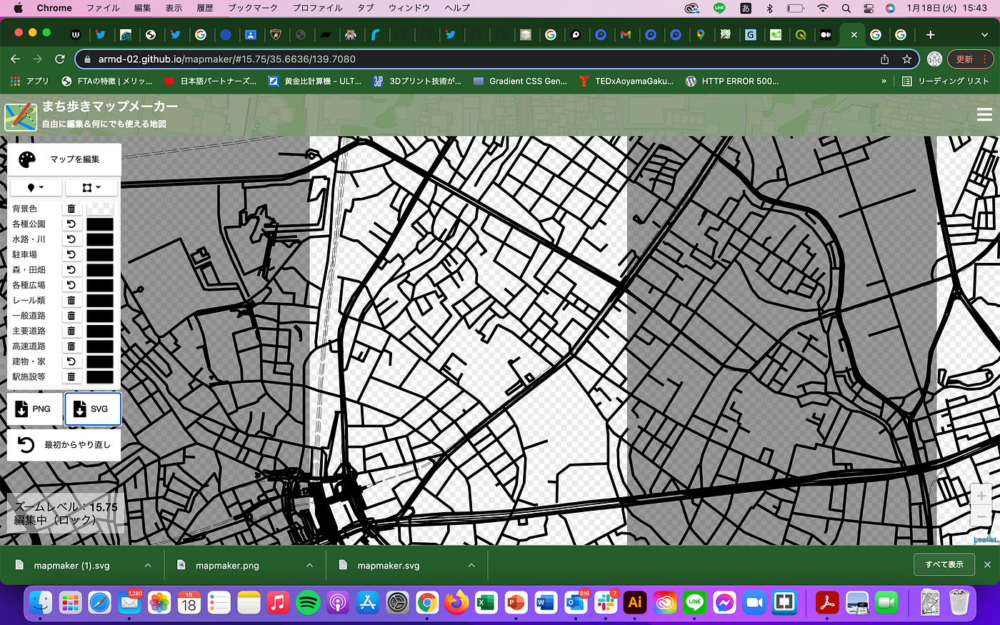

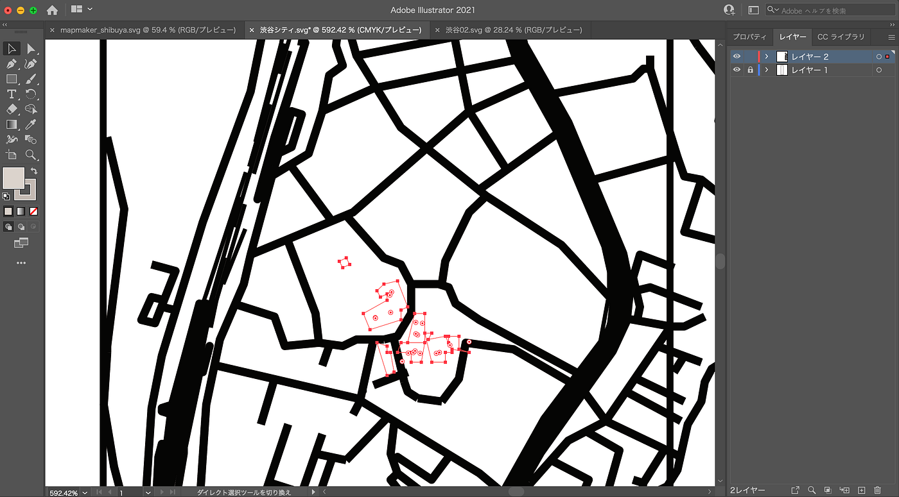

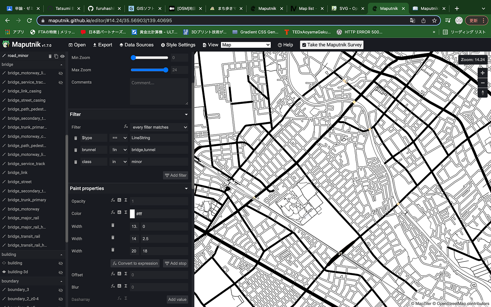

Illustratorでデータを作成する際に、レイヤーを細かく分け、そのレイヤーごとに色も変える。これにより、専用ソフトにエクスポートするとそのレイヤーが専用ソフトでもそのまま反映されレイヤーが分かれるので、レーザー加工のパラメータ設定が各レイヤーで変えられ、非常に加工しやすかった。

#### ・加工実施

加工する際には、レーザーの「強さ」「スピード」「回数」をメインに設定をする。

この設定次第で加工が上手くいくかいかないかが分かれてしまうのだ。この設定は公式サイト等で素材・厚さ別で共有されていたので、その通りにやってみたが、あまり上手くいかなった。つまり、その先行事例を参考にしながらも自分で少しずつ設定を変更し、上手くいくところまで持っていかなければいけなかったのだ。

以下の動画は成功例である。

また、加工後の焦げ・ヤニ付着防止のため加工前にマスキングテープを予め貼っておくと仕上げが楽になった。

#### ・仕上げ

加工後、形を整えるのと焦げ・ヤニを落とす意味でヤスリをかけ、お湯で流しながら歯ブラシで擦りドライヤーで乾かした。

### 先行事例と自己事例：

地理空間情報を使用したデジタルファブリケーションというものは、上記の通り自分が想定していたより多く既に存在していたのだった。栞に関してもまた然りである。

このような様々な地理空間情報、栞のアイデアがある上で今回私がアプローチしたのは、デジタルファブリケーションであるレーザー加工機を使用し、個人レベルで既存商品と同等なものを制作するという点である。

今回制作したものは立教大学のキャンペーンと近いものであったが、素材をMDF板にし優しい印象を与えたこと、裏面に区名と紋章を分かりやすく刻印しその地域の情報を全面に出したことの二点で常に身近に置いておきたくなると同時にデザインされたその地域を意識してもらえるようにという考えがある。

### **制作を終えて：**

デジタルファブリケーションという技術は、現在個人レベルで扱う事が出来る時代になっている。それに伴い”ものづくり”の幅も大きくなった。今回のレーザー加工機を使用した制作はそれを証明するものとなったと思う。

しかし、個人で取り扱うにはまだまだ不十分な点が多いと感じた。

- **組立マニュアルの不完全さ**

- **同様な環境の先行事例結果との相違からくる曖昧さ**

のみならず一初心者としては、

- **加工機の特性**

- **加工対象物の素材の特性**

- **行うべき加工前 / 加工後の処理**

などを調査し知っておかなければならないことがたくさんある。様々なものを加工できるという多様性がある分、得ておくべき知識も増える。知っておくべきことを知らないまま強行的に実施してしまうとまだまだ発展途上のデジタルファブリケーションにはそれ相応の危険性が潜んでいることを実体験からも体感した。

また、それを充分に学び実施していくと”デジタル”ファブリケーションと言いつつもやはり人の手を使った作業も非常に重要な役割を果たしていることも理解出来た。

地理空間情報は、日常だけでなく災害時等でも活躍する。しかしそれがどのように活かされているのか具体的に認知している人はそう多くない。

今回はまず、そんな”地理空間情報”に興味を持ってもらう事に意識を置いたのだ。災害時に自分たちで迅速に避難し命を守れるように、大人だけでなく子供にも学んでもらいたいのである。

そのためには、教科書に載っているような一般的な地図だけで学ぶより、もう少し興味が湧くような入口を作る必要がある。今回の私の卒論はまさにその入口を作るきっかけとなり得るのだ。

### 最後に：

今回のこの研究を通じて私は、現代の”ものづくり”を行う上でデジタルファブリケーションの可能性を非常に感じたと同時に、地理空間情報が「現在地、目的地までの道のり等」を教えてくれるだけのものではなくデザインとしての一つのジャンルになり得ることも実感し、今後の価値の幅が益々広がっていくものであると思えた。

今後は食料品とデジタルファブリケーション、地理空間情報を掛け合わせて新たな観点からの価値創造を行なっていく事も面白いのではとも考えている。

また今回私が制作した栞は、同じ方法で別地域を刻印出来るので、このRepoitory・Projectを参考にして頂きシリーズ化するという事も一つのアイデアとして引き継ぎたい。

古橋研究室ではレーザー加工機を使用したのが初の試みであった為、

- **ドローン**

- **３Dプリンター**

- **位置ゲー**

- **グラレコ等**

古橋研究室ならではの方法で新しいアイデアを形にし**共有・発信**させ、益々の発展が遂げられるのではないかとも考えている。

そして、様々な加工対象物に様々な出力で試し、それぞれ最適な設定を導き出し、作品と共にオープンデータ化する事が重要となってくると実体験から思う。その際に**「こうすれば成功する。」**という事だけではなく、その間に出た失敗例も同時に共有する事で結果的に多くのユーザーのトラブルの減少や製作時間の短縮に繋がると思うのでそのような点も次に引き継ぎたいと思うのでここに記述させて頂きたいと思う。

#### ＜参考文献＞

[古橋ゼミ卒論2021-2022参考文献・参考資料リスト(馬場)
Templete ID,大分類,中分類,小分類,著者,発行年,最終更新日,タイトル,雑誌名,雑誌号数,該当ページ,出版社,ISBN,URL,URL4archives,閲覧日,MEMO1,MEMO2 論文,査読つき 論文,査読なし 書籍…docs.google.com](https://docs.google.com/spreadsheets/d/1jpRv0i6nmzOQlFufo8qODGCFgeomgjxghMPRr35G7CM/edit?usp=sharing)

#### ＜スライド＞

#### ＜GitHub Repository＞

[GitHub - furuhashilab/2021gsc_TatsumiBaba: 2021年度古橋ゼミ卒論用リポジトリ
2021年度古橋卒論用レポジトリ 馬場 巽 青山学院大学 地球社会共生学部 地球社会共生学科 馬場 巽/TATSUMI BABA 学生番号 1A118124 指導教員 古橋 大地 教授 © Furuhashi…github.com](https://github.com/furuhashilab/2021gsc_TatsumiBaba)

#### ＜グラレコ＞

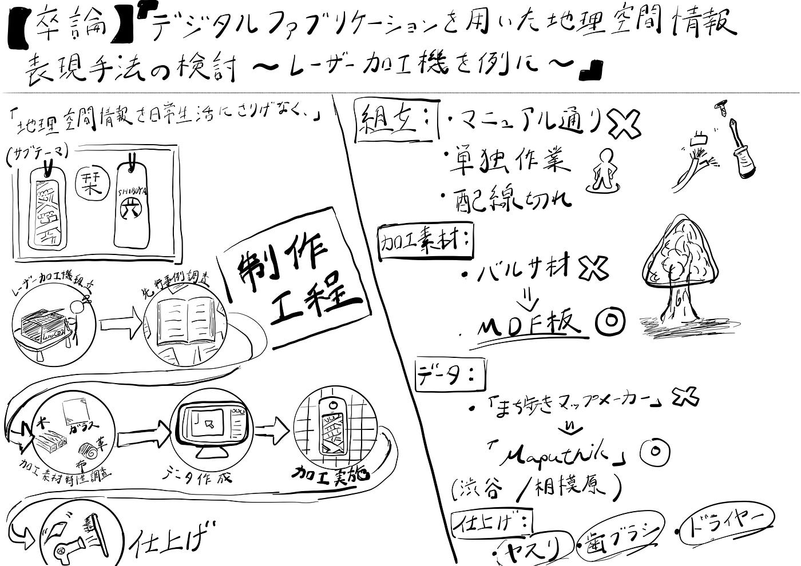
