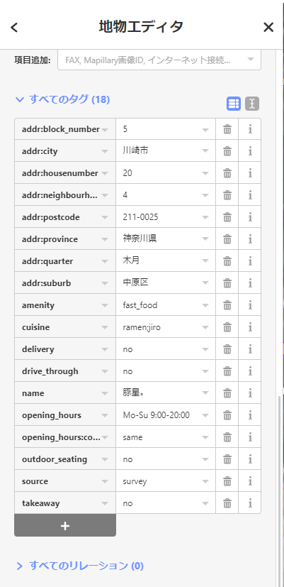
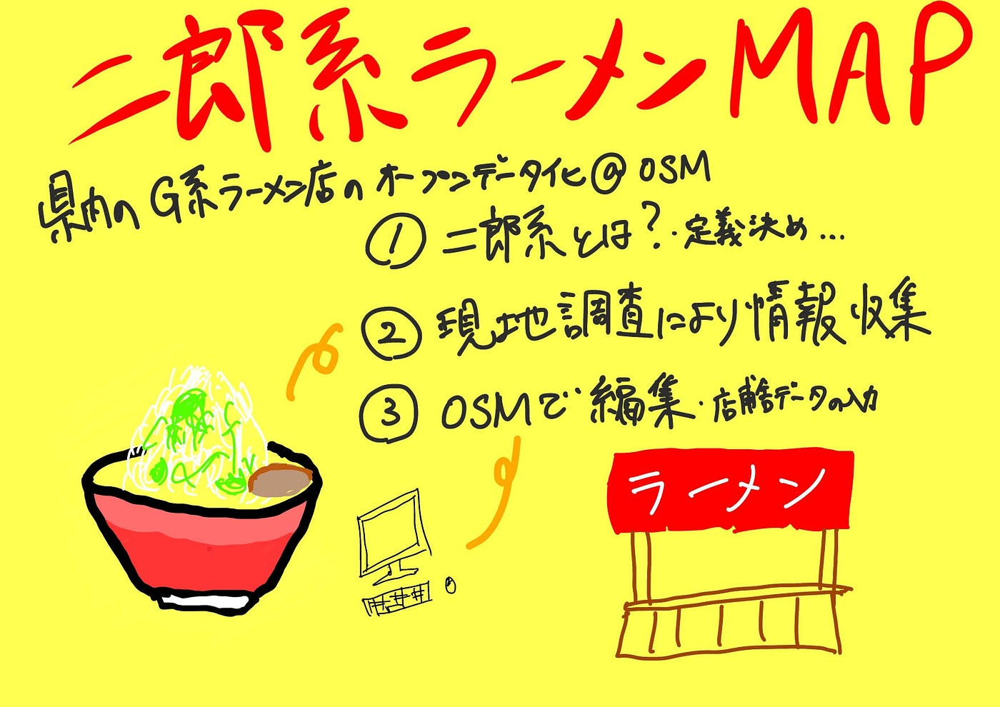

### 二郎系MAP

古橋研究室3年の鈴木です。

2021年度ゼミ論最終発表の記事を書かせていただきます。

_**[神奈川県内二郎系ラーメン地理空間情報オープンデータ化の実践_**](https://github.com/furuhashilab/2021gsc_SotaSuzuki)

> _**概要_**

本研究は2018年度卒業生である渡邊結南氏の卒業論文「[日本全国ラーメン二郎店舗位置情報オープン化の実践](https://furuhashilab.github.io/www4yunawatanabe/)」に着想を得て、神奈川県内の「二郎系ラーメン」店舗の地理空間情報を、OpenStreetMap（以下OSM） データベース内に登録し、だれもが自由に二郎系ラーメンのデータにアクセスし、二次利用が可能な状態を構築することが目的です。

> _Introduction_

上記した卒業論文の現地調査によって得られた日本全国のラーメン二郎店舗情報をマッピングを渡邊氏が、その研究のデータ更新やタギングルールの統一を依田氏が行ったことで、OSMのオープンな地理空間情報プラットフォームを用いて、日本全国のラーメン二郎店舗データ、およびそのメタデータを整理、網羅することによって、誰もが自由にラーメン二郎店舗データにアクセスし、再利用することが可能な状況が構築構築された。

そこで私はラーメン二郎ではなく「二郎系ラーメン」に着目し、OSMにて神奈川県内に存在する「ラーメン二郎」以外の「二郎系ラーメン」の店舗データ、およびそのメタデータを整理していくことにした。

> _Method_

現在営業をしている二郎系ラーメン54件（2021年12月時点）の店舗データをOSM上で編集、追加を行い公開しました。

また、情報源は現地調査を行うことができた店舗にのみsource=surveyを記入した。ほかは更新が行われている公式Twitterなどを参照したほか、DMなどで連絡し、実際に情報の聞き込みを行いました。

> _Results_

OSM上で整理されていなかった神奈川県内の二郎系ラーメンの店舗データを渡邊先輩のリファレンスにのっとり、以下のタギングルールで整理をしました。

- 店舗データが未入力の店舗を入力

- 全店舗の住所を入

- 全店舗のOpening_hoursを入力

- 全店舗のopening_hours:covid19を入力

- amenity=fastfoodに統一

- cuisine=ramen;jiroに統一

- delivery=yes/no

- takeout=yes/no

- drive_through=no

- outdoor_seating=no

- branch=支店の場合入力

- source=survey（現地調査を行うことができた店舗のみ）

> _Discussion_

論点は主に3つあり、一つ目は二郎系ラーメンに適したcuisineタグのvalueの検討を行った結果、渡邊氏のリファレンスによればcuisine=ramen;jiroは「ラーメン二郎」のみを指すタグではなく、あくまで「二郎系」を指すものであると助言をいただくことができ、cuisine=ramen;jiroという組み合わせのタグセットを選択しました。

二つ目は複雑な営業時間をしている店舗のOpening_hoursタグの表記についてOSM上で質問をした結果、土日祝の表示はSa-Su, PHと回答をいただくことができた。また、新型コロナによる時短営業のOpening_hours:covid19の入力も行いました。

最後は新型コロナの影響でテイクアウトやデリバリーのサービスが広まっており、ラーメン二郎マップとは異なり、その部分の有無も調査し記入する必要がありました。

> _Conclusion_

本研究を通じて、私が現地調査と聞き込み行った神奈川県内の二郎系ラーメン54店舗分の地理空間情報をOSMデータベース内に登録し、既存のデータの見直しを行いました。また、渡邊氏のリファレンスにのっとり新たな「二郎系ラーメン」の店舗のメタデータをOSM上で編集、追加し、公開することができた。しかしながら、新型コロナウイルスの影響で新たにお持ち帰りのサービスを始める店舗が多く出てくることが予想され、その情報をどのように素早く反映するか、また現地調査を実施することのできていない店舗が多く残ったことや、コロナ期間前の営業時間についてデータを得られなかったことが課題であり、今後徐々に入力していく必要があると考えています。

> _発表用スライド_

> _グラレコ_

> _GitHub Repository_

[https://github.com/furuhashilab/2021gsc_SotaSuzuki](https://github.com/furuhashilab/2021gsc_SotaSuzuki)
