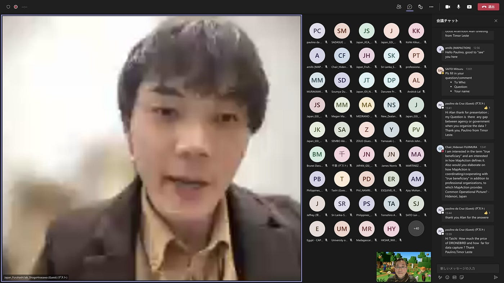
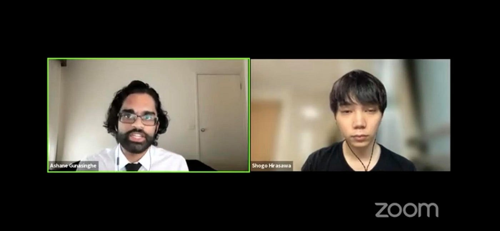
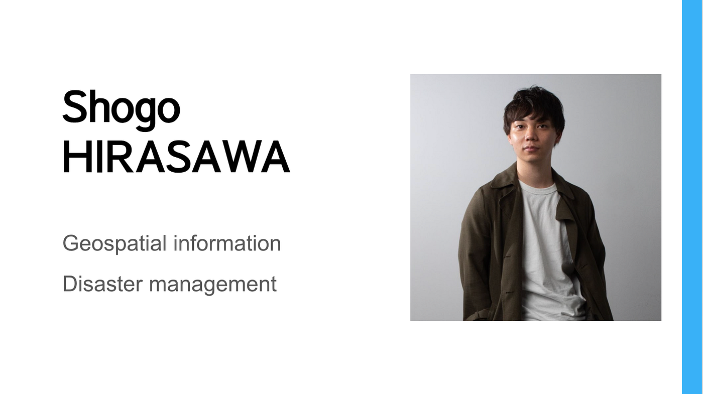

### 国際会議で発表してみよう

青山学院大学 古橋研究室 4年 平澤彰悟です。

この記事では、平澤が2021年度登壇させていただいた2つの国際会議
（[FOSS4G SotM Oceania](https://osgeo-oceania.org/foss4g-sotm-oceania-conference/), [UN-GGIM WG-Disasters TG-B meeting](https://speakerdeck.com/hfu/un-ggim-wg-disasters-tg-b-meeting-chair)）で得た気づきについて書いていこうと思います。

主に、以下の3点に焦点を当てお話していきます。

・国際会議に出席するハードル
・必要だなと思ったスキルやアイテム
・国際会議に参加した後の周りの反応

#### ## 国際会議に登壇するハードル

結論から言うと、そこまで高くないと思っています。

国際会議に登壇する際に超えなきゃいけないハードルは主に2点だと思いっています。

> 国際会議の登壇に躊躇してしまう

面白そう / 気になる国際会議を見つけても、登壇するともなれば、躊躇してしまう人が多いのでは無いでしょうか？ 僕もそのうちの１人でした。

多くの人が、自分がこんな大きな舞台で話して良いのかと躊躇してしまうと思います。

国際学会ともなれば、その分野のプロフェッショナルが集っています。
そのような人たちと対等なレベルで話さなきゃいけないという考えから、身分不相応という考えに陥ってしまうのかもしれません。

僕たち学生がプロと同じレベルの研究ができるはずがありません。

学生がこ国際学会のような大きな舞台でアピールすべきは、どのような視点 / 課題意識をもって研究に取り組んでいるかだと思います。
僕たち若者世代がどのようなことに興味があるのか。これは学生の僕たちにしか話せない内容だと思います。

至らない点はたくさんあるということをまず認め、自身にしか話せない内容で勝負する。

そうすることで、運が良ければプロの研究者の方に興味を持っていただけたり、時にはアドバイスもいただけたりすることもあります。

至らない点を認め、そこはプロにアドバイスをもらう。
これを繰り返していくことで、研究も前進し、自信の獲得にもつながっていくと思います。

> 英語力

「英語のスピーキングには自信がなくて…。」

これは日本人なら、ほぼ全員がぶつかる壁だと思います。

このような方は以下の2つのツール（どちらも無料）を使ってみてください。

[DeepL Translate: The world's most accurate translator
Drag and drop to translate Word (.docx) and PowerPoint (.pptx) files with our document translator. Popular: Spanish to…www.deepl.com](https://www.deepl.com/translator)

[Write your best with Grammarly.
Compose bold, clear, mistake-free writing with Grammarly's AI-powered writing assistant. 30 million people use…www.grammarly.com](https://www.grammarly.com/)

DeepLは非常に高精度な翻訳ツールです。
まず、日本語で話す内容を書き、それを翻訳してみる。

最初から、英語で内容を考えなくて良いので原稿を作るハードルは低くなるはずです。

その次に、Grammarlyを使いましょう。

これは、文章の文法がおかしくないかどうかをチェックしてくれるツールです。
口語なのか、フォーマルな文章なのか、などなどそのシチュエーションにあった文法補正をしてくれるので、場面にあった適切な英語を作ることができます。

この２つのツールを使うことで、英語での発表はかなりハードルが下がると思います。

国際会議の登壇以外にも、授業や翻訳作業など英語⇔日本語を行う時にかなり使えるツールなので、使い慣れておくと便利だと思います。

#### ## 必要だなと思ったスキルやアイテム

国際会議で登壇する時に必要だと思うスキル / アイテムを紹介していこうと思います。

> 必要なスキル

それはスクリーンショットです。
何じゃそれ？と思った方もいるでしょうが、お話を聞いていただければと思います。

スクリーンショットを撮っておくことで、国際会議に登壇したという何よりの証拠となります。

国際会議にでた経験がある学生とそうでない学生では、その能力に差がなくても、周りからの見られ方は全然違います。（どう違うのかについては次の章で後述します）

なので、国際会議に参加したという証拠なり、証明はかなり重要であると思っています。

実際に登壇してみるとわかるのですが、話すのに精一杯になってしまい、スクリーンショットを撮ることを忘れてしまった。なんてことは多々おこります。

大きな舞台で発表するのは緊張しますよね。

こういう時は、友人などに代わりに写真を撮ってもらうなどしてもらいましょう。
場馴れしてきたら、喋りながらでも自身でスクリーンショットが撮れるかもしれませんが、そうでないなら、友人に頼むのも一つ手だと思います。

> 必要なアイテム

アイテムというとドラえもんのひみつ道具的なものを想像してしまうかもしれませんが、そんな大したものではなく、今回私がお話するのは、自身の写真についてです。

スライド一枚目に自己紹介をすることが多いと思うのですが、その時に使う自身の写真を前もって用意しておくと便利かもということを、ここでは話していきます。

私が、FOSS4G SotM Oceaniaで発表した時のスライド一枚目がこれです。

正直、こんなドヤ顔の写真しかなかったのが非常に悔やまれます…笑

国際会議という場なので、Instagramにアップする写真ほどラフではなくて、就活等で使う写真よりフォーマルすぎない写真がベストだと思うのですが、これがなかなか見つからない。

写真好きな友人等に、プレゼン資料用の自分の写真を撮ってもらうなどして、前もって用意しておくと、資料作りが楽になると思います。

#### ## 国際会議に参加した後の周りの反応

学部生で国際会議に登壇する学生はかなりレアなので、良い意味で目立てます。

虎の威を借る狐ではありますが、大きい舞台で発表したという実績を持つことで、あらゆる方面でプラスなことしか無いと思っています。

まずは、就活で話せる内容ができます。

国際会議で発表しました！と言うと、面接官が興味を持ってくれますし、他の学生との差別化もできます。
場合によっては英語ができそう、しっかり学部で勉強していたなどのイメージを植え付けることができます。

僕は来年度（2022年度）から大学院進学をするのですが、この場面でも国際学会の登壇実績は役に立ちました。

大学院受験をする上においても、国際学会での登壇実績は他の学生との差別化になり、優位に受験を進められると思います。

研究を外部で発表する意欲がある、国際的な視野を持ち研究しているなど受験大学の教授陣に対して、良いイメージを植え付けることができると思います。

院試においては、学部時代の実績は非常に重要なものになってくるので、院進学を検討している人は、国際学会での登壇を少なくとも一回は経験しておくとよいでしょう。
