### 紆余曲折の末に…

四年の木多です。

### Introduction

私のゼミ論は、スマートフォンで撮影した画像をもとに点群データを作成し、どのレベルの点群データを作成することができるのかをテーマとした。

ゼミ論を決めた当初は、東京都内にストリートサーキットを建設するとしたらどこにどのようなサーキットを作るかを検討し、地図上で見たものと、現実とではどれほどの差異があるのかを認識するというものをテーマとしていた。しかし、自分が作成したコースが既にゲームに存在しているコースと完全に被ってしまったため、作成したサーキットを撮影しながら一周し、そのスマートフォンで撮影した画像を基に点群データを作成するという方向に切り替えた。また、今回サーキットとしたエリアは赤坂御所と皇居周辺のため全面的に飛行禁止であり、空撮が出来ないエリアの点群化をどうするかという面でも、今回のテーマを選んだ。

そして、どのように撮影をすれば認識可能レベルの点群データを作成することができるかのフローを検証し、その過程で発生した課題をまとめた。

### Method

作業過程は大きく分けて三つとなっている

1, サーキット策定編

2, サーキット点群化編

3, 点群データ作成方法検討編

#### 1, サーキット策定編

まず一つ目のストリートサーキット建設案では、ストリートサーキットのメリット・デメリットを書き出し、そこで出たメリットをなるべく残し、デメリットを解消するように考えていった。

コースを作成するにあたって、以前のハッカソンで使用したblenderGISや、地理院地図に対象エリアを反映させ、道幅が広く高低差があるルートを探していった。

#### 2, サーキット点群化

次に、作成したストリートサーキットを撮影しながら一周し、点群データを作成していった。

目的としては、このエリアは飛行制限エリアであること。

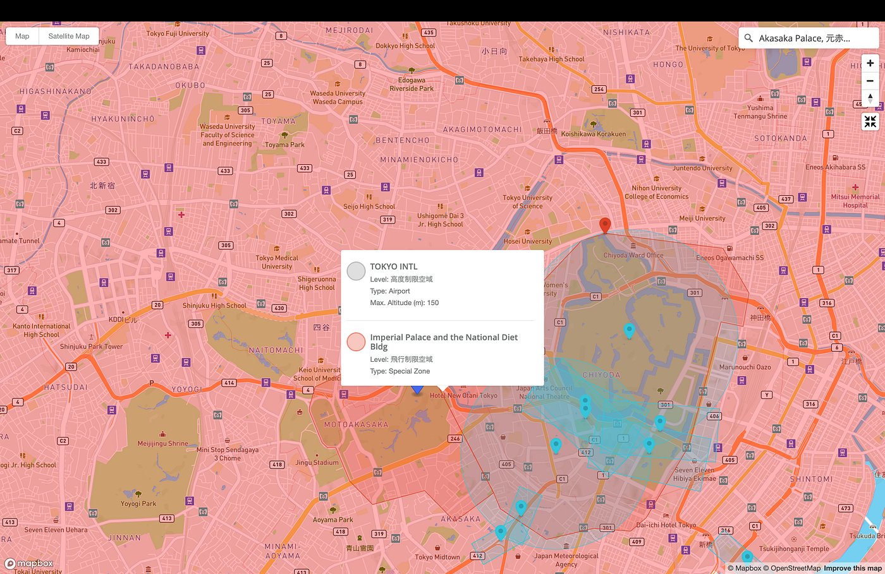

また、PLATEAUでもこのエリアはLOD2どころか建物データのないエリアがあるため、点群を作成していく事とした。

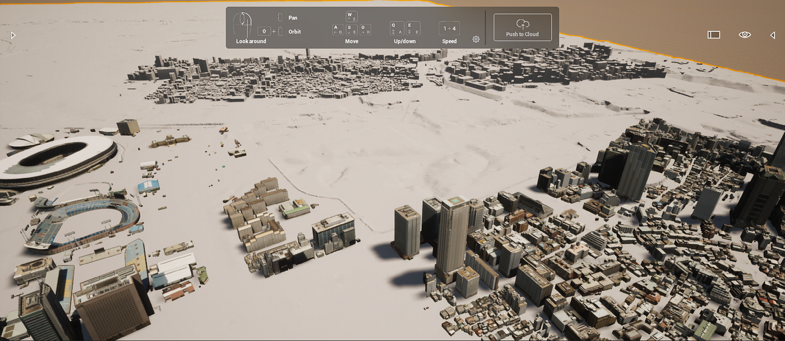

↑この画像は、Twinmotionという建築系のソフトにPLATEAUのデータをインポートしたものである。これの作成にあたっては[archisoft‐建築学生‐](https://www.youtube.com/channel/UCP8yfmUqM6SfDKThI3qJBjw)さんの動画を参考にし作成した。

撮影方法としてはバイクの前後にスマートフォンを取り付け、Mapillaryを使用し0.3秒/１枚のペースで撮影したが、ブレブレでまともな画像データが出来なかったためデフォルトの１秒/１枚のペースで撮影した。（撮影したデータはMapillaryにアップロード済み）

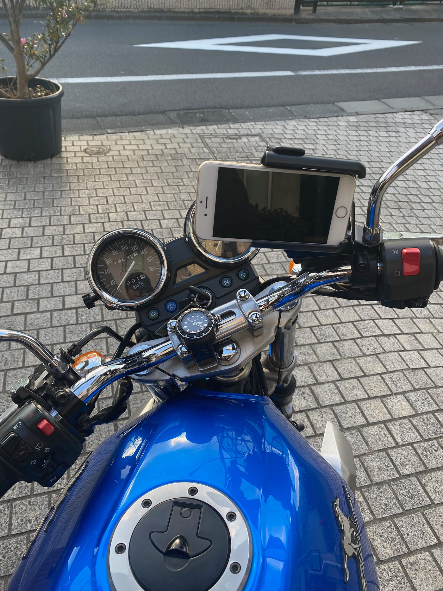

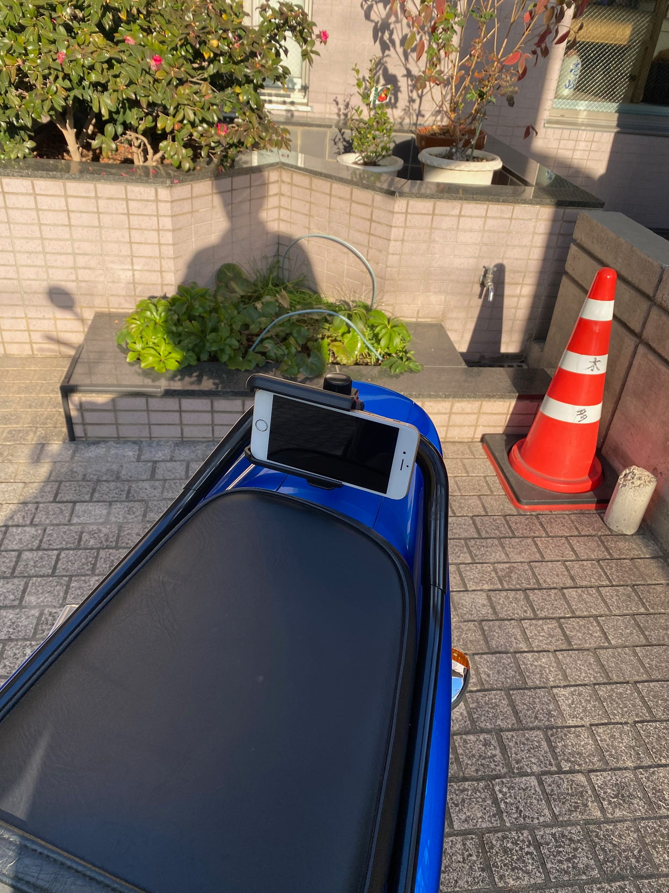

一周で800~900枚の画像データを取得することができた。

そして次に撮影した画像の点群化をしていく。点群化にはPix4DcloudとMetashapeを使う二通りの方法で行った。

Pix4Dcloudは撮影した画像をアップロードするだけで、Pix4Dのサーバーを使って点群化するため、低スペックのマシンでも点群化することができる。Metashapeは自分のパソコンで処理を行うため、かなりのスペックを要求される。

#### 3, 点群データ作成方法検討編

最後は、一つの対象物をどのように撮影すれば綺麗な点群ができるかを考えていった。

撮影するポイントは変えず、撮影する向きだけを変えて撮ったデータを基に点群化する方法と、撮影ポイントを変えながら、一つの対象物（建物）を囲うような撮影の二通りを比較してみた。

### Result

#### 1, サーキット策定編

まずストリートサーキットのメリットとしては

・ランドマークの前などを通ることで、都市の雰囲気を感じる事ができる

・エスケープゾーンがあまり無いため、壁が近く迫力が増す

・都市部で開催することができる といったものが挙がった。

次にストリートサーキットのデメリットとしては

・既にある道を使用するため、直角コーナーが多くなりやすい

・都市部だと、自然の地形を利用した高低差が少ない

・道幅が狭い

・追い抜きが難しいコースになりやすい といったものが挙がった。

建設する場所としては、既に公道を封鎖してF1やMotoGPイベントを行った実績のある神宮外苑いちょう並木をベースに考えていき、自然の地形が残っているエリアを通るコースとした。一周の長さは、F1が開催されるグレード１ライセンスを取得しているサーキットの平均的な距離である約４〜５kmとした。

コースを作成するにあたって、以前のハッカソンで使用したblenderGISや、地理院地図に神宮外苑いちょう並木の区画を反映させ、道幅が広く高低差があるルートを探していった。

その結果、外苑いちょう並木（ストート・ゴール）〜青山通り（国道246）〜赤坂見附交差点〜紀伊國坂〜迎賓館前〜赤坂御所裏〜権田原〜神宮外苑をめぐる、一周約5.4kmのコースを作成した。

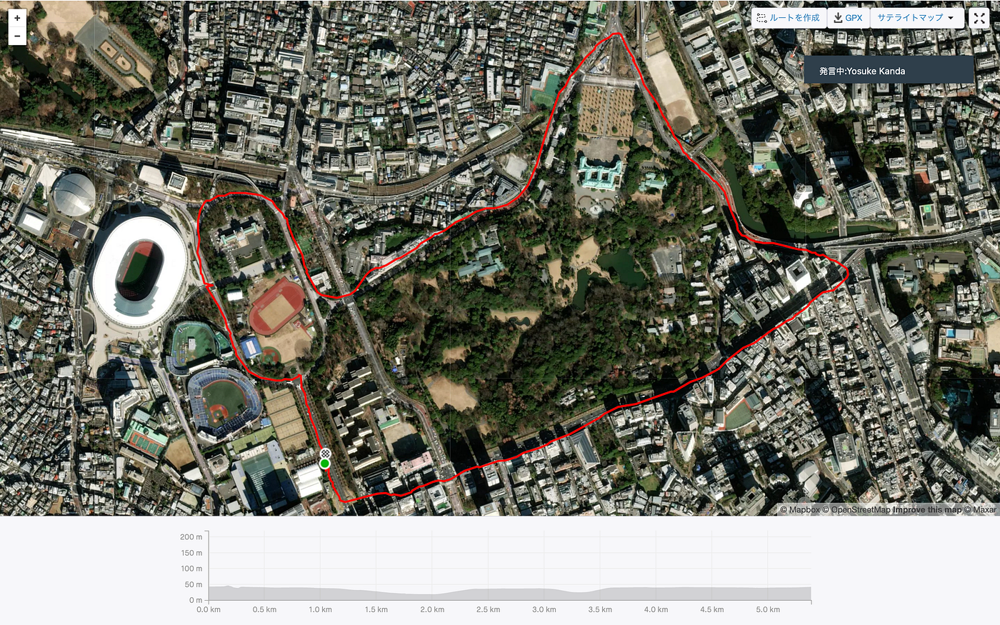

uMap 2, [http://u.osmfr.org/m/712675/](http://u.osmfr.org/m/712675/)

#### 2, サーキット点群化編

まず一回目では275 out of 928とレポートに記載され、アップロードした画像の29%しか使用されなかった。

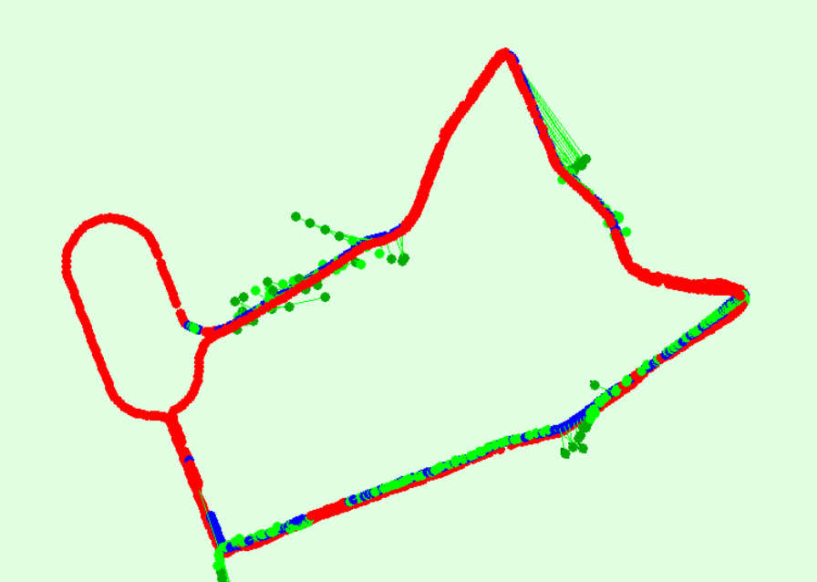

そのため下の画像のように殆ど形にならなかった。

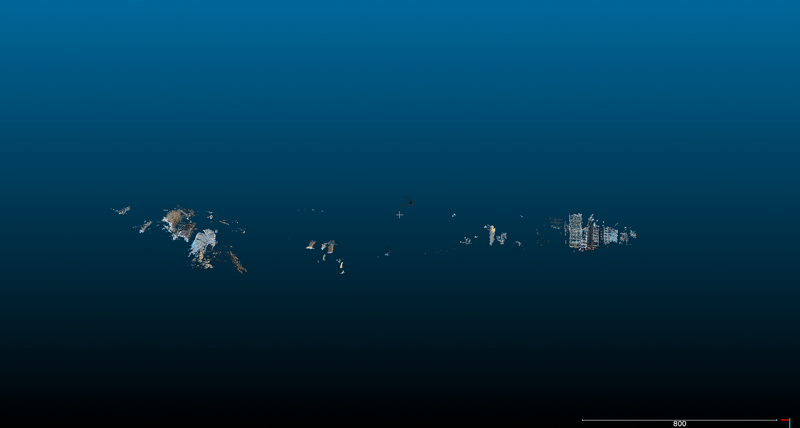

一度目の点群化が完成した後に、今回アップロードした画像データを見直してみると、エンジンの振動によるブレや、道路上の標識や看板などにピントがあってしまいピンボケを起こしている画像、太陽の光が強く入っている画像などがあることに気が付いた。

そのため、可能な限り低速走行で、尚且つすぐにシフトアップしエンジンの回転数を上げないようにして振動対策を行い、カメラをより上向きにすることで道路上の標識にピントが合わないようにした。また、通行車両が少ない時間を選んだ上に、太陽光が入りにくい時間を選んで走行するなどの対策を施した結果、759 out of 995（76％）まで画像を使用することができた。

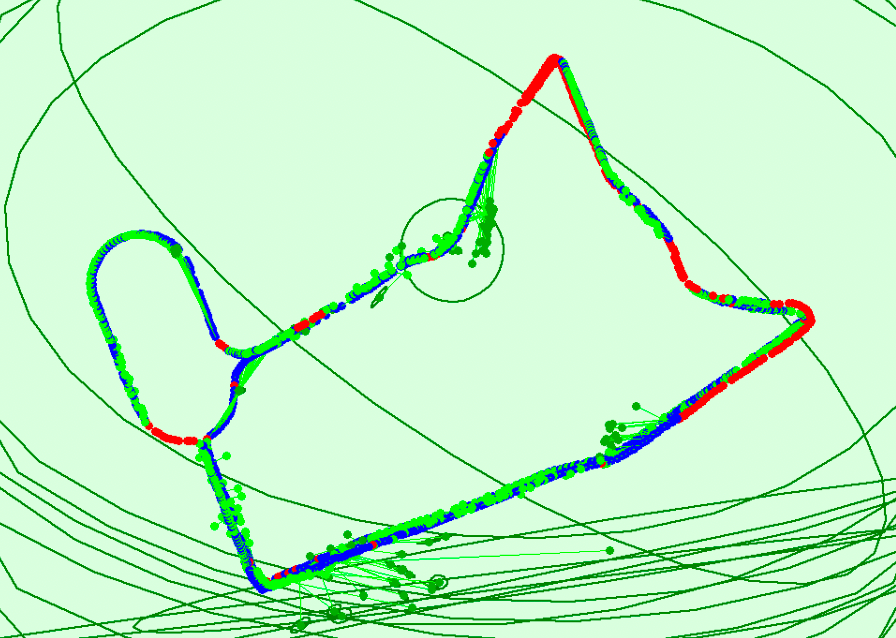

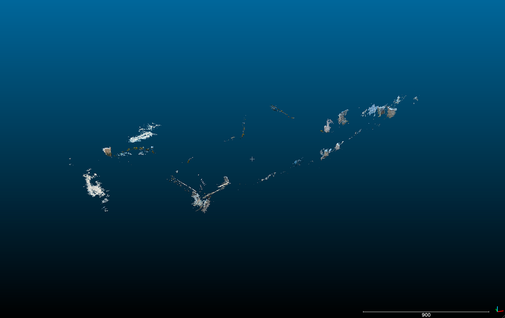

それでも空撮画像からのような綺麗な点群データは作成することはできなかった。しかし、最初の点群では識別することが出来なかった建物などが識別できるようになった。

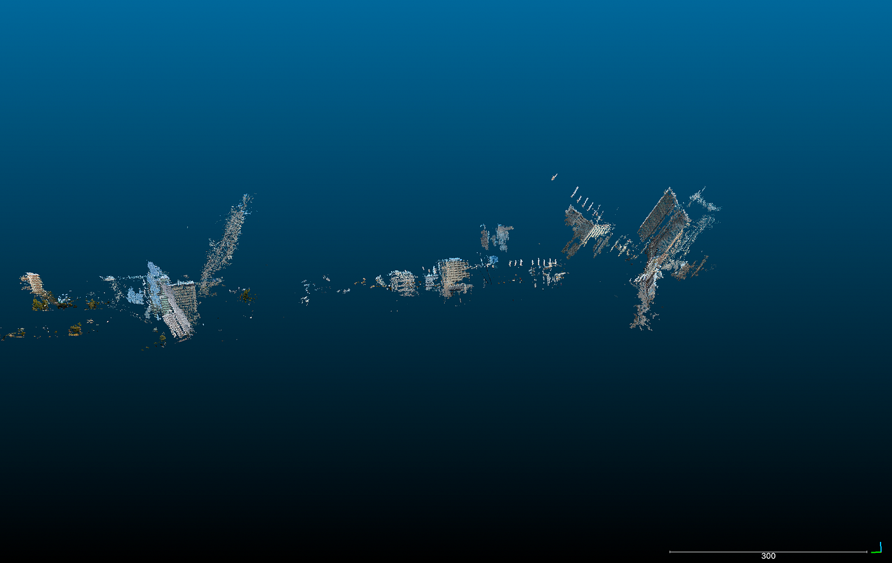

次に、Metashapeに今回撮影した全ての画像データをアップロードし、データ量を増やすことで点群データの質を高めていくという方法をとった。このMetashapeは自分のパソコンで処理を行うため、かなりのスペックを要求される。 最初に自分のPC(MacBook Pro2021,M1pro 10コアCPU,16コアGPU,16GBメモリ)でHighest qualityで処理を開始したが、１時間経過しても1%しか処理が終わらず、残り２days,14hoursと表示されたため、Mediumの設定に変更したところ、約１時間半で処理が終了した。

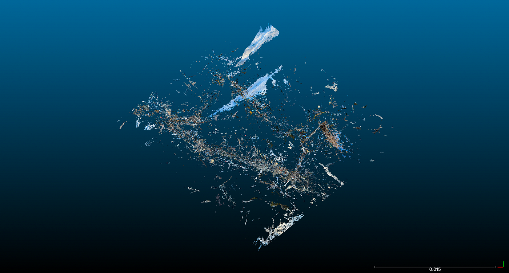

しかし、点群の数は増えたが今度はどこがコースなのかや。建物すら識別することが出来なくなってしまった。

次に外苑いちょう並木だけの画像データを点群化したみた。すると、少しながらうまくいかなかった

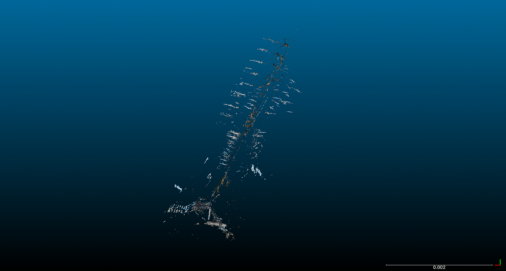

このように拡大すると、少しながら点群化がうまくいかなかった理由が分かってきた。撮影ポイントが異なる画像を使って点群化すると、このように撮影されたポイントとポイントの間に隙間ができ、点群も段差ができてしまうことがわかった。

#### 3, 点群データ作成方法検討編

そこで、今度はスケールを小さくし、一つの対象物をどのように撮影すれば綺麗な点群ができるかを考えていった。

まずは、撮影するポイントは変えず、撮影する向きだけを変えて撮ったデータを基に点群化をしていった。

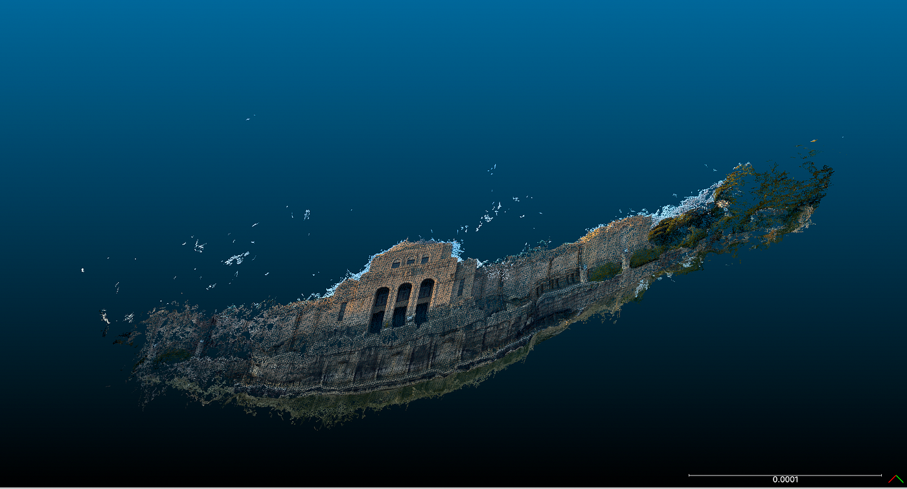

すると、とても綺麗な点群データが完成した。少し平面的ではあるが、これが何の建物であるか容易に認識できるレベルである。

次に、撮影ポイントを変えながら、一つの対象物（建物）を囲うように撮影していった。一周するように撮影すれば精度の高い点群データを取得できると言うデータは既にあったため、敢えて一部分しか撮影することができない建物を選択した。

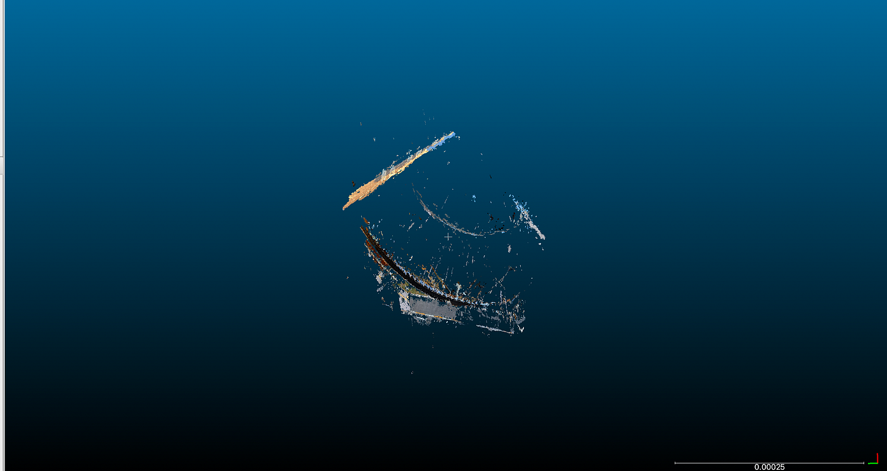

すると、一部は認識することができるが、全体像の認識は出来なかった。撮影するポイントは変えず、撮影する向きだけを変えて撮ったデータを基に点群化した時と比較しても、この差は明白である。

### Discussion

今回の、スマートフォンで撮影した画像をもとに点群データを作成するという試みは、正直に言うと想定していたようなレベルの点群は完成させることが出来なかった。 究極の理想としては、相模原キャンパスで空撮した画像から作成された点群データのレベルであったが、それとは程遠い結果となってしまった。また、同じようにスマートフォンなどで撮影された画像から作成されたMapillaryの点群データに近いレベルのものはできるだろうと考えていたが、それにも及ばなかった。

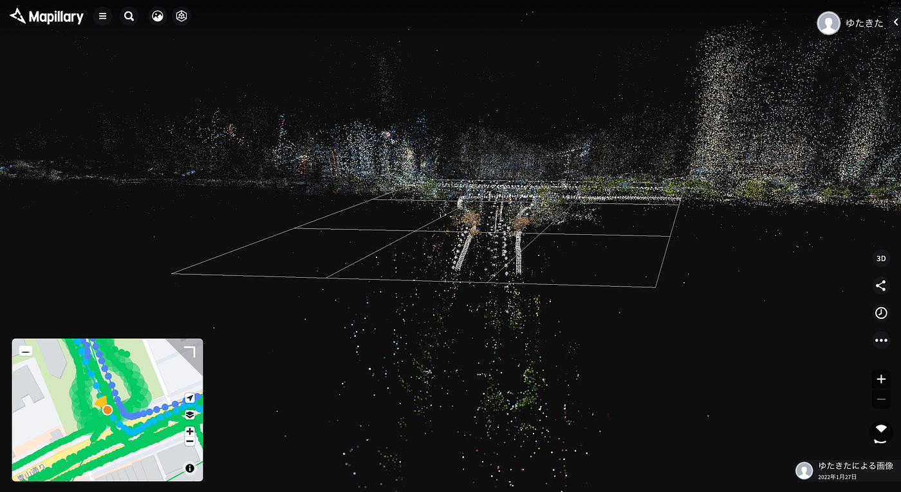

Mapillary点群データ

その一方で、撮影するポイントは変えずに撮影する向きだけを変えて撮ったデータを基に作成した点群は非常に完成度が高かったため、オーバーラップが多ければ多いほど高精細な点群データが出来るのではないかと考えた。今回は一秒間のコマ数を増やすという方法を行ったが画像がブレて上手くいかなかった。しかし、撮影した動画を画像化するという方法を用いればよりオーバーラップ部分が多い画像データを取得できたのではないか。この方法も検証する必要があった。

### Conclusion

今回の研究では、空撮が出来ないエリアにおいて地上から撮影できる画像データだけで点群データを作成することは可能かと言うテーマで臨んだが、一建物を点群化させることはできたが、広範囲の点群化は上手くいかなかった。同じような試みをしている人もなかなか見つけることが出来ず、殆ど手探りの状態であったため、何が原因で上手くいかないのか分からずとても難しい研究となってしまった。

### 参考文献

[木多祐太 ゼミ論参考文献
シート1 ID,大分類,著者,発行年,最終更新日,タイトル,雑誌名,雑誌号数,該当ページ,出版社,ISBN,URL,URL4archives,閲覧日,MEMO1,MEMO2 報告書,一井…docs.google.com](https://docs.google.com/spreadsheets/d/1TzONcB1H-n91HSwhPEUiRT71D__Lgha5n1ErH88UmgU/edit?usp=sharing)

### 発表スライド

### グラレコ

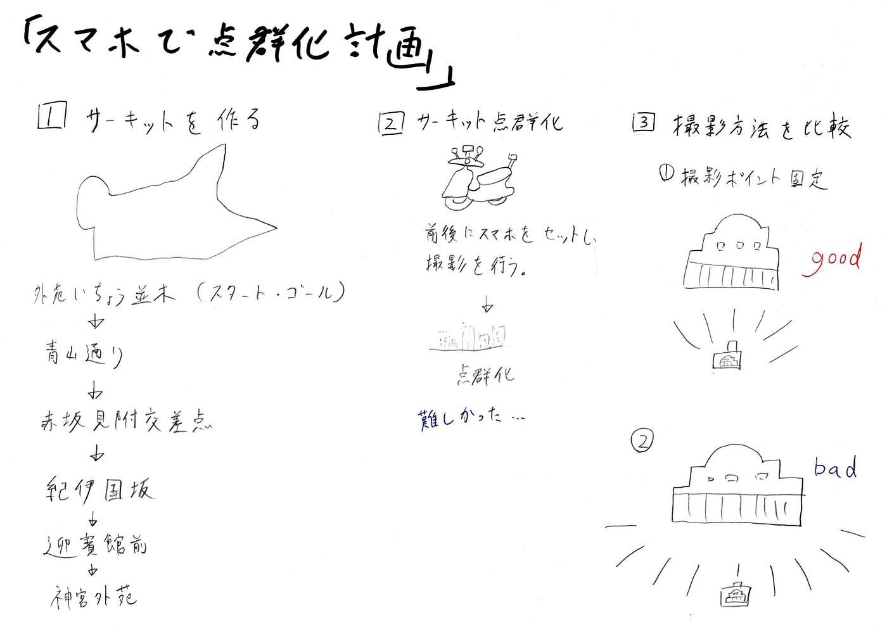

### プロジェクト管理

[https://github.com/furuhashilab/2021gsc_YutaKita](https://github.com/furuhashilab/2021gsc_YutaKita)
