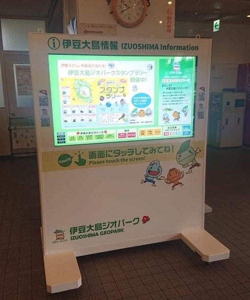

### 2021年 ゼミ論最終発表

2022.2.5

こんにちは、3年の葉賀です。

今回は１年間のゼミでの活動の締めくくりであるゼミ論最終発表について書いていきたいと思います。

### 「伊豆大島における災害対策としてのデジタルサイネージ活用の検討」

### Introduction

私がこのテーマを選んだきっかけは、ゼミに入りたてのハッカソンの時に水害に遭われた方の話を聞いたことでした。

家が水浸しになって大変だけど、実はその地域は水害がハザードマップで予想されていたそうです。自分もハザードマップはほとんど見たことがないことから、同じように災害に関する情報が公開されているにも関わらずそれを知らない、あるいは忘れている人が多いのではないかと思いました。

また、ゼミのYouthMappersの合宿で伊豆大島を観光し、万が一慣れない土地で災害に見舞われたら普段以上にどうしたいいかわからなくなりそうだと思いました。有事の混乱の中では、多くの人に素早く、わかりやすく情報を提供する必要があります。伊豆大島は観光地として有名であるため、土地勘のない観光客にも伝わりやすい情報の伝達が求められるのではないでしょうか。

そこで、デジタルサイネージを設置し平時は観光情報、災害発生時は災害情報を提供することで効果が期待できるのではないかと考えました。

### Methods

・フィールドとしている伊豆大島の情報メディアに関するこれまでの状況と現状を公開資料から確認。

・公開されている先行研究をレビューし、

> ①デジタルサイネージ概要と設置のメリット、デメリット

> ②観光地の防災、災害対策

> ③広告媒体としての可能性(生物追従、複数データ、インタラクティブ機能)についてを中心に情報を収集し、まとめる。

### Results

古橋先生経由で伊豆大島の観光協会の岡田さんに連絡を取りました。以前の合宿でお世話になった方です。

島にあるデジタルサイネージについて質問したところ、

> ・島内では元町港、岡田港、町役場、山頂口に設置(ジオパーク用)

> サイズ：横146cm横185cm画面50インチ、タッチパネル方式

> ・設置はジオパーク推進委員会、予算は町役場が管轄

> ・災害情報表示への有事の切り替えは想定されているが実績はなし

> ・初期導入コストは補助金あるがランニングコスト

> (主にシステム利用料、保守料、拡張性の担保)の確保が厳しい

という情報を教えていただきました。

デジタルサイネージがどのような利点・欠点があるのか、先行研究をレビューしながら調べました。

その結果は以下の通りです。

メリット：素早い表示・情報更新、ペーパーレス、見せる対象を絞れる

デメリット：電気代・メンテナンス代がかかる、止まって注視されにくい

利用目的としては、広告 ・情報提供・促進販売 ・エンターテインメントの４つが主なものです。

さらに、観光客が観光地で防災についてどのように考えているかを調査した研究がありました。

姫路城に来ていた観光客約230人にアンケート調査を行い、自身の居住地での避難場所と比較すると、観光地での避難場所の知識を持っている割合の方が圧倒的に低いことが明らかになった。

### Discussion

災害時に情報弱者になりやすい観光客が正確な情報を得る方法として、やはりデジタルサイネージが有用だと考えられます。

デジタルサイネージは一部の人が欲しい詳細な内容を伝えられるからです。テレビやラジオも素早く情報を伝達しますが、それらは全国を満遍なく網羅するため設置場所や地域に合わせた局地的な情報提供は難しいのです。

### Conclusion

今回は先行研究を参照しデジタルサイネージの有用性を検討しましたが、今後研究を継承して、実際に伊豆大島で実装し検証していきたいと思います。

＜参考文献リスト＞

[https://docs.google.com/spreadsheets/d/1QXFF2BYQ8-Bcgktrca2RO1P_d50pwnTIN-LIyE1u6pI/edit#gid=0](https://docs.google.com/spreadsheets/d/1QXFF2BYQ8-Bcgktrca2RO1P_d50pwnTIN-LIyE1u6pI/edit#gid=0)

＜GitHubレポジトリ＞

[https://github.com/furuhashilab/2021gsc_NatsumiHaga/blob/main/README.md](https://github.com/furuhashilab/2021gsc_NatsumiHaga/blob/main/README.md)

＜発表スライド＞

＜グラレコ＞
