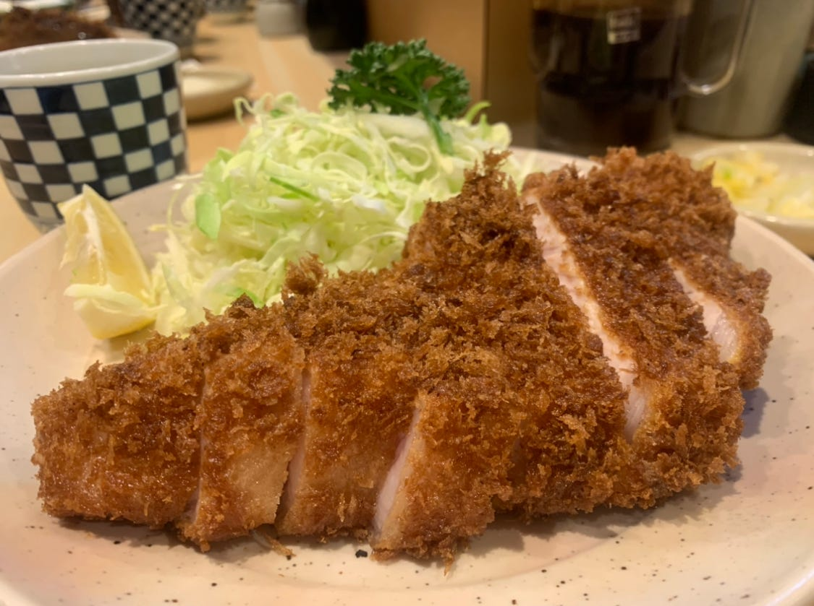
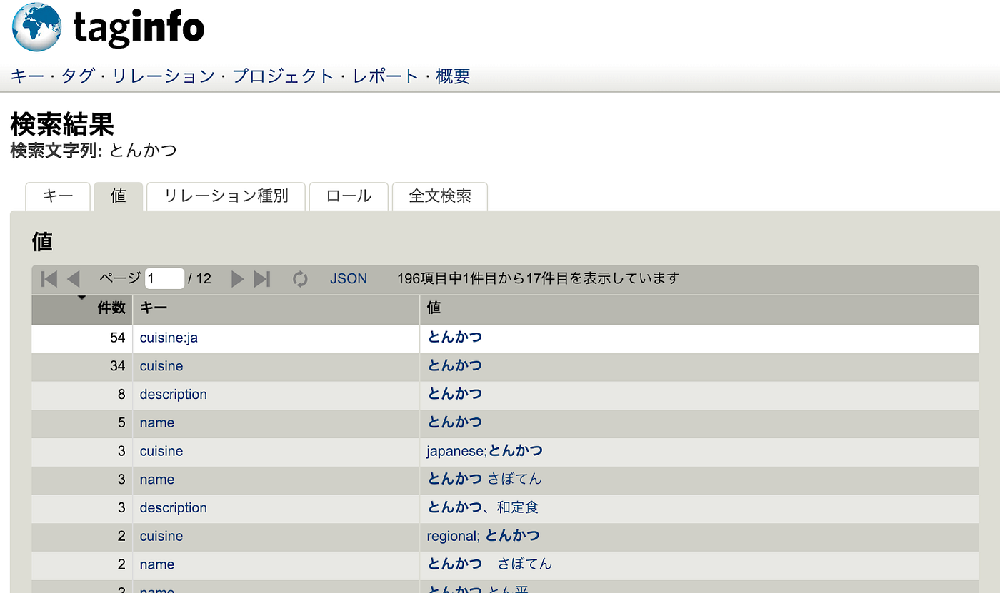
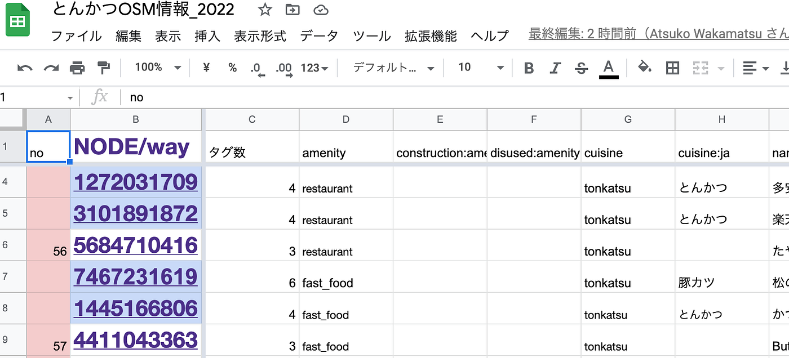
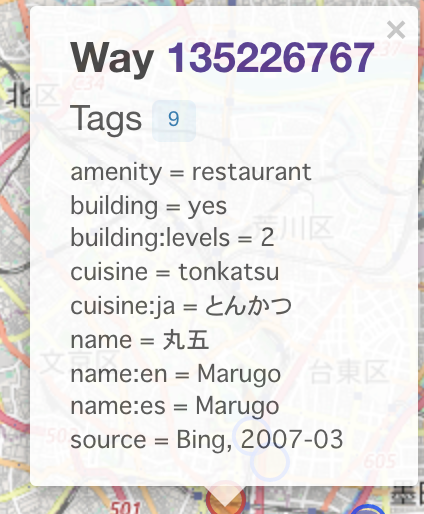
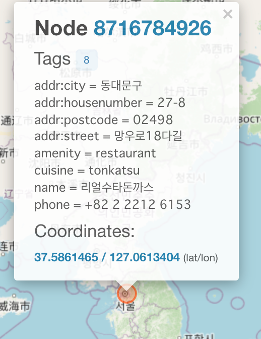
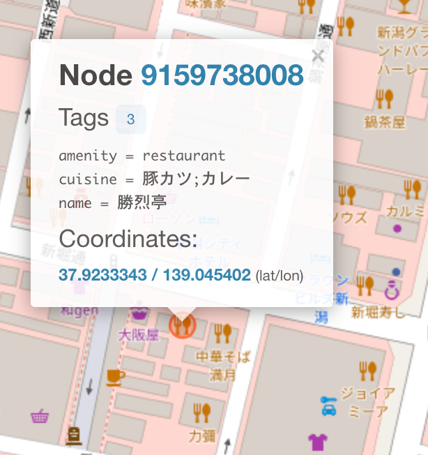
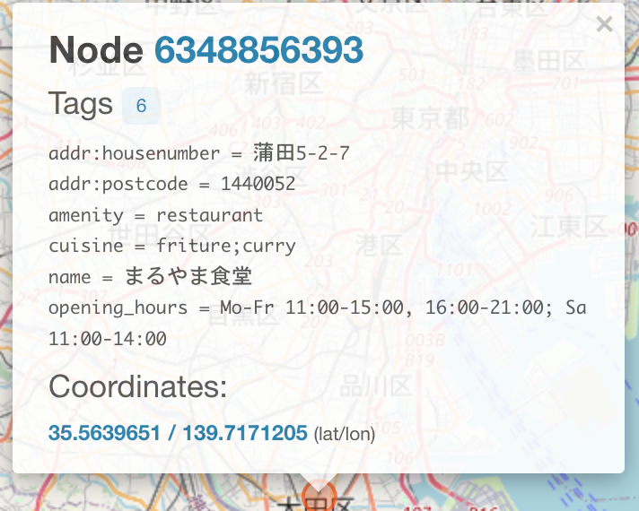
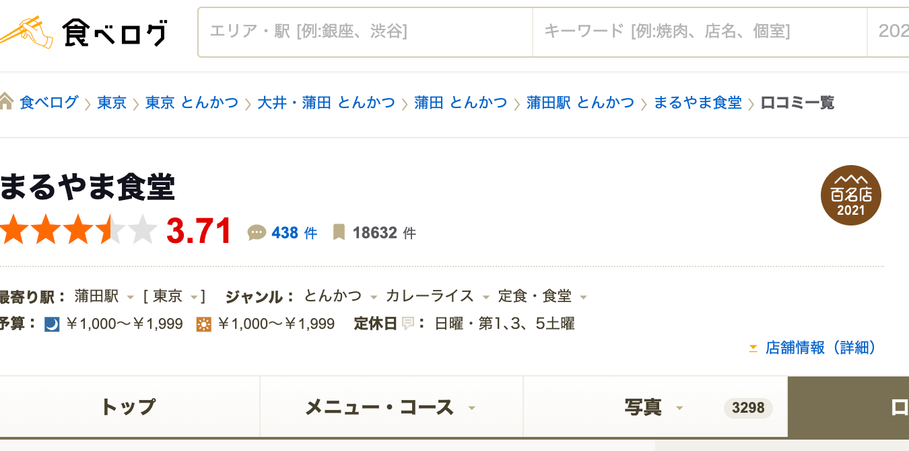
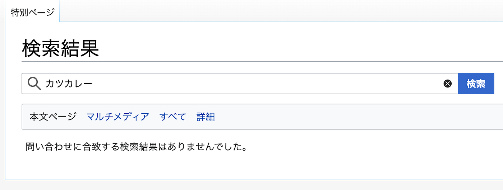
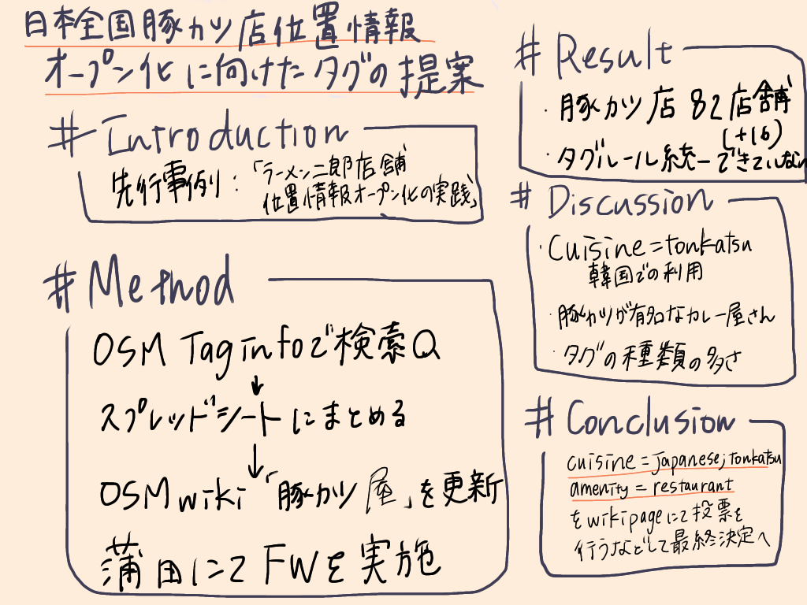

### ゼミ論最終発表！！

４年の若松です

ついに最終発表です。。。緊張。。。

私の最終発表のテーマは

**「日本全国の豚カツ店位置情報のオープン化実践に向けたタグの提案」
**です。

**＃INTRODUCTION**

私は昨年同様、先行事例である渡辺結南「日本全国のラーメン二郎店舗位置情報オープン化の実践」を参考に日本全国におけるOpenStreetMap上での豚カツ店の情報の整理、更新を行った。

・日本全国におけるOpenStreetMap上での豚カツ店の情報の整理、更新

・OSM Wiki「豚カツ屋」ページの更新

・蒲田エリアを中心にしたフィールドワークの実施

**＃METHOD**

> _１とんかつ店の情報の整理_

OSM Taginfoを利用し、日本全国82店舗を発見
「とんかつ」、「豚カツ」「豚かつ」、「tonkatsu」「tonkatu」など文字列を変更しながら検索を行った。

昨年同様に[スプレッドシート](https://docs.google.com/spreadsheets/d/1ORTYDpcYsIHHqbR3mmenV2l_hWLRsVI3ykfClEFPKvM/edit?usp=sharing) にまとめた。

**＃RESULTS**

作成したwikiページは閲覧履歴がなく、昨年同様豚カツ店の表記の仕方は編集者によって大きく異なることがわかった。

使用されていたタグは68種類と昨年より４種類ほど増え、タグルールの統一には至っていない。

NODEではなく、wayで登録されているものも発見された。

> _２ OSM Wiki 豚カツ屋ページの更新_

昨年作成したOSM Wikiの[豚カツ屋ページ](https://wiki.openstreetmap.org/wiki/%E3%81%A8%E3%82%93%E3%81%8B%E3%81%A4%E5%B1%8B)に上記の情報を加え、更新を行った

> _３ 蒲田駅周辺にてFWを実施した_

食べログとんかつ100名店2021にて蒲田周辺から5店舗選出

とんかつの激戦区と言える場所にてOSM上で情報を記録する際に必要情報の調査を行った。

**＃DISCUSSION**

昨年度行った研究でのdiscussion部分に追加する形で研究を行った。

＞とんかつの表記は「とんかつ」か「トンカツ」か「豚カツ」か。
→ Wikipediaで記されている「豚カツ」である

＞とんかつ店のcuisneタグはどのように統一すべきか
→cuisine= Japanese;tonkatsu を提案

＞とんかつ店としてのamenity=restaurant,amenity=fast_foodの違いはどこにあり、どちらのタグがふさわしいのかを検討
→amenity=restaurantがふさわしいのではないかとした。

＞今年は蒲田でのFWを通して最低限必要なタグは何か。

蒲田駅周辺でのフィールドワークを通して

- 店舗名称

- 日本語表記（読み方が難解なお店も多い）

- 英語表記

- amenity=restaurant

- cuisine=japanese;tonkatsu

- 住所の入力

- takeaway の有無 コロナ禍で重要な情報

- opening_hoursの表記

- source=survey きちんとした実地調査が重要

これらが必要な情報になるのではないかと強く感じた。

個人的にな願いとしては豚カツ店の情報を収集する手段としてOSMをもっと自由に使ってほしいなと考える。食べログや個人ブログなどを通して情報が更新されるような仕組みを作るためには何が出来るかを考えたい。

＞韓国でのcuisine=tonkatsu の使用について

Taginfo内でcuisine=tonkatsuを検索したところ韓国のとんかつ屋さんがヒットした

→OSM Wikiとんかつ屋ページから韓国のとんかつは日本のものと似て非なるものとして捉えるため、cuisine=japanese;tonkatsuのタグの推奨ができると言える

＞豚カツが有名なカレー屋さんの場合（カツカレー店等）

### 豚カツが有名なカレー屋さんの場合、カレーが有名なとんかつ屋さんの場合

こちらのお店のようにとんかつ屋さんでありながらも、カレーを提供しているようなカツカレーのお店の定義をどのようにするのかが難しい。

カツカレー店を定義するOSM Wikiのページは存在しなかった。

OSMwikiの定義では主にカレーを提供する場所とあり、cuisine=curry;tonkatsuまたはtonkatsu;curryなど新しいタグが必要になる可能性がある。

> **cuisine=curry**

> A place that mainly sells curry. Note that there are several different styles of curries, not only Indian style.

**＃CONCLUSION**

本研究を通してOSM上にある既存のとんかつ店の情報未整備の現状を明らかにし、新たなタグルールの提案を行った。そして今後とんかつ店をOSM上で編集していく上でOSMwikiページを作成、情報の更新をした。「豚カツ店」におけるタギングルールの統一、また正式にcusineタグ「japanese;tonkatsu」の承認に向けた取り組みが実践されることを期待する。 Wikiページにて議論の場を設け、投票を行うなどして最終決定に至りたい。本研究では議論ページの作成、タギングルールの提案に留まり、タグの決定には至っていない

＃グラレコ

＃最終発表用資料

＃GITHUBレポジトリ

[GitHub - furuhashilab/2021gsc_AtsukoWakamatsu: 2021年度ゼミ論レポジトリ
2021年度ゼミ論レポジトリ 4年 若松暖子 ゼミ論用レポジトリになります。 学籍番号:1A118185 氏名：若松暖子 地球社会共生学部3年A組184番 指導教員：古橋大地教授 © Furuhashi Laboratory/Taro…github.com](https://github.com/furuhashilab/2021gsc_AtsukoWakamatsu)

＃進捗管理用プロジェクト

[Atsuko Wakamatsu · furuhashilab/sotsuron2021
You can't perform that action at this time. You signed in with another tab or window. You signed out in another tab or…github.com](https://github.com/furuhashilab/sotsuron2021/projects/19)
