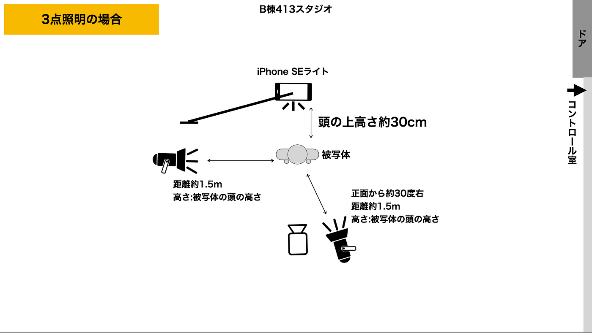
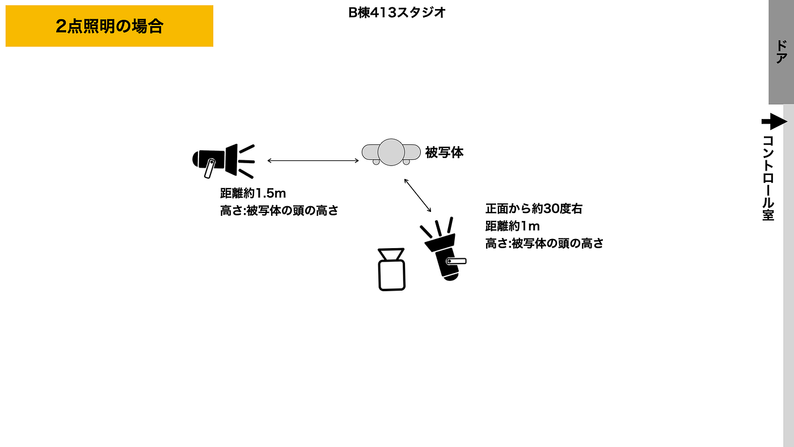
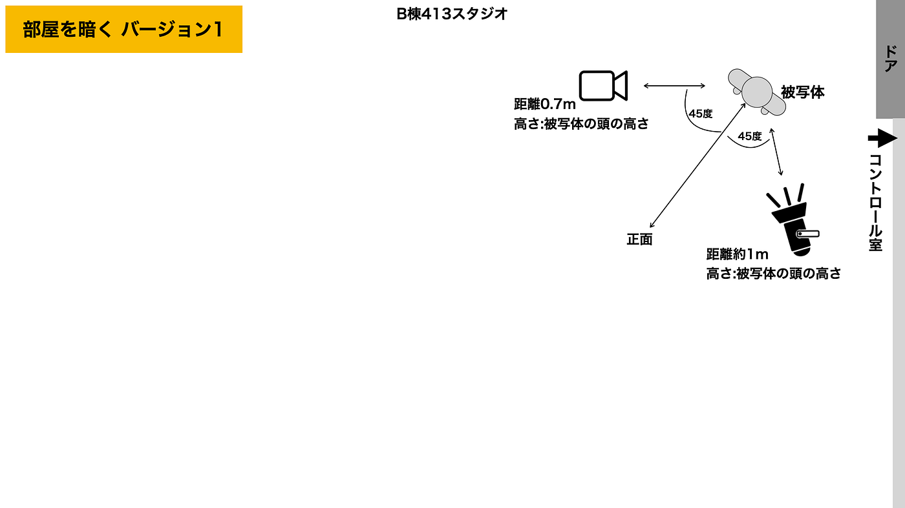
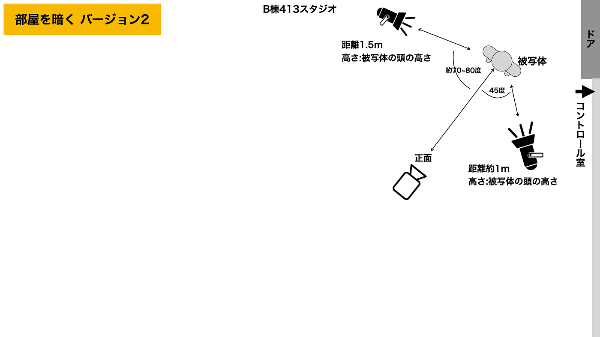
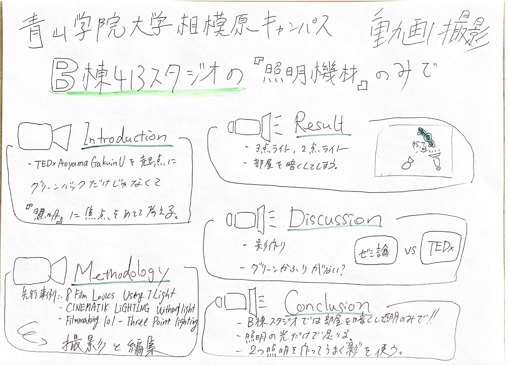

### 部屋を〇〇して解決!ゼミ論2021

青木も最終発表していきたいと思います。

今回のテーマは『**青山学院大学相模原キャンパスB棟413スタジオの照明機材のみで「クオリティの高い動画撮影」を提案。』です。**

こちらがゼミ論の本文になります！

[2021gsc_Ren-Aoki/README.md at main · furuhashilab/2021gsc_Ren-Aoki
青山学院大学 地球社会共生学部 地球社会共生学科 青木怜 / Ren Aoki 学籍番号 1A118002 指導教員 古橋 大地 教授 © Furuhashi Laboratory/Ren Aoki, CC BY 4.0…github.com](https://github.com/furuhashilab/2021gsc_Ren-Aoki/blob/main/README.md)

### 成果物

今回のゼミ論で制作した動画を制作していきます！

- 全体の再生リスト

[https://youtube.com/playlist?list=PLlj_rbX4LxZ5LO9gXAGwe9n9m0SXK-MhW](https://youtube.com/playlist?list=PLlj_rbX4LxZ5LO9gXAGwe9n9m0SXK-MhW)

- 撮影した素材とフリー素材で作品を作ってみる

- 照明あり:なし検証

- 「影作り」- 照明の角度調整

- TEDxAoyamaGakuinU2020 iYutaさんと今回の撮影の比較

- ゼミ論2021 RenAoki メイキング裏側

- グリーンかぶりが目立たない。

このような感じになりました。

### 照明の配置

### 部屋を暗くする

B棟スタジオでは、照明を上手くかつ初心者でも使いこなすためには「部屋を暗くする」のが大事だということがわかりました。照明以外の光を全て遮断することで簡単に撮影できます。

### B棟スタジオでの撮影のコツ

1. B棟スタジオでは部屋を暗くして照明のみで撮影すべき。

1. 照明の光だけで余裕で足りる。

1. 2つの照明を使い、“影”を上手く作る。

### スライド

### 参考文献

[古橋ゼミ卒論2021参考文献_青木怜
Templete ID,大分類,中分類,小分類,著者,発行年,最終更新日,タイトル,雑誌名,雑誌号数,該当ページ,出版社,ISBN,URL,URL4archives,閲覧日,MEMO1,MEMO2 論文,査読つき 論文,査読なし 書籍…docs.google.com](https://docs.google.com/spreadsheets/d/1aTm66UNxFB5cAVl1_44wyT1jAr8qmjzAisON0W4mXs0/edit)

### Githubプロジェクト

[Ren Aoki · furuhashilab/sotsuron2021
You can't perform that action at this time. You signed in with another tab or window. You signed out in another tab or…github.com](https://github.com/furuhashilab/sotsuron2021/projects/17)

### 動画管理

- 再生リスト [https://www.youtube.com/playlist?list=PLlj_rbX4LxZ5LO9gXAGwe9n9m0SXK-MhW](https://www.youtube.com/playlist?list=PLlj_rbX4LxZ5LO9gXAGwe9n9m0SXK-MhW)

- Google ドライブ

[ゼミ論2021用 - Google Drive
Edit descriptiondrive.google.com](https://drive.google.com/drive/folders/10pvrhj31vhUJL78bbD78trISLu3uBNR0?usp=sharing)

### グラレコ

