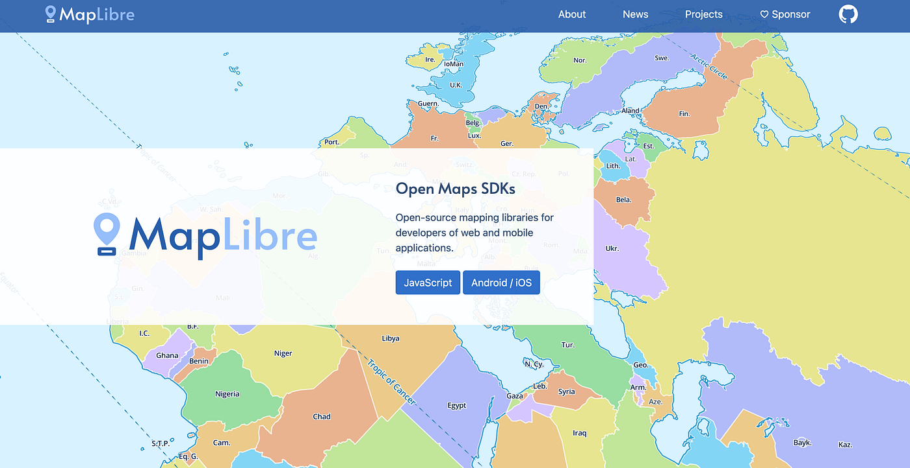
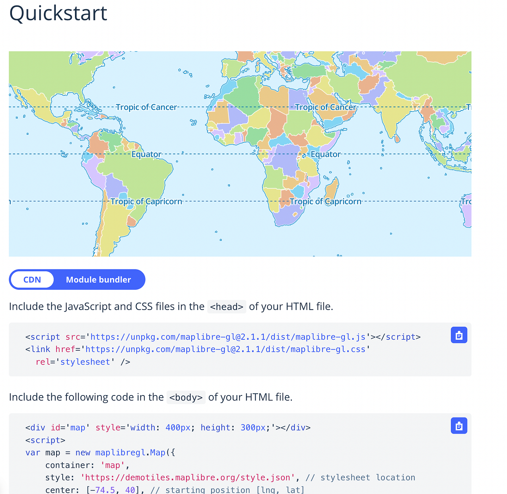
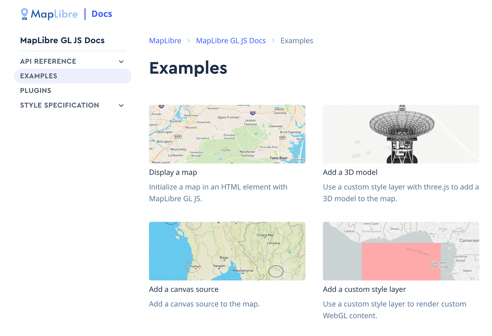
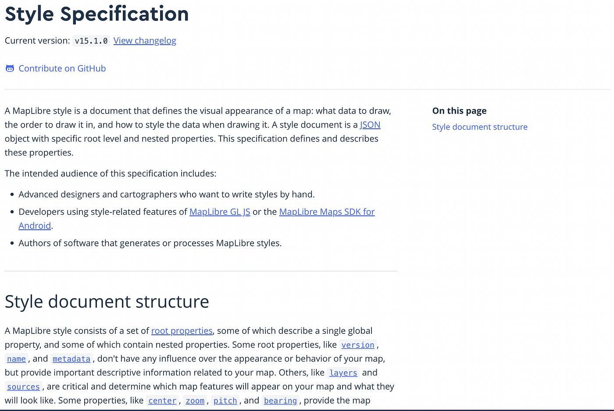

### MapLibreってなに？

[MapLibre](https://maplibre.org/)とは[Mapbox GL JS](https://docs.mapbox.com/mapbox-gl-js/guides/)のv1.13.0がフォークして生まれたオープンソースプロジェクトです。

2020年12月にMapbox GL JSがver2.0をリリースする際、オープンソースをやめ、Mapbox独自で開発を進める方針に切り替え、API利用による重課金制を導入しました。これに伴い、Mapbox GL JSとは別のオープンソースプロジェクトとしてMapLibreが生まれました。

この[リポジトリ](https://github.com/maplibre/maplibre-gl-js)から現在の開発状況を確認することができます。

### ## 開発を始めるために

初めてMapLibreに触れる人は、まず[Quickstart](https://maplibre.org/maplibre-gl-js-docs/api/)を参考にしてみましょう。

CDNもしくはModule bundlerを使って簡単にMapLibreでの開発をスタートすることができます。

### ## MapLibreでどんなものが作れるの？

MapLibreで制作できる様々なマップを[Examples](https://maplibre.org/maplibre-gl-js-docs/example/)として提供しています。

### ## 細かい設定を行うために

Examplesを参考にしつつも、より細かくマップを開発していきたいと思う方は[Style Specification](https://maplibre.org/maplibre-gl-js-docs/style-spec/)を参考にしてみましょう。

Style Specificationのルールに従いコードを書いていくことで、自分好みのマップを自由に作ることができます。

### ## Mapbox GL からMapLibre GL への変更

Mapbox GLからMapLibre GLへ移行するは JavaScript,HTML,CSSを以下の通りに変更します。

> - 
- <link
- href=”[https://api.mapbox.com/mapbox-gl-js/v1.13.0/mapbox-gl.css](https://api.mapbox.com/mapbox-gl-js/v1.13.0/mapbox-gl.css)"
- rel=”stylesheet”
- />

> <! — Use maplibre-gl version 1.15.2 for backwards compatibility with mapbox-gl version 1.x. →
+ 
+ <link
+ href=”[https://unpkg.com/maplibre-gl@1.15.2/dist/maplibre-gl.css](https://unpkg.com/maplibre-gl@1.15.2/dist/maplibre-gl.css)"
+ rel=”stylesheet”
+ />

> - var map = new mapboxgl.Map({
+ var map = new maplibregl.Map({

> - <button class=”mapboxgl-ctrl”>
+ <button class=”maplibregl-ctrl”>

### ## MapLibreコミュニティーに興味がある方へ

MapLibreはSlackを用いて、コミュニティ開発を行っています。
興味のある人は、SlackチャンネルにJoinしてみましょう([Slackチャンネル](https://osmus-slack.herokuapp.com/))
