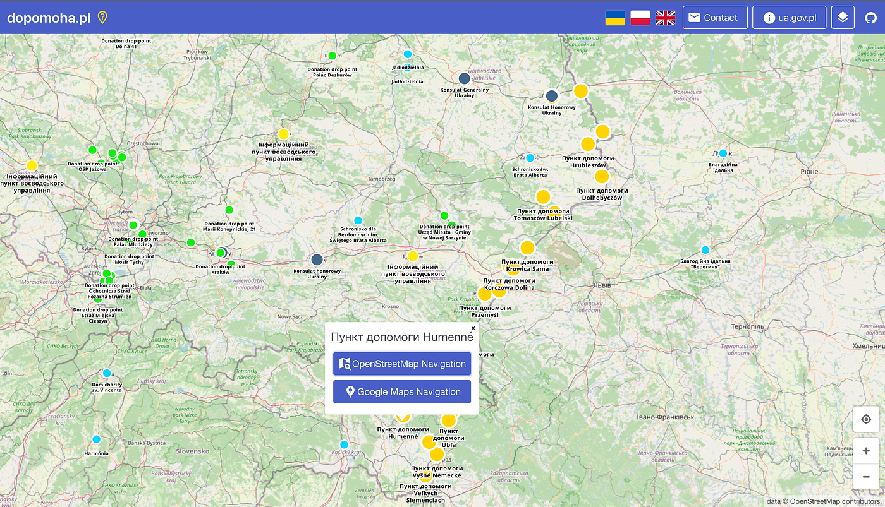
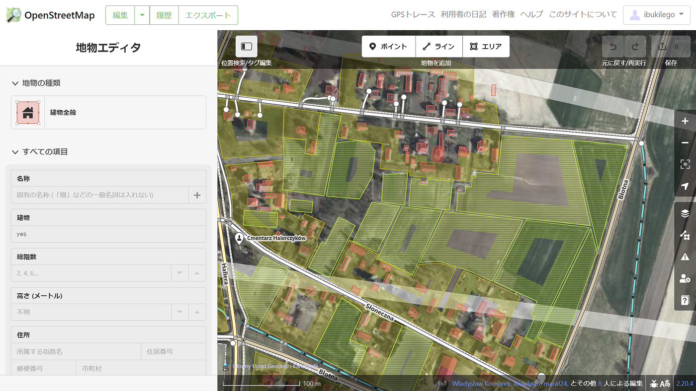

### OSMマッピングによるウクライナ支援

YouthMappers AGUはOSMマッピングによるウクライナの支援を行います。詳細と支援方法は古橋先生から共有された [OpenStreetMap Polish community からのメール](https://lists.openstreetmap.org/pipermail/talk/2022-February/087321.html)で確認できます。

[[OSM-talk] Ukraine - how one may help (dopomoha.pl)
Polish community is preparing a map/service that is intended to help Ukrainian refugees (100 000 refugees crossed…lists.openstreetmap.org](https://lists.openstreetmap.org/pipermail/talk/2022-February/087321.html)

主にウクライナからポーランド東部の地域のマッピングを行い、ウクライナからの難民のための準備を行います。マッピングが必要な地域は以下の [dopomoha.pl サイト](https://dopomoha.pl/en/#map=6.81/50.059/22.323)で確認できます。アクセスしてしばらく待つとポイントが表示されます。

[Help Ukraine
Interactive map of places with help for Ukrainiansdopomoha.pl](https://dopomoha.pl/en/#map=7/50.538/24.055)

我々は2/27はウクライナとの国境付近のDołhobyczów（ドウホビチュフ）の建物と道路をマッピングしました。

[OpenStreetMap
OpenStreetMap is a map of the world, created by people like you and free to use under an open license.www.openstreetmap.org](https://www.openstreetmap.org/directions?from=&to=50.58792327488902%2C24.030532836914062#map=14/50.58792327488902/24.030532836914062)

各ブロックごとにに登録されていない新しい建物が数個ありました。耕作地のエリアの登録もできていない場所が多かったです。耕作地が広がる地域でしたが、使用されていない土地は難民の方々のために使用できるのではないかと思いました。
