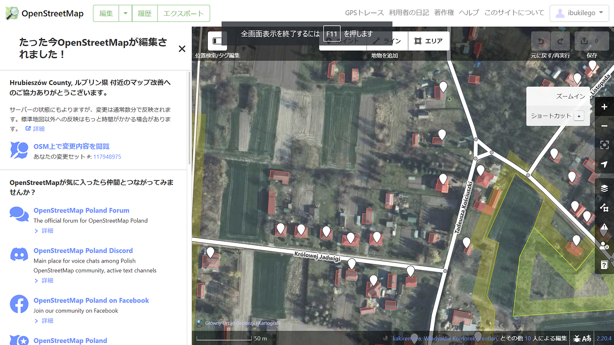

### ウクライナマッピング支援

支援の詳細はこちらで確認できます。

[[OSM-talk] Ukraine - how one may help (dopomoha.pl)
Polish community is preparing a map/service that is intended to help Ukrainian refugees (100 000 refugees crossed…l.facebook.com](https://l.facebook.com/l.php?u=https%3A%2F%2Flists.openstreetmap.org%2Fpipermail%2Ftalk%2F2022-February%2F087321.html%3Ffbclid%3DIwAR1vNmkJr03zm1GcS8W5_IK9bIullzy0F6CWjm76ABqf79koJL7UKt17zSs&h=AT2gbU3A438O-B2g02CXJ8Uib8TzZOrUoSMlA5_iPi9U4OK_Hs2FFeAfuVzLJeg7Ty-0NQ_PZVXLpnB8crXeY-keVtPNwey5rMGehQuqPO17mfwhLA4x0xtplMaHLHGy_mNF&__tn__=-UK-R&c[0]=AT2PdrDfqD3myJUd9meKH6HGzRtRQ8_As6GhUIa9T9rzAzeb40dC77-1bCRCVLTiXxxoOyQN5a1DYQ1okFXGLhc5IAU39o-BJsB6ojjn4lCyWhuNouJoUpQRu6o29a4EEOF2SXDizheHMVB505_GsJWpm0RCzebYTMpQKqbwxeZXBpw8YhaoGqemgjXUjx7c3SYzuZ4KAnUXJzX4jb0)

2/28はポーランド東部のHorodło（ホロドウォ）をマッピングしてみました。

[OpenStreetMap
OpenStreetMap is a map of the world, created by people like you and free to use under an open license.www.openstreetmap.org](https://www.openstreetmap.org/directions?from=&to=50.8922060099319%2C24.038772583007812#map=14/50.8922060099319/24.038772583007812)

耕作地が多い地域ですが、小さな建物や耕作地のエリアの登録ができていないところがありました。
