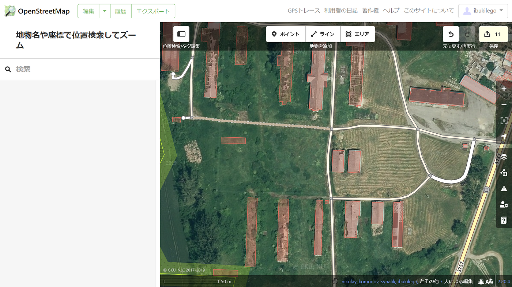

### ウクライナマッピング支援 3/1

YouthMappers AGUはマッピングによるウクライナ支援を行っています。支援方法の詳細は以下のページでご確認ください。

[[OSM-talk] Ukraine - how one may help (dopomoha.pl)
Polish community is preparing a map/service that is intended to help Ukrainian refugees (100 000 refugees crossed…lists.openstreetmap.org](https://lists.openstreetmap.org/pipermail/talk/2022-February/087321.html)

3/1はスロバキアとウクライナの国境付近の[Veľké Slemence](https://www.openstreetmap.org/#map=14/48.5088/22.1315)をマッピングしてみました。

ポーランドとウクライナの国境付近と同様に耕作地が多い地域でしたが、既に無くなった建物の位置に建物エリアが登録されている場所が多かったです。半壊しているような廃墟と思われる建物もありました。
