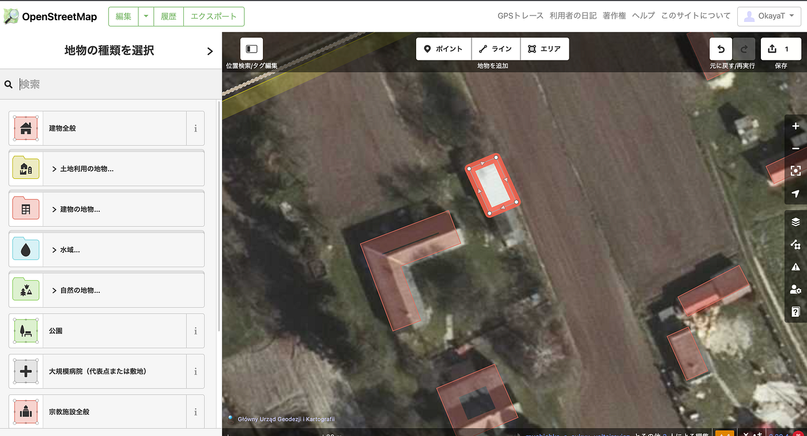
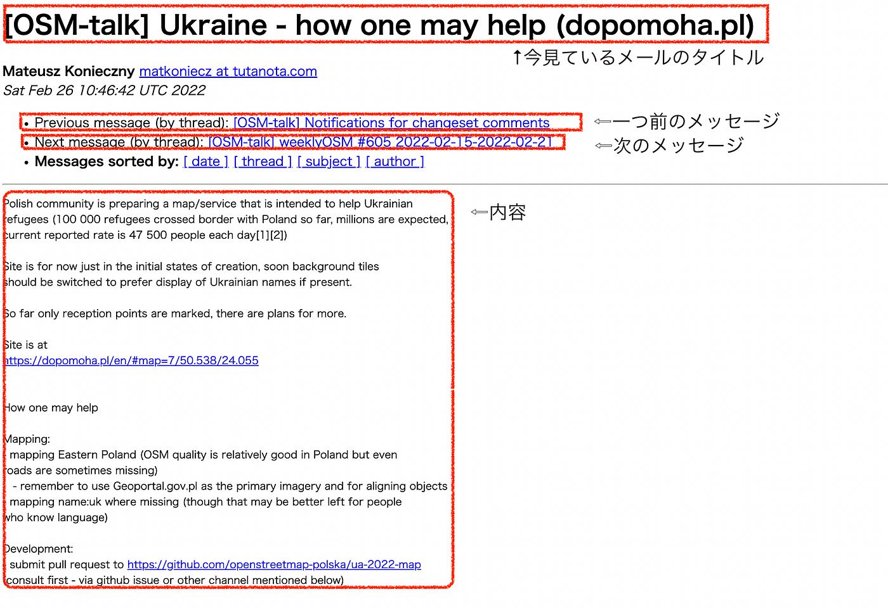
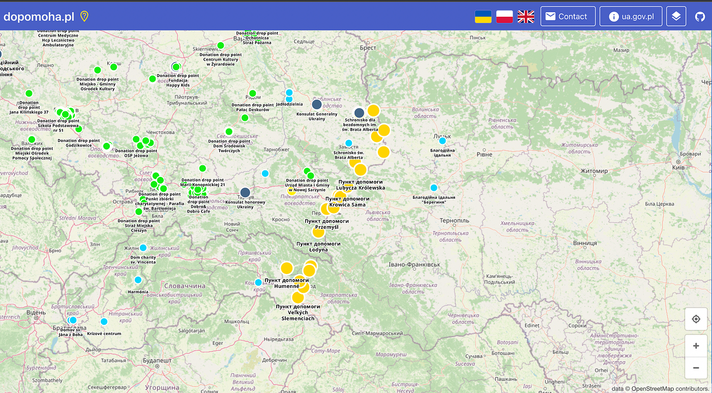
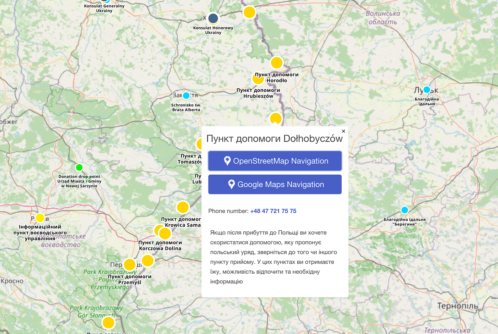
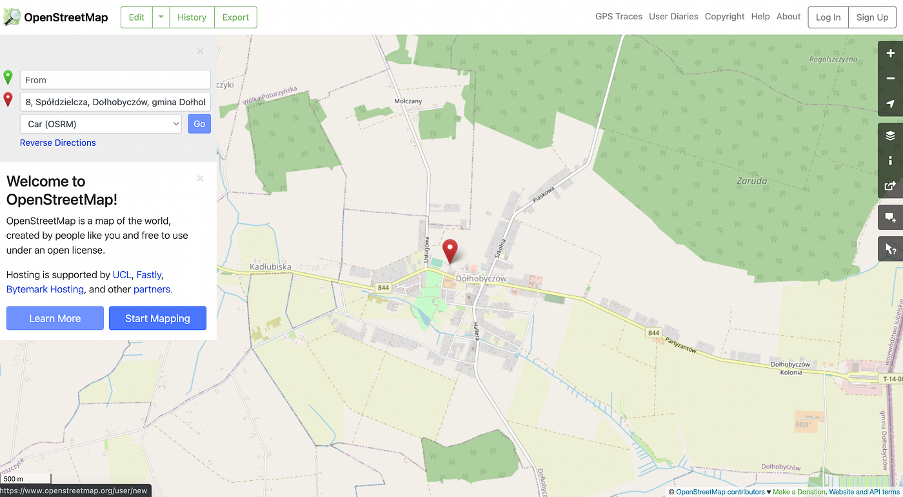
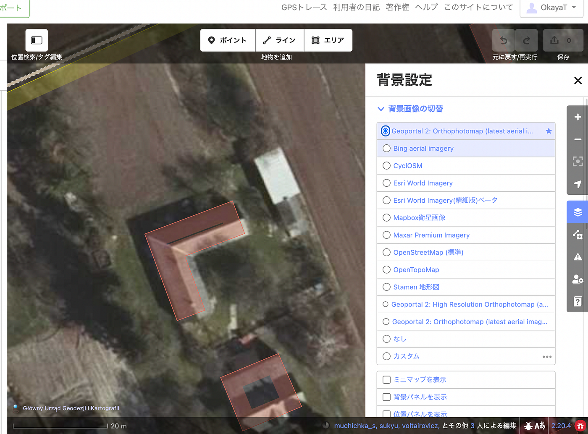
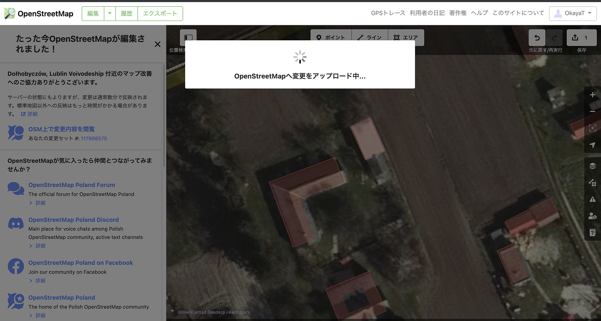

### OSMマッピングによるウクライナ支援の方法 〜3月2日〜



本日も、マッピングでウクライナの支援を行いました。

YouthMappersAGU の髙橋です。

現時点では英語の資料が多いこと、情報共有に普段多くの人が使っているSNSを利用していないことなどから「OSMマッピングによる支援の方法がよくわからない」という方もいらっしゃると思うので、詳細を図とともに説明しようと思います。

### ①メーリングリストって？

YouthMappersAGUの[メンバーが月曜日から連続して投稿しているウクライナ支援に関する記事](https://link.medium.com/HNVijFNx1nb)には**「OpenStreetMap Polish Community」のメーリングリストに詳細がある **と、書かれています。

しかし、アクセスしてみても見慣れたメール受信画面ではなかったはずです。

ここで、スクリーンショットとともに確認します。

ポーランドのコミュニティーによるメーリングリストのURLは**[こちら**](https://lists.openstreetmap.org/pipermail/talk/2022-February/087321.html)です。

アクセスすると次のような画面が出てきます。まずは見方を確認します。



わかりやすいように、主な四つの項目を四角で囲ってみました。

上から、**今見ているメールのタイトル**、**一つ前のメールのタイトル**、**次のメールのタイトル**、**メールの内容（本文）** です。

前後のメールのタイトルとリンクが表示されるのは、日本のブログに少し似ているように思います。

### ②で、支援の方法は？

前述のリンクからメーリングリストにアクセスした場合、**”how one may help”(支援の方法）**という題名のメールが表示された状態になっていると思います。

マッピングでの支援のほかに、開発面での支援についても言及されていますが、ここではマッピングによる支援についてのみ説明します。

本文には以下の通りに記載されています。

```
Mapping:
- mapping Eastern Poland (OSM quality is relatively good in Poland but even
roads are sometimes missing)
   - remember to use Geoportal.gov.pl as the primary imagery and for aligning objects
- mapping name:uk where missing (though that may be better left for people
who know language)
```

ざっくりとした内容は次の通りです。

- ポーランド東部をマッピングする（ポーランドのOSMは比較的ちゃんとマッピングされていますが、たまに道すらもマッピングされていない場所がある）**※地物の位置を合わせるときは、Geoportal.gov.plを背景画像として使うように**

- name:uk で欠けているところをマッピングする（現地の言葉がわかる人に頼んだ方がいいかもしれないけど）

では、実際に作業の手順も確認しましょう。

### ウクライナ支援になるマッピング方法

私はウクライナで使われている言語がわからないので、先述の二つあるマッピングによる支援のうち一つめについてのみ説明します。

実は先ほど訳した文はメールの全文ではなく、他の部分に次のようなリンクが添付されています。

[Help Ukraine
Interactive map of places with help for Ukrainiansdopomoha.pl](https://dopomoha.pl/en/#map=7/50.538/24.055)

こちらは簡単に言えば、**マッピングが必要な場所がわかるマップ**です。

アクセスするとポーランド東部（ウクライナとの国境付近）の地図が表示され、さまざまな色の丸印が表示されています。



丸の色が何を表しているのかは把握できていないので、わかり次第追記します。（2022年3月2日現在）

丸印を一つ選んでクリックすると、OpenStreetMapかGoogle Mapsでナビを開始するといった表示が出てきます。



二つあるうちの上のボタンをクリックしてOpenStreetMapに移動します。



ログインしている場合はStartMappingで周辺地域のマッピングを開始し、

ログインされていない場合は右上のログインボタンからログインしてマッピングを始めます。

マッピングの際は、指定された背景画像を使っているか確認します。



建物をマッピングし、アップロードまで忘れずに行ってください。



### まとめ

この記事では、OSMマッピングによるウクライナ支援の方法を詳しく説明しました。

メールのレイアウトが見慣れないものでよくわからない。英語ばかりでマッピングまで辿り着けない。という方がマッピングで支援する際の助けになれば幸いです。

現地にいなければ何もできない、と思いがちですが、マッピングはパソコンとインターネットがあれば**いつでも・誰でも・どこからでも支援**ができます。

これまでも、世界各国のマッピングによる人道プロジェクトに参加してきた YouthMappersAGUは、今後もマッピングを通してウクライナを支援していきます。

平和を願って。

髙橋彩子
