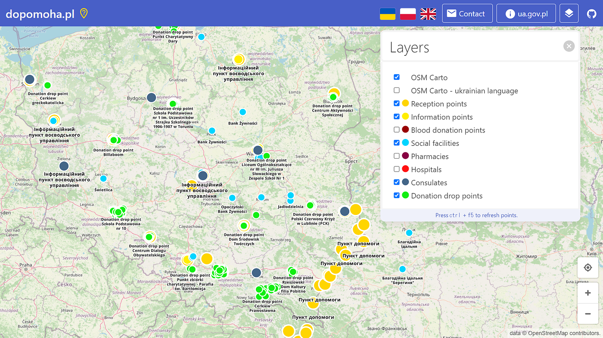
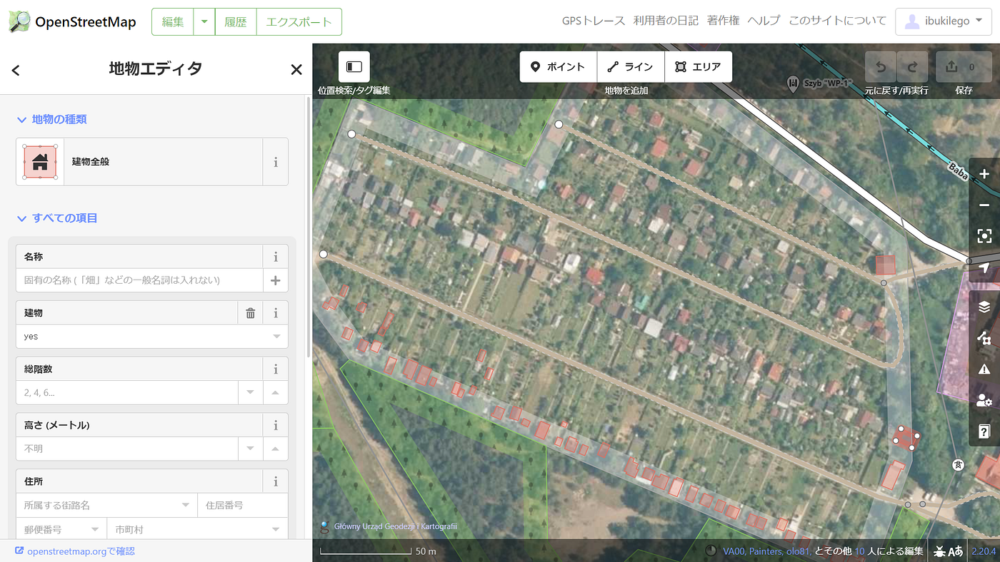

### ウクライナマッピング支援 3/3

こんにちは。YouthMappers AGUの柴山です。

本日もウクライナのマッピング支援を行いました。

昨日まではポーランドとウクライナの国境付近だけにReception pointsが表示されていましたが、それ以外にも[ポーランド国内各地に新たに追加されていることが確認できました](https://dopomoha.pl/en/#map=7/50.538/24.055)。

[Help Ukraine
Interactive map of places with help for Ukrainiansdopomoha.pl](https://dopomoha.pl/en/#map=7/50.538/24.055)

3/3は南部のOlkuszをマッピングしました。

ポーランド東部の国境付近に比べると住宅地や公共施設が多く集まっていました。一部の住宅地の建物がほとんど登録できていなかったので、周辺でも同じような場所があるかもしれません。
