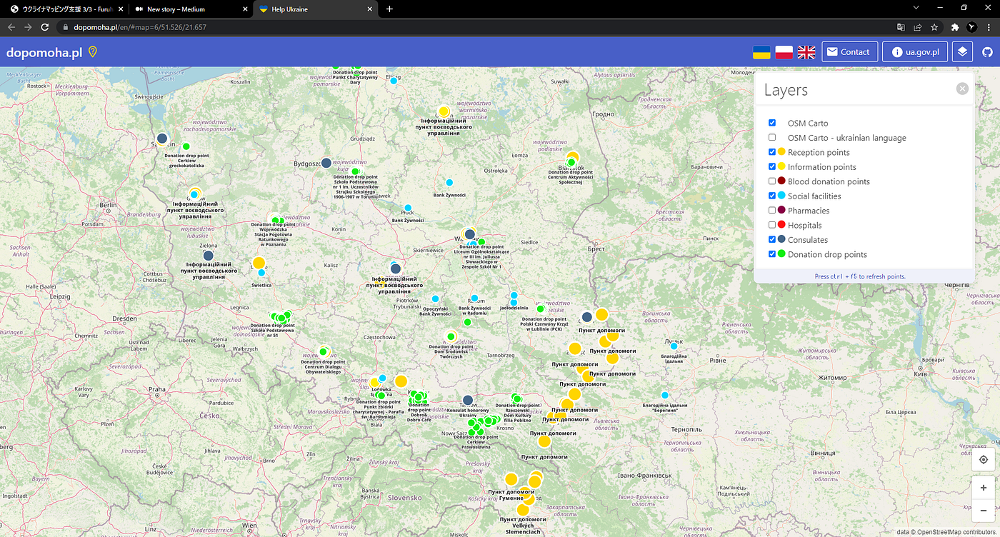
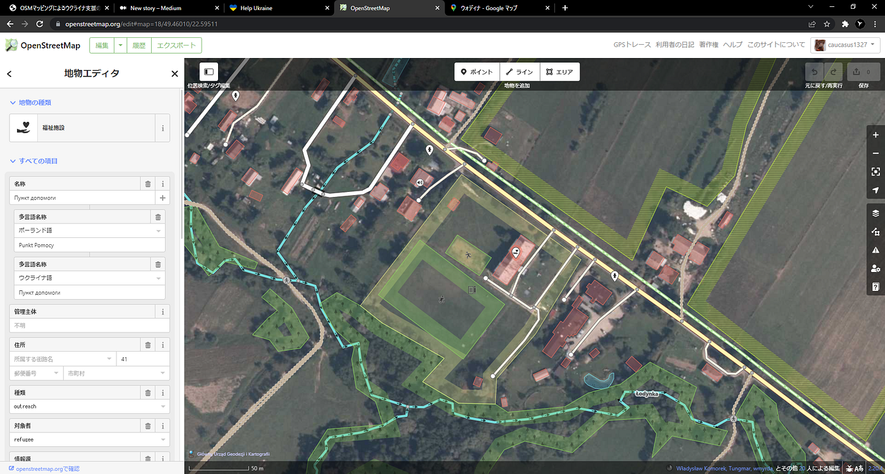

### ウクライナマッピング支援３/４

こんばんは、YouthMappers AGUの鈴木です。

本日は私が柴山と高橋に代わり記事を担当させていただきます。

昨日柴山が [OSMポーランド運営の情報共有ポータル dopomoha.pl](https://dopomoha.pl/en/#map=7/50.538/24.055) で reception pointsがポーランド国内に増えていると[報告してくれました](https://medium.com/furuhashilab/%E3%82%A6%E3%82%AF%E3%83%A9%E3%82%A4%E3%83%8A%E3%83%9E%E3%83%83%E3%83%94%E3%83%B3%E3%82%B0%E6%94%AF%E6%8F%B4-3-3-59673d8cef97)が、その報告時点よりもさらに何か所の増加が認められました。

[Help Ukraine
Interactive map of places with help for Ukrainiansdopomoha.pl](https://dopomoha.pl/en/#map=5.32/50.646/24.268)

3/4はウクライナとの国境からほど近い[Łodyna（ウォディナ）](https://www.openstreetmap.org/node/692614221)のマッピングを行いました。

[Node: ‪Łodyna‬ (‪692614221‬) | OpenStreetMap
OpenStreetMap is a map of the world, created by people like you and free to use under an open license.www.openstreetmap.org](https://www.openstreetmap.org/node/692614221)

ウォディナにある社会福祉センターが難民受け入れ所になっているようです。

何か所か建物がなくなっている場所が見受けられましたが、道などもふくめ、比較的丁寧にマッピングがされていました。
