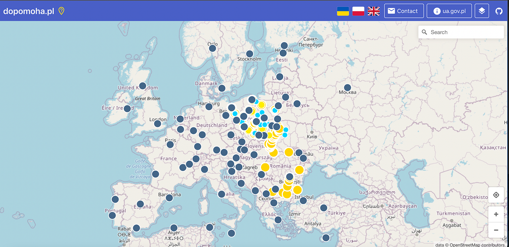
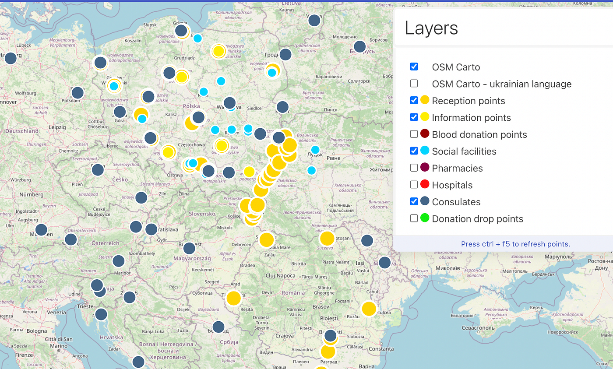

### ウクライナマッピング支援３/５

YouthMappersAGUはウクライナマッピング支援を継続しています。

本日は、 [OSMポーランド運営の情報共有ポータル dopomoha.pl](https://dopomoha.pl/en/#map=7/50.538/24.055) にみることができる変化と、前回[ウクライナマッピング支援の方法についての記事](https://medium.com/furuhashilab/osm%E3%83%9E%E3%83%83%E3%83%94%E3%83%B3%E3%82%B0%E3%81%AB%E3%82%88%E3%82%8B%E3%82%A6%E3%82%AF%E3%83%A9%E3%82%A4%E3%83%8A%E6%94%AF%E6%8F%B4%E3%81%AE%E6%96%B9%E6%B3%95-3%E6%9C%882%E6%97%A5-b65b28050275)で説明しきれなかった「丸印の色が示すもの」について共有します。

下の図は、本日（2022年3月5日）の[OSMポーランド運営の情報共有ポータル dopomoha.pl](https://dopomoha.pl/en/#map=7/50.538/24.055)です。

丸で示されたポイントの数が増え、その分布範囲がヨーロッパ全体に広がっていることがわかります。

次に、丸印の色についてです。

画面右上の四角が二つ重なっているアイコンを押すと、”Layers”というウィンドウが表示され、次のようにそれぞれが何を示しているのかを確認できます。

それでは、詳しい内容を確認します。

一番上の二項目は背景地図のことで、”OSM Carto” が上の図でも表示されているOpenStreetMap、“OSM Carto -ukrainian language”はウクライナの言語で地名が表示されるOpenStreetMapを指します。

#### Reception Points

受け入れポイント：ウクライナから国外に避難した人々を受け入れるポイント

#### Information points

情報ポイント：

#### Blood donation points

献血ポイント：怪我をした人々の治療に必要な血液を寄付するための献血を行なっているポイントだと思われる

#### Social facilities

社会施設：難民の受け入れなどを行なっている施設であると考えられる

#### Pharmacies

薬局

#### Hospitals

病院

#### Consulates

領事館

#### Donation drop points

寄付のドロップポイント：寄付を受け付けてくれるポイントであると考えられる

ポーランド以外の国では、ほとんどが領事館のポイントですが、今後他の施設のポイントも追加されていくと思われます。

以上、本日の報告でした。

髙橋彩子
