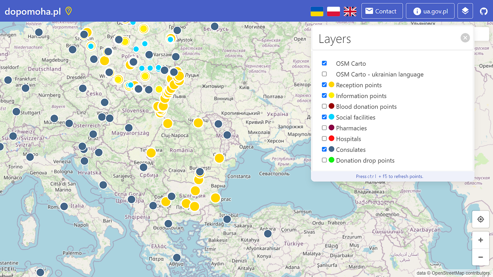
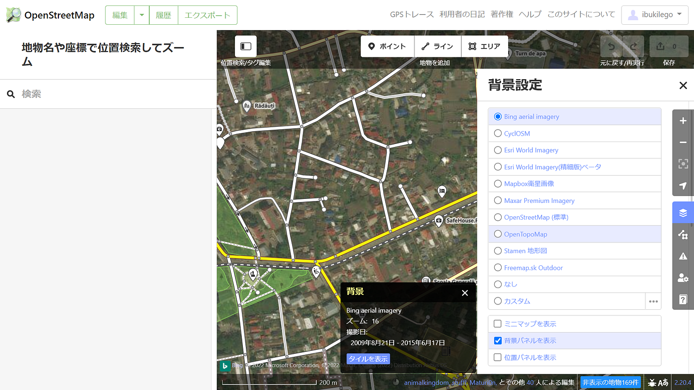

### ウクライナマッピング支援 3/6

こんにちは。YouthMappers AGUの柴山です。

前回までの記事でも紹介してきましたが、[OSMポーランド運営の情報共有ポータル dopomoha.pl](https://dopomoha.pl/en/#map=7/50.538/24.055)で表示されるポイントが増加してきています。

特に領事館と難民受け入れポイントはポーランド国外でも多数確認できます。今日はルーマニアの受け入れポイントを見てみました。

[OpenStreetMap Polish Communityのメーリングリスト](https://lists.openstreetmap.org/pipermail/talk/2022-February/087321.html)では、地物の位置を合わせるときは、Geoportal.gov.plを背景画像として使うように、と指示されていましたが、ポーランド国内でないためか表示がありませんでした。

ポーランド国外の背景画像の指定はまだ確認できていないので、背景設定のショートカットBの機能で撮影日を確認しながらなるべく新しい画像を選ぶ必要があります。

ただし、現地のマッピングコミュニティでは既に特定の画像が指定されていたり、これから指定される可能性もあるので今後も調べていく予定です。
