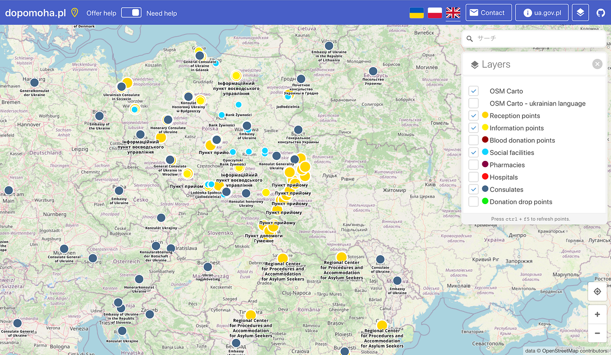
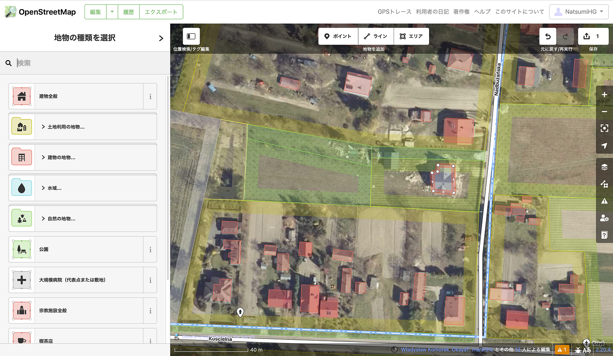
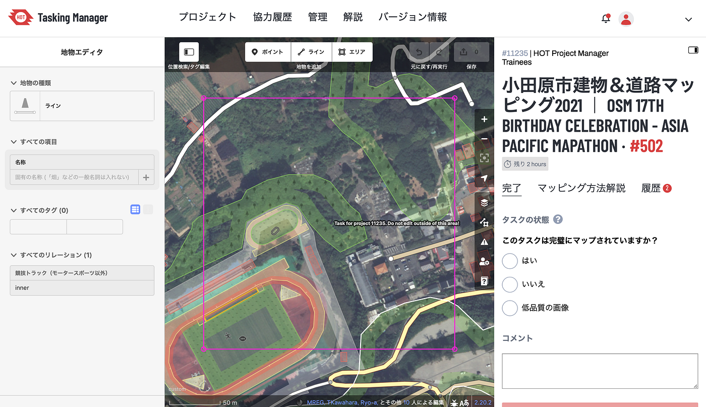
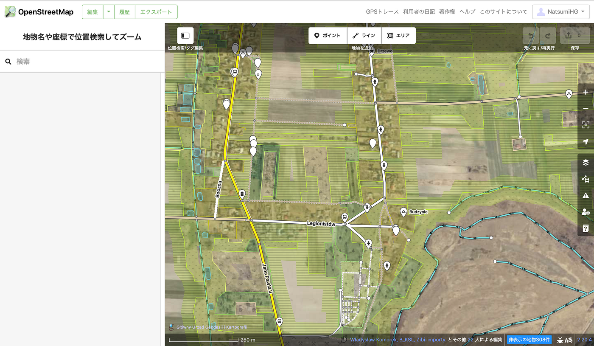

### ウクライナマッピング支援 3/7

こんにちは。YouthMappersAGUの葉賀なつみです。今日の報告を担当します。

本日(2022年3月7日)のOSMポーランド運営の情報共有ポータル dopomoha.pl(下写真)です。

ポーランドのワルシャワの右下に位置するルブリン県は、すでにほとんどのマッピングが終了しています。

その中で、建物２、３個が抜けていたのでマッピングしました(下写真)。

この他にもウクライナから国外に避難した人々を受け入れるポイントとして、重要な地域のマッピングが日々進められています。

今回のマッピングは緊急のミッションということで、通常私たちが取り組んでいるマッピングとは少し異なる部分があります。

普段マッピングする際は、[Hot Tasking Manager](https://www.google.com/url?sa=t&rct=j&q=&esrc=s&source=web&cd=&cad=rja&uact=8&ved=2ahUKEwjc1uKWm7T2AhXZEogKHdkqAjYQFnoECBMQAQ&url=https%3A%2F%2Ftasks.hotosm.org%2F&usg=AOvVaw2TBjiEQrhxdmFNUJDAXZiq) を利用します。Hot Tasking Managerとは、[OpenStreetMap](https://www.google.com/url?sa=t&rct=j&q=&esrc=s&source=web&cd=&cad=rja&uact=8&ved=2ahUKEwjKqtDlobT2AhXEeN4KHcunCVIQFnoECAcQAQ&url=https%3A%2F%2Fwww.openstreetmap.org%2F&usg=AOvVaw0nL1WtcWOxD0f37kxNRDMo)でマッピング時に複数人がチームで作業できる管理ツールです。

下写真は Hot Tasking Manager を使ってマッピングするときの画面です。

中央マップ画面にピンク色の四角い線があり、それが自分がマッピングする範囲を設定しています。

対して、今回のマッピングはこういった明確な区画決めとマッピング済みかどうかなどの情報を表すものがない(下写真)ため、

作業が重複したり、反対に抜けができてしまったり、区切りがわからなくなるということが起こる可能性があると思います。

緊急性が高く、いかに素早く作業を進めることが求められる中でも、正確さを保つための確認を怠らないようにしていく必要があると、改めて意識していきたいです。
