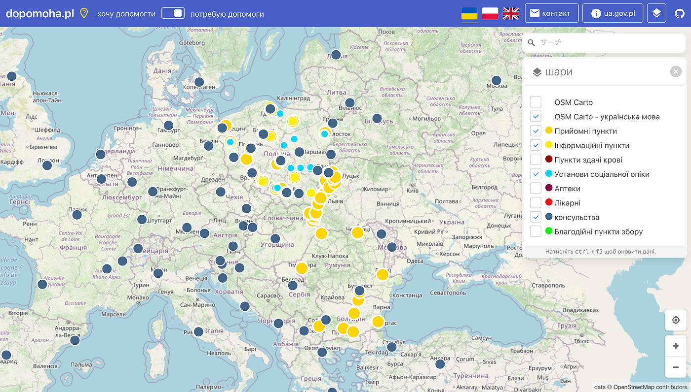
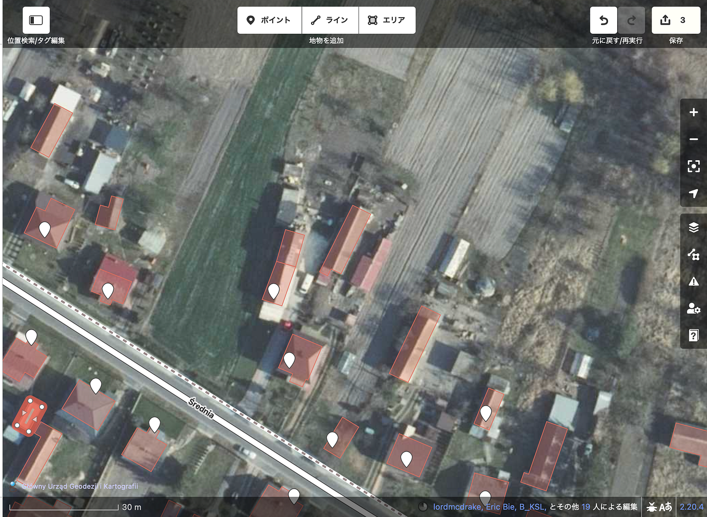

### ウクライナマッピング支援 3/8

こんにちは。YouthMappers AGUの小野です。

今日は私が担当させて頂きます。

本日(2022年3月8日)のOSMポーランド運営の情報共有ポータル dopomoha.pl(下写真)です。

黄色の丸で表示されているReception Points（ウクライナから国外に避難した人々を受け入れるポイント）が新たに追加されていました。

そして、何軒か記入されていない建物を見つけて、マッピングをしました。

全体を見ると、見つけるに苦労したくらい、マッピングが進んでいる印象でした。しかし、小さな建物や耕作地のエリアの登録ができていないところがありました。

その、小さな気づきを大切にして、これからもマッピングを通して支援していきたいと思います。
