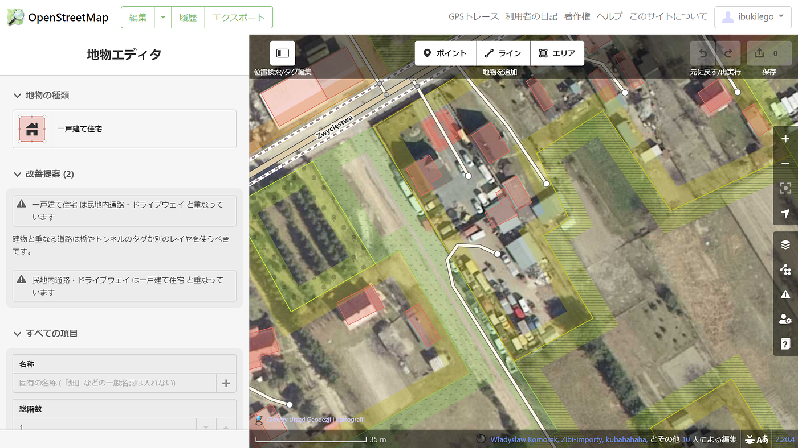

### ウクライナマッピング支援 3/9

こんにちは。YouthMappers AGUの柴山です。

[OSMポーランド運営の情報共有ポータル dopomoha.pl](https://dopomoha.pl/en/#map=7/50.538/24.055)で表示されるポイントの増加は少し治まってきた印象です。しかし、難民受け入れ箇所が今後増える可能性もあるので継続的にチェックする必要があると考えています。

ウクライナと受け入れ箇所はポーランドとウクライナとの国境沿いに特に集中しています。

その中で最も北部の[ドロフスク](https://goo.gl/maps/pCF1baEM4i6o6XGu5)のマッピング状況を見てみました。

履歴を確認すると、この数週間で非常に多くの編集が行われていることが確認でき、遠目で見るとマッピングは完了しているようにも見えます。しかし、細かくチェックしていくと無くなった建物や登録されていない建物の更新ができていない箇所がまだありました。今後は検証がメインになるかと思いますが、地道に地図の精度を上げていきたいです。
