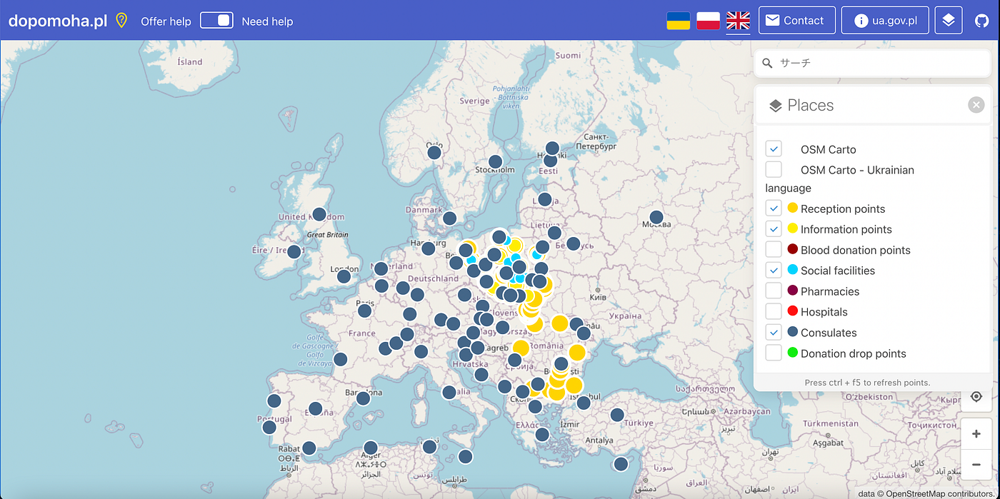
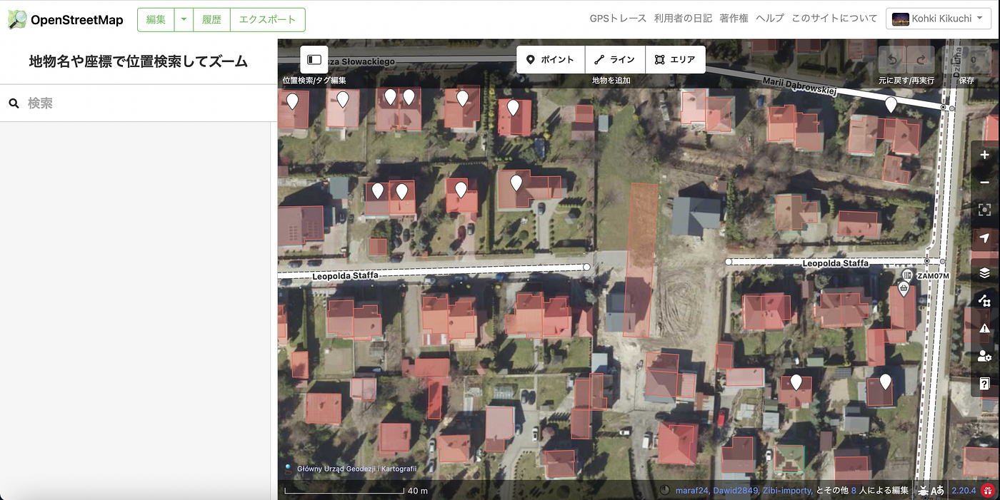

### ウクライナマッピング支援 3/10

こんにちは。YouthMappers AGUの菊池です。

[OSMポーランド運営の情報共有ポータル dopomoha.pl](https://dopomoha.pl/en/#map=7/50.538/24.055)におけるポイントの追加がほとんど止まりました。前日と比較すると変わっていません。今後の活動では、現状ある難民受け入れのポイントをマッピングしていくことがメインになると思います。

今回は[ザモシチ](https://www.google.com/maps/place/%E3%83%9D%E3%83%BC%E3%83%A9%E3%83%B3%E3%83%89+%E3%80%9222-400+%E3%82%B6%E3%83%A2%E3%82%B7%E3%83%81/@50.7214316,23.2134932,13z/data=!3m1!4b1!4m16!1m10!4m9!1m4!2m2!1d139.460608!2d35.8088704!4e1!1m3!2m2!1d23.2395172!2d50.713852!3m4!1s0x472367adda11d277:0xba00459202f8a580!8m2!3d50.7230902!4d23.2519627)をマッピングしました。ほとんどの建物・道はマッピングされていますが、以下の画像のように一部アップデートされていない箇所がありました。こういった細かな修正を行なっていくことも重要だと思います。

また現在、[Leaflet](https://leafletjs.com/?fbclid=IwAR1Tk9tuz70So5gjECDZ4vLBzrXZQyc1yXffhH1kRlcs8Gz8ZIVge7AX_o0)はウクライナ支援モードになっており公式ページを開くとLeafletからの声明文が表示されます。ウクライナ人で開発者のウラジミール・アガフォンキン氏からのコメントも見ることができます。

マッピングは重要な支援の一つですが、ハードルはそれほど高くありません。寄付以外の支援を考えている方には、是非とも参加していただきたいです。
