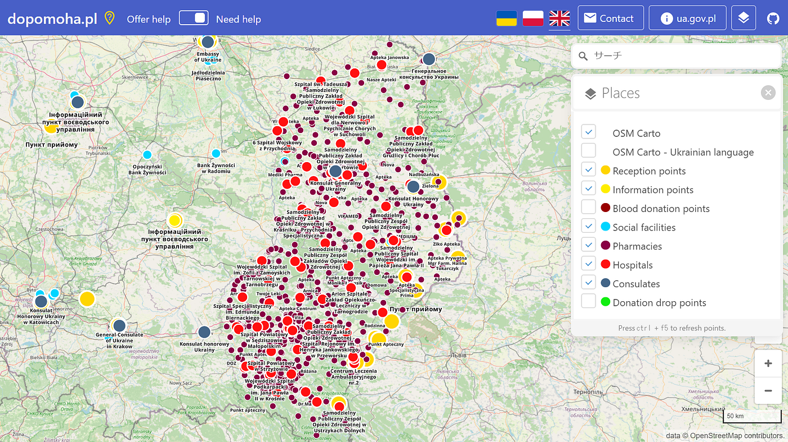
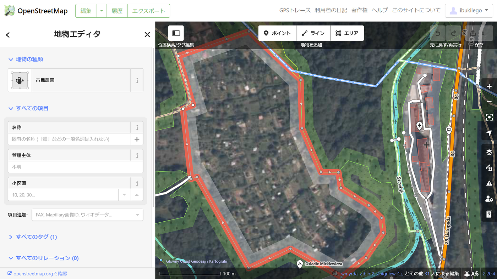

### ウクライナマッピング支援 3/11

こんにちは。YouthMappers AGUの柴山です。

[OSMポーランド運営の情報共有ポータル dopomoha.pl](https://dopomoha.pl/en/#map=7/50.538/24.055)ではウクライナからの難民支援のための各種ポイントがマッピングされていて、左上のスイッチを操作することで「支援の募集箇所」と「支援箇所」をソートすることができます。

下の画像は「支援箇所」をソートした様子です。国境部分の薬局と病院の場所が集中的に登録されていることが確認できました。

今回はその病院の中の一つ、[ポーランド ウストシキ・ドルネの総合病院](https://goo.gl/maps/mSdv4RtV9TjW7tiV8)付近をマッピングしてみました。

病院の西側を見てみると、市民農園エリア内の住宅とみられるものを含む建物が登録されていませんでした。マッピング支援をしてきた中で、山間部だとこのようなケースが多いように感じています。引き続き地道なマッピングをしていく必要があると思いました。
