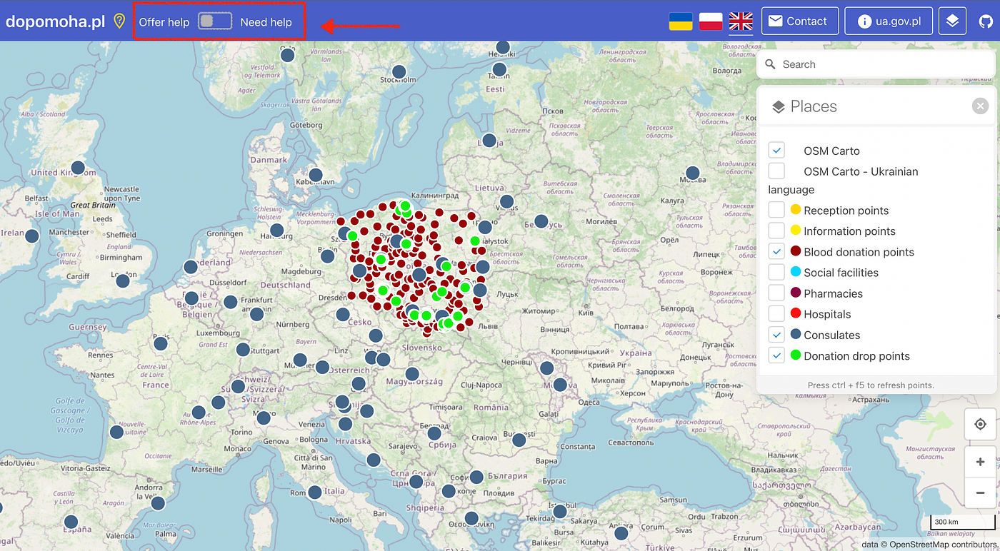
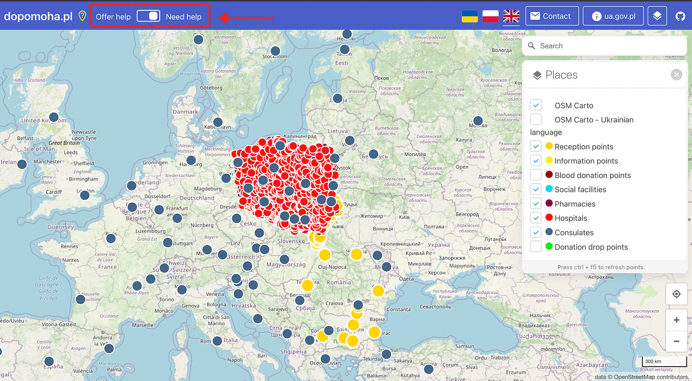
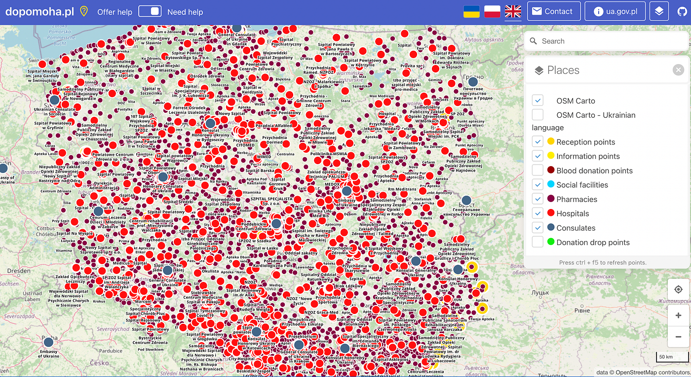

### ウクライナマッピング支援3/12

YouthMappersAGUは、ウクライナマッピング支援を続けています。

最近登場した画面左上のスイッチによって、

１、”Offer help”(支援を提供する。つまり、献血で助けたい、支援物資を届けたい、という人が行くべき場所。）

2、“Need help”(支援が必要。つまり、支援が必要な人がいる場所。）

の、２つのカテゴリーをそれぞれ分けて表示することが可能になりました。

Offer helpには、献血ポイント、領事館、寄付の受付場所の三種類のポイントが表示されます。

ぱっと見ての判断ですが、献血ポイントと寄付の受付場所はポーランドのみに見られます。逆に、ポーランド国内では全国的にプロットされています。

以下はNeed helpの設定にした時に表示されるマップです。

献血ポイントと寄付の受付場所以外の全てのポイントが表示されます。

ポーランド国内の病院がありったけプロットされているように見えます。

拡大すると、薬局もかなりの数がプロットされていることがわかります。

今までYouthMappersAGUのメンバーが投稿してきた記事に載っているスクリーンショットと見比べると、この地図がすごい勢いで更新されていることがよくわかるので、ぜひ他の記事も確認してみてください。

担当：髙橋彩子
