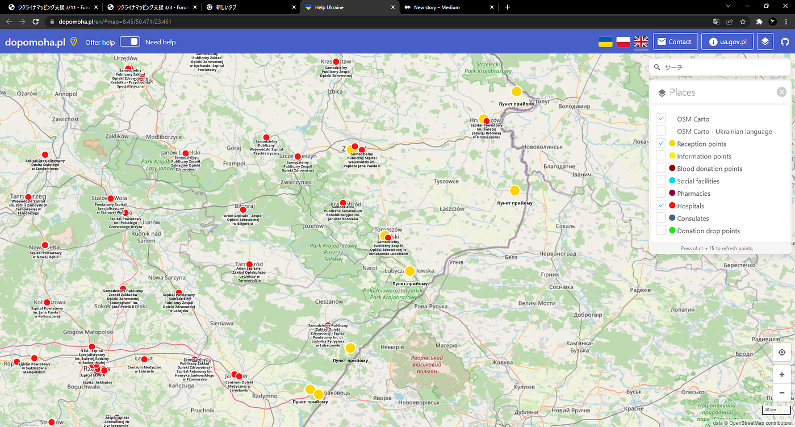
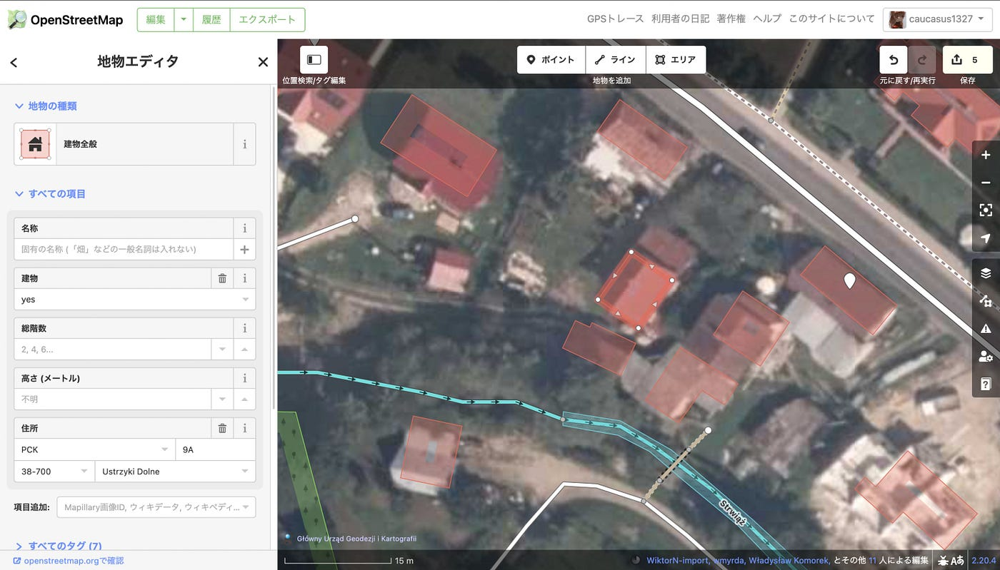

### ウクライナマッピング支援3/13

こんばんは、YouthMappers AGUの鈴木です。

本日も[OSMポーランド運営の情報共有ポータル dopomoha.pl](https://dopomoha.pl/en/#map=7/50.538/24.055)を用いてマッピングを行いました。

黄色の点で表示される難民受け入れ施設ですが、赤の点で表示される病院の位置と比べてみると、、、

写真のように国境に隣接したような病院は少なく、難民受け入れの施設に傷病者が運ばれてくる可能性を考慮すると、その輸送経路となるであろう道のマッピングも欠かせないものだと思いました。

そこで今回は難民受け入れ施設のあるUstrzykach Dolnych（ウストキシ・ドルネ）付近の住宅街やそこから内陸に向かう道路のマッピングを行いました。

建物自体がなくなっていたり、新たに増えているものなど数多く見られたほか、敷地内道路を追加すべき地点も多くあった。主要な道路はほぼ完璧にマッピングが行われていたため、物資や人の搬送、輸送に支障をきたす、至急マッピングが必要な道路は見られなかった。
