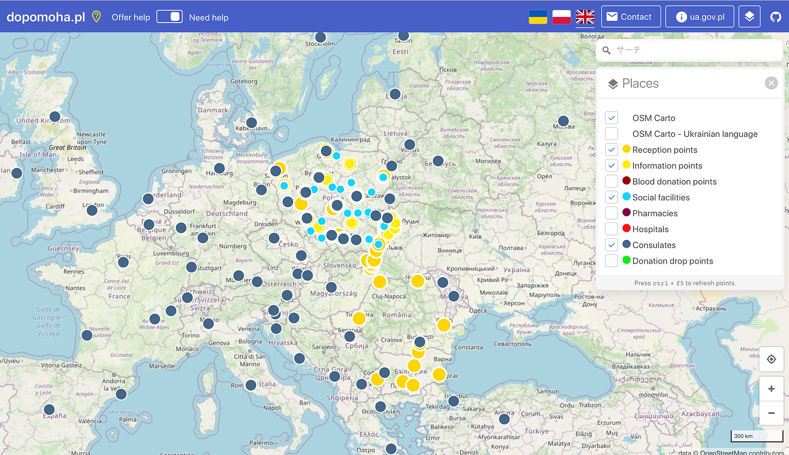
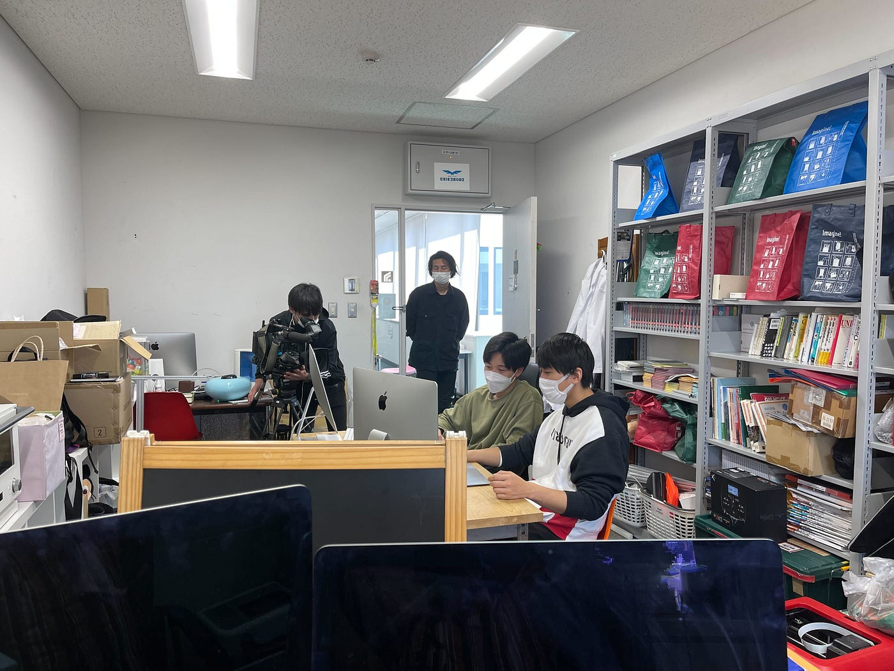
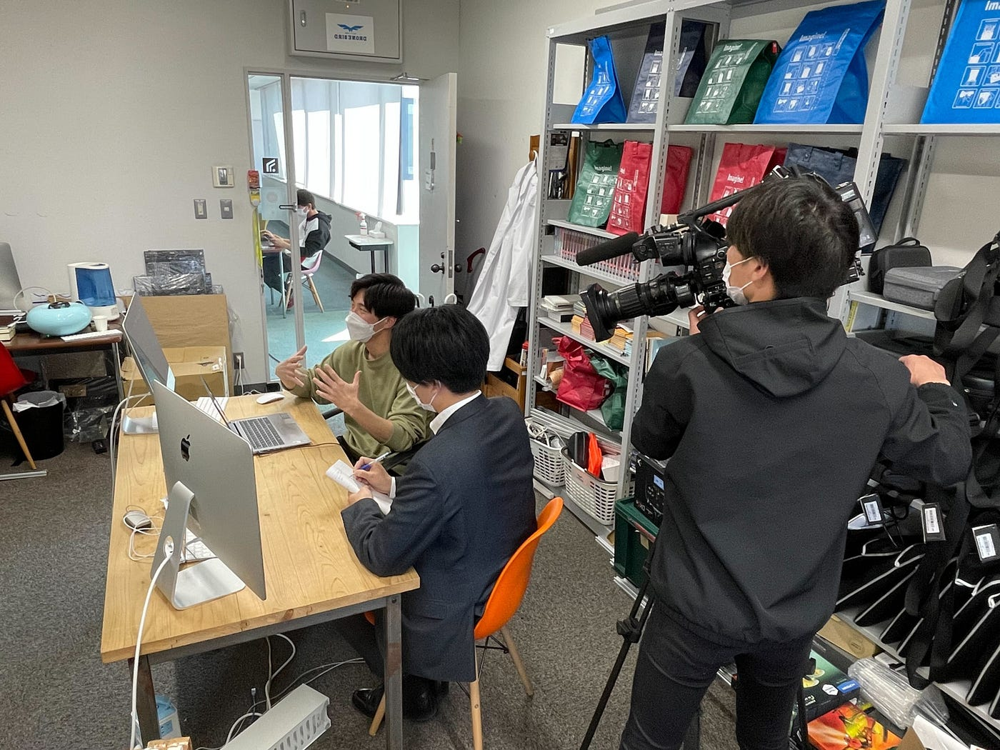

### ウクライナマッピング支援3/14

YouthMappersAGUの葉賀です。

YouthMappersAGUは、今日も引き続きマッピングを行なっています。

本日(2022年3月14日)の[OSMポーランド運営の情報共有ポータル dopomoha.pl](https://dopomoha.pl/en/#map=4/50.54/24.06)より、ポーランド周辺の様子です(下写真)。

プロットされたポイントの数に大きな変化は見られません。写真では表示していませんが、病院や薬局等のプロットも進められています。

現存する各ポイントに関する情報入力はかなり充実してきていると思われます。

3/13に朝日テレビからYouthMappersAGUの活動を取材したいと依頼があり、柴山と鈴木が代表して応じました。

以下写真は取材時の様子です。取材は感染対策を十分にした上で、青山学院大学相模原キャンパスの古橋研究室で行われました。

YouthMappersが行なっているマッピング作業の手順や、地図作りがどのようにウクライナ支援につながるのかを語りました。

マッピング支援は初心者でも比較的簡単に作業でき、場所も選ばない利点があります。

今回の取材でウクライナ支援やマッピングの可能性を広く知られ、協力者が増えることを期待したいです。

> YouthMappersAGUの活動に興味がある方は[こちら](https://github.com/furuhashilab/youthmappers4agu)。
