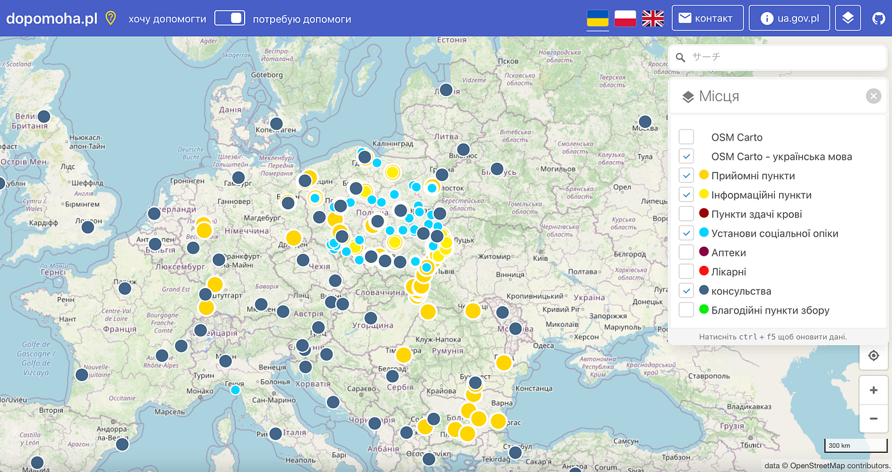
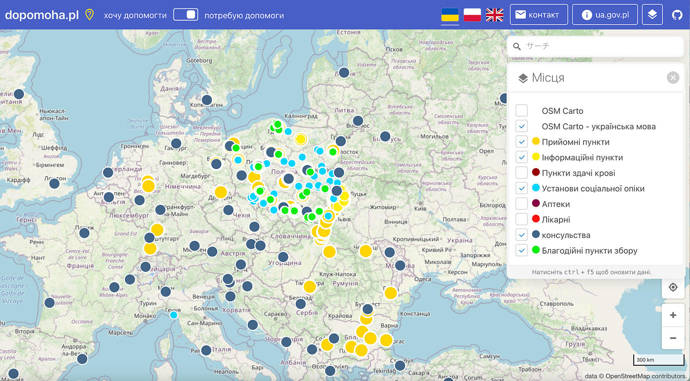

### ウクライナマッピング支援3/19

本日は、YouthMappersAGUの小野が担当させて頂きます。

YouthMappersAGUは、今日も引き続きマッピングを行なっています。

本日(2022年3月19日)の[OSMポーランド運営の情報共有ポータル dopomoha.pl](https://dopomoha.pl/en/#map=4/50.54/24.06)より、ポーランド周辺の様子です(下写真)。

水色の丸印である、難民の受け入れなどを行なっている施設が増えているように感じます。

そして、黄緑色の丸印である、寄付を受け付けてくれるポイントも増えているように感じます。

寄付が最良の解決策であるとは言い切れませんが、良い風潮であることは間違いありません。

ウクライナの方々のために自分たちができる最大のことを、これからもやっていきたいと考えています。
