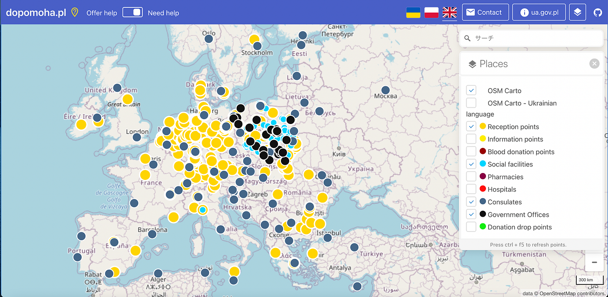
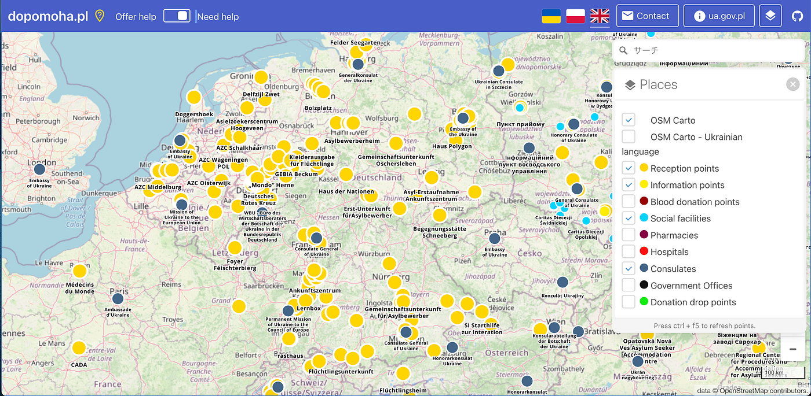

### ウクライナマッピング支援 3/20

こんにちは！本日は3年の菊池が担当いたします。

YouthMappers AGUでは本日も[dopomoha.pl](https://dopomoha.pl/en/#map=4/50.54/24.06)によるマッピングによる支援を行なっています。

前日比較して、マップに大きな変化がありました。

一目でわかるほど難民受け入れ所の数が増えました。ドイツを中心にスイス、ベルギー、オランダなど多くのヨーロッパの国での受け入れが進んでいることがわかります。受け入れ所の数が少ないところでも、イギリス、イタリア、スペイン等も設置を始めいているようです。非常に大きな前進だと思います。

受け入れ所の増加があるということはマッピングの需要も高まるということだと思うので、さらに多くの地域をマッピングしていけたらと思います。
