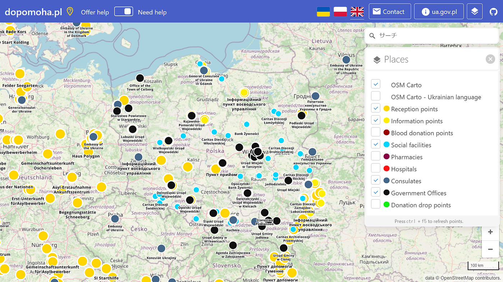
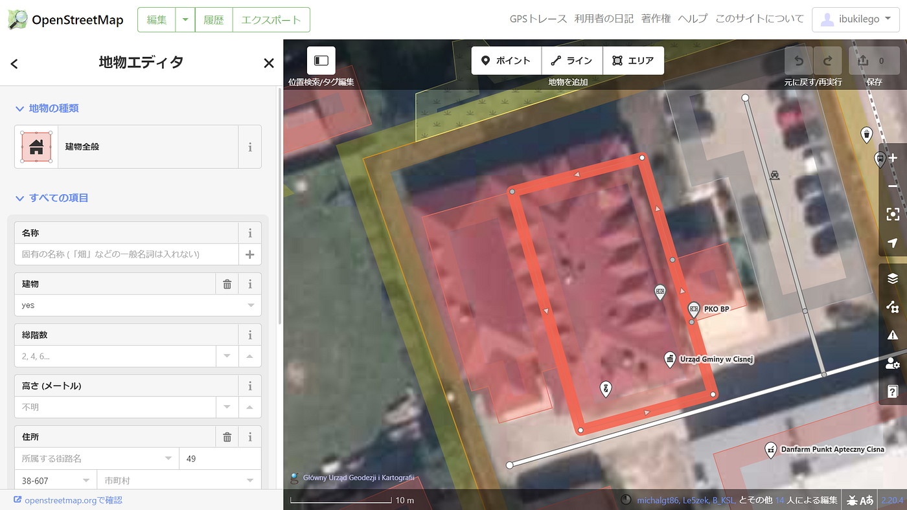

### ウクライナマッピング支援 3/21

こんにちは。YouthMappers AGUの柴山です。

昨日の記事で報告があったように、[dopomoha.pl](https://dopomoha.pl/en/#map=4/50.54/24.06)上での難民受け入れ場所がさらに広範囲にわたって新たに登録されました。

また、Placesのポイントに ”Government offices”（黒色）が追加されました。

これらのポイントはポーランド政府の官公庁の位置を示していて、国内各地に分布しています。

今回はその中でも最南端でウクライナとの国境付近にある[チスナ市役所](https://www.openstreetmap.org/?mlat=49.21249&mlon=22.32773#map=18/49.21249/22.32773)周辺をマッピングしてみました。

市役所の建物のポリゴンが直行化できていなかったので修正しておきました。他にも直行化ができていない建物があったり、登録できていないものも確認できました。

[市役所ホームページ](https://gminacisna.pl/)を確認したところ、難民の人々のためのIDナンバーの発行や、子どものワクチン接種などの支援を行っているようです。難民の方々が支援を得られる場所へアクセスできるように、また支援団体が迅速に行動できるようにマッピング支援を行っていきたいです。
