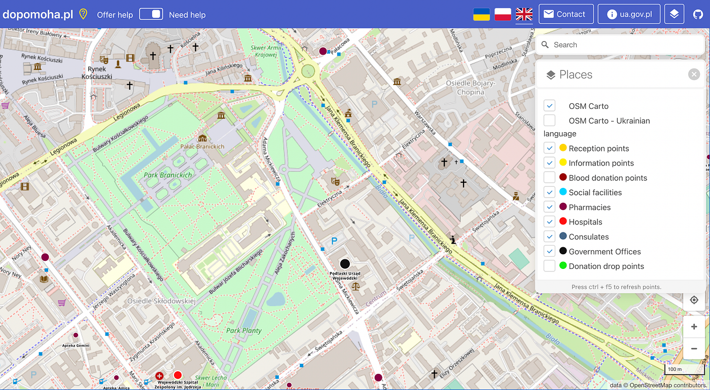
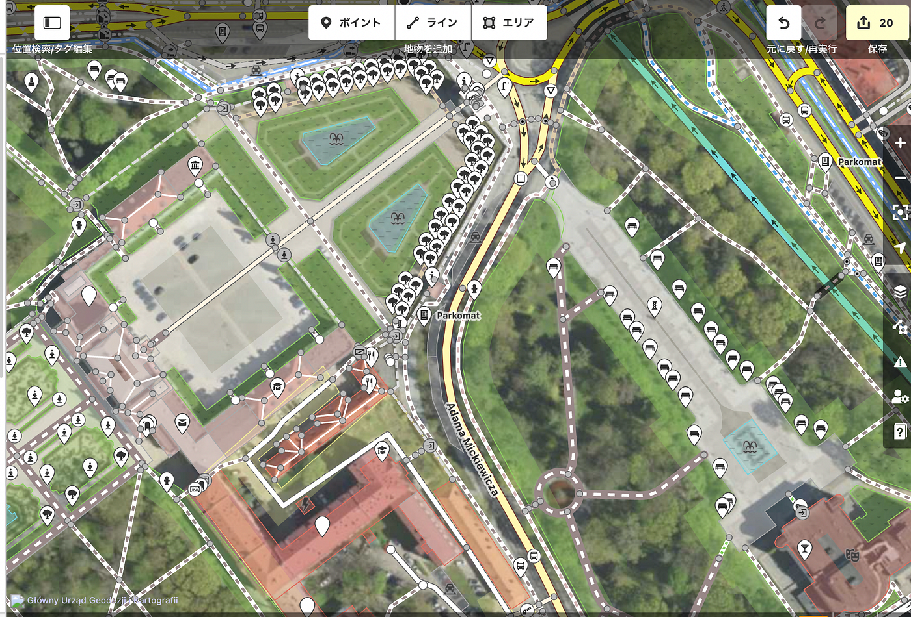

### ウクライナマッピング支援3/23

ウクライナ東部のGovernment Officesの一つを拡大すると、大学などの教育施設が隣接しているようでした。

さらに詳しく見てみると、

背景の衛生画像が見えず楽なるほど細かくマッピングされていることがわかります。

画面中央上部の道では木の一本一本までマッピングされています。

まだ[dopomoha.pl](https://dopomoha.pl/en/)で「教育機関」を示すプロットはありませんが、学校の場所も子ども連れの避難者にとっては重要な情報なはずです。

上で紹介した地域のように植えてある植物を一つ一つマッピングする必要はないにしても、

プロットのある「領事館」や「献血場所」だけでなく、マッピングされていない施設はできるだけマッピングすることが今後のためになるのではないかと思います。

担当：髙橋
