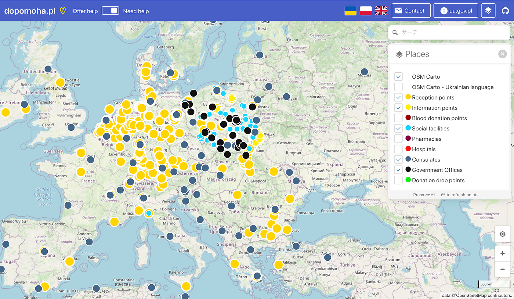
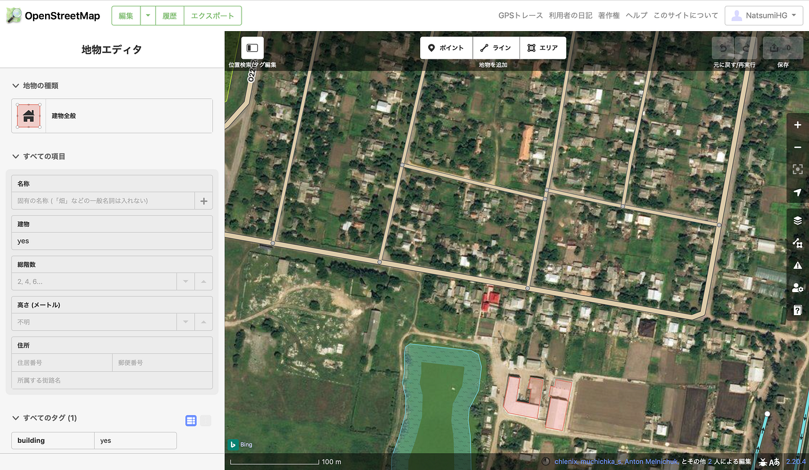
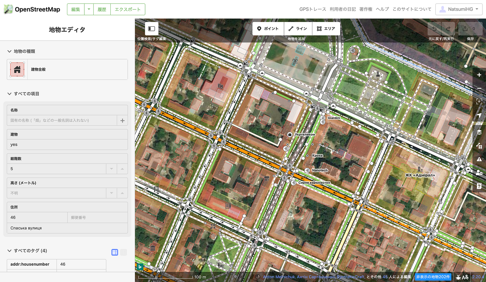

### ウクライナマッピング支援3/24

こんにちは。YouthMappersAGUの葉賀です。

今日はウクライナとロシア間で初の捕虜交換が行われたと報道がされていました。

連日ウクライナの悲惨な様子が伝えられていますが、少しでも和解の方向に進んでいるのでしょうか。

１日でも早い事態の収束と平和を願って、YouthMappersAGUは支援を続けています。

さて、本日は(2022年3月24日)の[OSMポーランド運営の情報共有ポータル dopomoha.pl](https://dopomoha.pl/en/#map=4/50.54/24.06)より、ポーランド周辺の様子です(下写真)。

[Institute for the Study of War](https://www.understandingwar.org/backgrounder/ukraine-conflict-updates) のホームページより、

ウクライナのヘルソン州がロシアが支配したとみられる地域とレポートされていたため、その周辺を覗いて少しマッピングしました。

ヘルソン州にあるこの街では、建物の損壊は見られないもののマップ内下部の建物以外のマッピングがされていませんでした。

一方、同レポートよりヘルソン州の真上に位置するムィコラーイウ(ニコラエフ)は、ウクライナによる反攻が続けられている地域のようです。

こちらはかなり細かくマッピングが進んでいることがわかります。少しずれや複数の建物を１つにまとめてマッピングしている部分があったため、修正しました。

やはり、現地の人々が今住んでいる地域や避難している地域のマッピングは優先度が高く、対応が急がれます。

ウクライナの方々にとって必要なマッピングができるよう、日々更新されていく情報をしっかり確認しながら支援を行なっていこうと思います。
