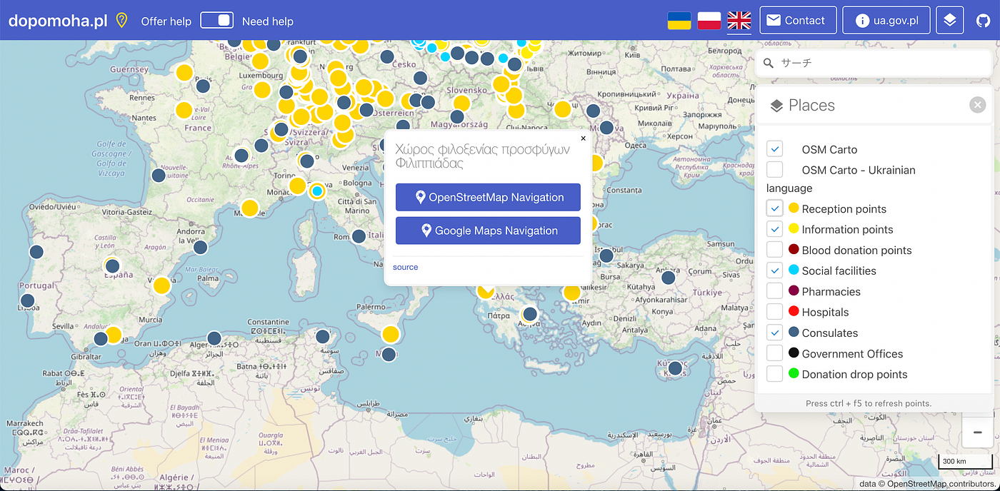
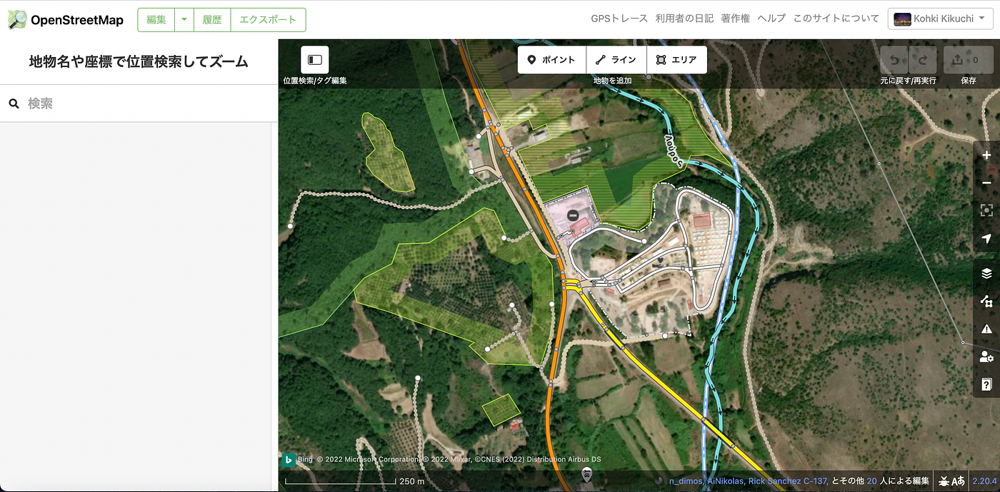
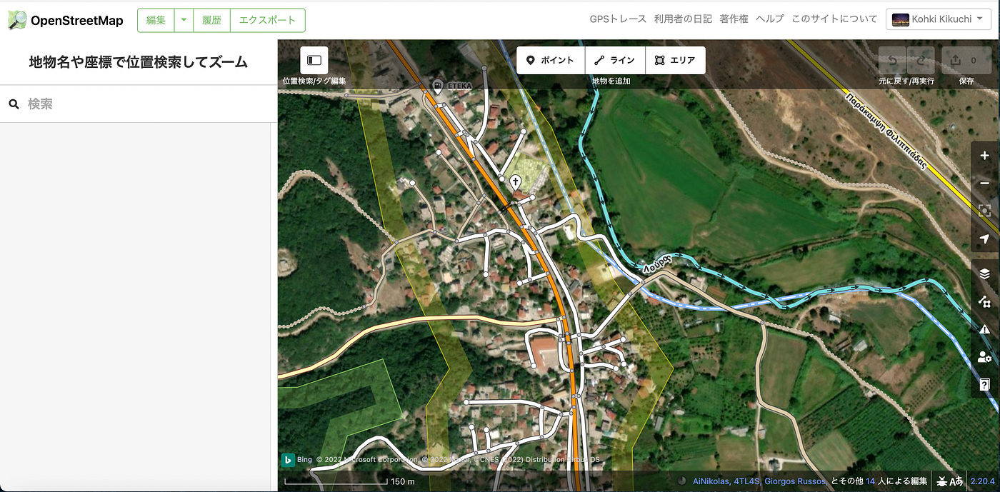

### ウクライナマッピング支援 3/31

こんにちは！本日は3年の菊池が担当いたします。

YouthMappers AGUでは本日も[dopomoha.pl](https://dopomoha.pl/en/#map=4/50.54/24.06)によるマッピングによる支援を行なっています。

ヨーロッパ全土に広がった難民受け入れ所ですが、他のメンバーの報告の通り、マッピングはかなり進んできました。今回私が着手したのは、ギリシャのフィリッピアダです。

ここが難民受け入れ所のマッピング状況です。川や道は正確にマッピングされている一方で、建物はあまりマッピングできていません。

周辺の町を見てみるとこちらも建物が不完全です。実際に難民の方達がここで生活するためには、建物のマッピングはもちろん、スーパーや役所、病院などの施設の情報が不可欠です。ヨーロッパの中心地だけでなく、こういった場所もマッピングが進むといいと思いました。
