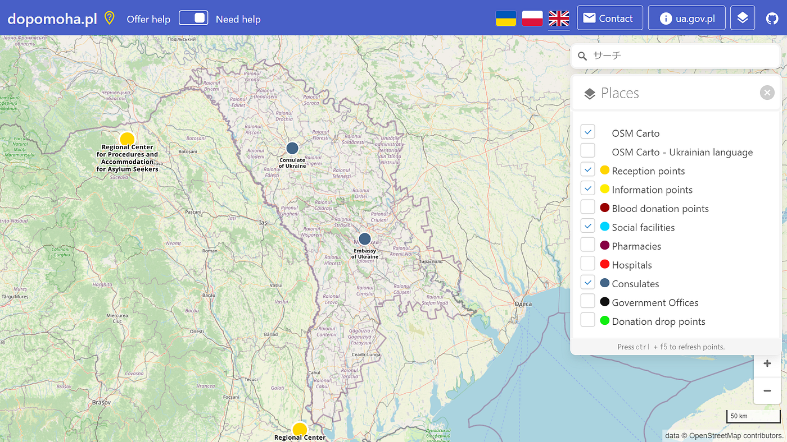
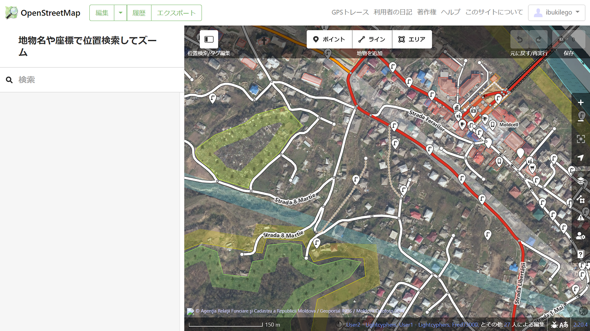

### ウクライナマッピング 4/5

こんにちは。YouthMappers AGUの柴山です。

2月末にウクライナ避難民の方々のためのマッピング支援活動を始め、早くも1ヶ月が経過しました。[テレビニュース](https://news.tv-asahi.co.jp/news_society/articles/000248087.html)や[青学公式ウェブサイト](https://www.aoyama.ac.jp/faculty112/news_20220317?fbclid=IwAR1FbWfKArSFpJ-3KO0SmSL8oUyj9sMgAiKH6fY_8l8bp-Jt8cveZ8gvdO4)にて活動をご紹介していただいた他、イベントの場で[ひろゆき氏](https://news.yahoo.co.jp/articles/c1bfdd036606065e858626db0ff2199fa4118e50?page=2)にも言及していただき、我々の支援内容が広まりつつあると実感しています。

その一方、長期にわたって不安や恐怖の中避難生活を続けている人々のことを思うと胸が痛みます。我々が編集した地図が避難生活や現地の支援活動に少しでも役に立つように引き続きマッピングをしていきたいです。

今回はウクライナ南部に接する国、モルドバに注目しました。

現在モルドバには[JICA](https://www.jica.go.jp/press/2022/20220405_22.html)のメンバーが支援活動をしているため、その基盤として地図情報が大いに役立つと考えられます。

しかし、ポーランドのosmコミュニティによって支援関連ポイントがまとめられた[dopomoha.pl](https://dopomoha.pl/en/#map=6.56/47.57/28.771)を確認すると、モルドバ国内に登録されているピンが少ないことが確認できます。また、OSM上にも登録されていない建物が多く存在しているようです。

上の画像はウクライナと接するモルドバ北部の[Otaci](https://www.openstreetmap.org/#map=15/48.4397/27.7837)という町の様子ですが、街の中心地から少し離れた地域からの建物がほとんど登録できていません。このような状況を踏まえ、YouthMappers AGUや古橋研究室のメンバーでモルドバ国内を集中的にマッピングしていく方針です。
