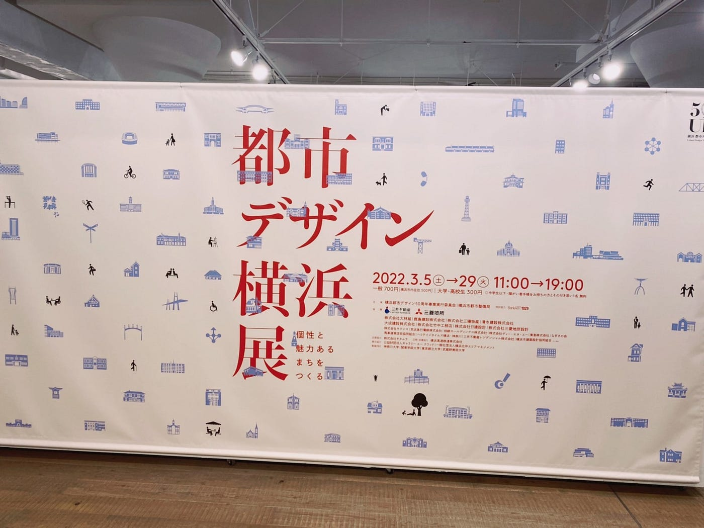
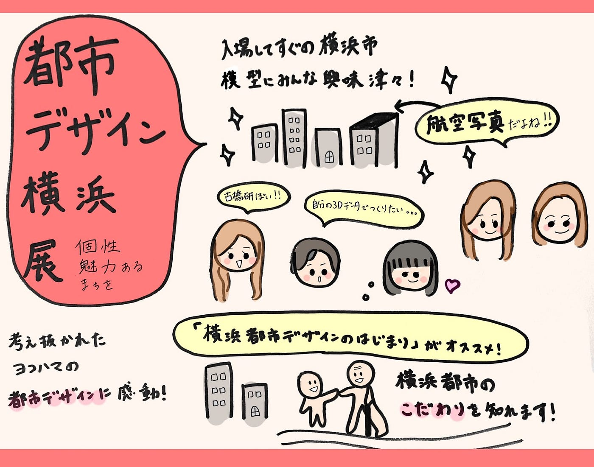

### デザイン部フィールドワーク

こんにちは、うららです！

投稿するのが遅くなりましたが、3月22日にかほるさん、ゆうかさん、あつこさん、いぶき、うららで横浜で現在開催されている「都市デザイン横浜展」に行ってきました！

[都市デザイン横浜展 個性と魅力あるまちをつくる
4月5日(火)～8日(金)17時45分から。先着15名。 集合時間までに会場にご入場ください。 都市デザイン50周年記念事業の⼀環として3⽉5⽇（⼟）より開催しております「都市デザイン…toshide50.com](https://toshide50.com/)

1971年に全国に先駆けて、横浜市役所内に「都市デザイン」担当を設置し、進められてきた横浜の都市デザインについて50年間の歴史を振り返りながら具体的な取り組みなど紹介されている非常に興味深い展示です。

最初に私たちを迎え入れてくれたのは横浜市の模型です。おそらく航空写真から建物の上部を切り取って貼っているであろう古橋研究室に関係大ありな模型にメンバーみんな興味津々で長いこと見ていました。

航空写真を見ているようで面白かったです。

建造物の天井部分は航空写真からのようですが、側面は似通ったものもあり、建物テクスチャの写真素材を使用しているのかなとみんなで予想していました。

写真撮影は可能でしたが個人利用の範囲でとのことでしたので、皆さん実際に行ってご自分の目でぜひ！

沢山の展示の中でも個人的に一番気に入っていたのが「横浜都市デザインの始まり」というものです。

都市デザインが始まる際に「７つの目標」がたてられました。

私が一番感銘を受けたものが目標1つ目の「歩行者活動を擁護し、安全で快適な歩行者空間を確保する」というものです。

これは人が横浜を歩く際に安心して堂々と歩くことができ、老人も子どもも目的地まで車に圧迫されることなく気持ちよく歩くことができることが都市生活を豊かにする基本的な要件である、ということなのだそうです。

これを読み、自分が横浜に行く際に無意識に感じていたことを思い出しました。横浜は私が遊びに出かける都市の中でも最も道幅も広く、階段は決して多くない、ユニバーサルデザインのような街だな、と！

これを最近ではなく50年前にたてられた目標なのだから驚きです。

本当に市民のことを考えて作られているのだと、（私は横浜市民ではないですが）感動しました。

他にも横浜市が都市でありながら自然豊かな理由や美し夜景、歴史ある建造物の数々など、魅力がいっぱいの展示です。

もっといろいろな学んだことも書こうと思いましたが、これ以上書くとこれから行く人のネタバレになりかねないのでこれで終わりにします。

嬉しいことに好評につき4月24日（日）まで延長になったそうです。

古橋研究室の皆さんぜひお時間があるときに足を運んでみてください。

> **タイトル「都市デザイン 横浜」展 〜個性と魅⼒あるまちをつくる〜**

> 開催⽇程：令和４年３⽉５⽇（⼟）〜４⽉２４⽇（日） 11時〜19時

> （最終⽇は17時まで）
（4⽉以降の⽉曜⽇：4⽇、11⽇、18⽇は、休館日となります。）

> 会場：BankART KAIKO
（横浜市中区北仲通5–57–2 KITANAKA BRICK&WHITE 1F）

> 料⾦⼀般:700 円（横浜市内在住:500 円）/⼤学・⾼校⽣:300円
中学⽣以下・障害者⼿帳をお持ちの⽅とその付き添い１名:無料
ご本人に限り会期中何度でも入場可能主催横浜都市デザイン50 周年事業実⾏委員会、横浜市都市整備局

グラレコ

