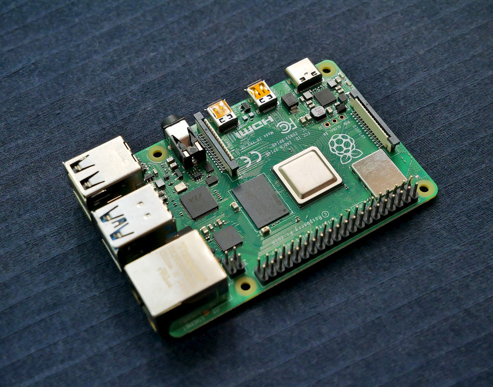
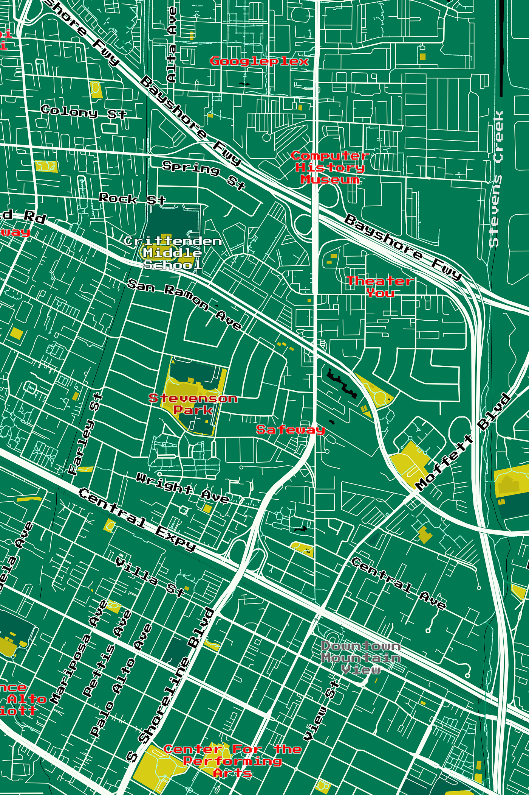
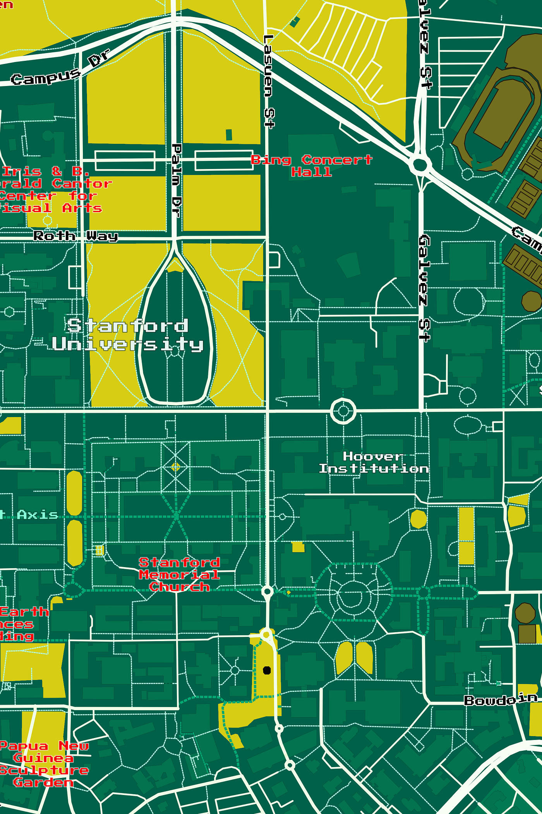
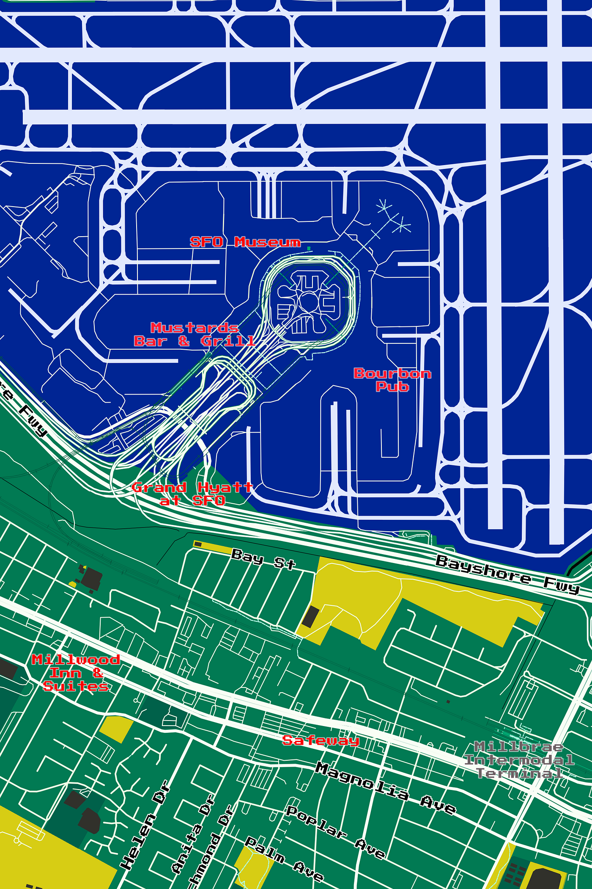
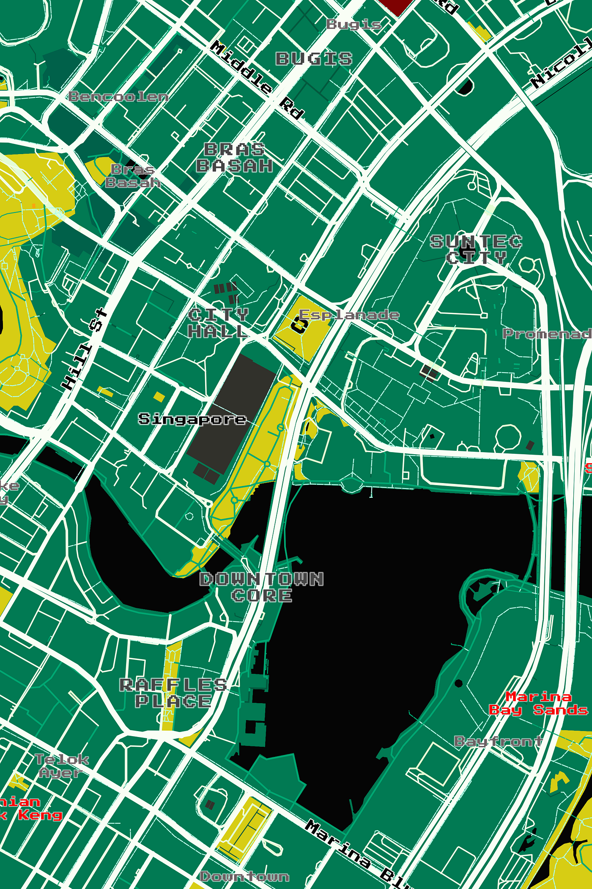
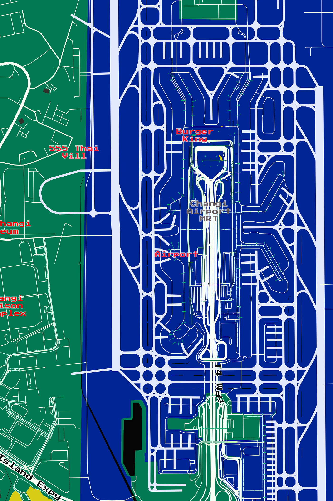
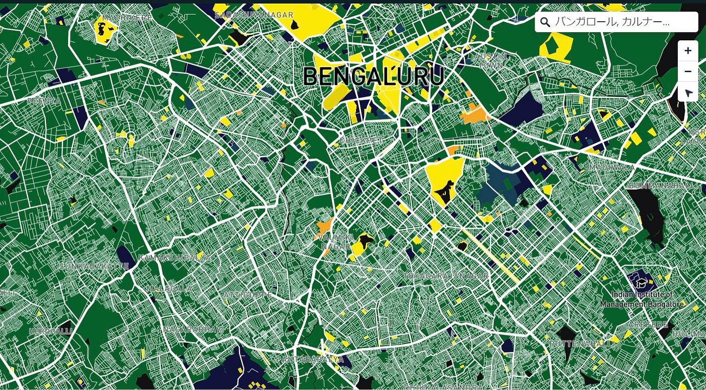
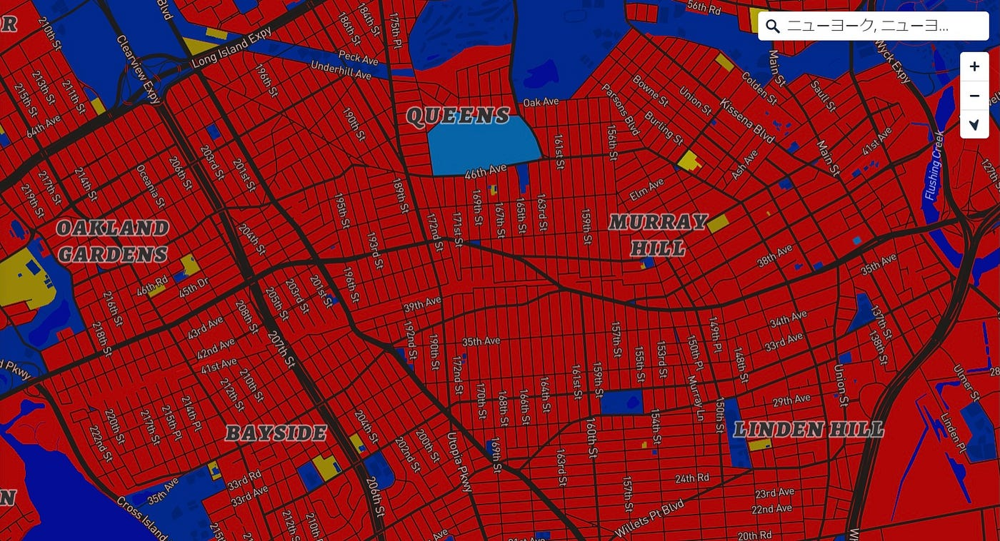

### トートバッグハッカソン 柴山・吉田チーム

こんにちは。4年の柴山です。

古橋研究室 2022/4/5–12 トートバッグハッカソンの発表用記事です！

今回のお題は「地図×トートバッグ」。Mapbox Studioを利用してトートバッグにプリントするための地図デザインを行いました。

> Introduction

柴山・吉田チームが決めたテーマは「地図×トートバッグ×プリント基板」です。地図、トートバッグにプリント基板という要素を加えたデザインに挑戦しました。

プリント基板の要素を加えた理由は、地図、トートバッグのそれぞれとの相性に可能性を感じたからです。

まず地図×プリント基板では、視覚的に類似した特徴を持っているといえます。地図で表示される建物は基板上の電子部品に、道路は配線に似ています。この類似性から、「プリント基板かと思ったら地図だった。」と感じられるような地図デザインができると考えました。また、デジタルという要素を持つ点が共通しています。

次にトートバッグ×プリント基板の相性です。まず布製品に「プリント」する行為と、基盤に電子部品や配線を「プリント」する行為が共通しています。また、両者とも機能性が追求された設計になっています。ここまでは共通するポイントでしたが、今回は両者の相反する要素にも注目しました。例えばアナログ×デジタル、シンプル×コンプレックス、入れ物×中身といった点です。このように相反する2つを組み合わせることで対比を利用した斬新なデザインができると考えました。

> Methods

テーマが決まり、今度は場所についても関連するエリアを検討してみました。プリント基板から連想されるのは情報系の技術や産業だったため、世界の中でIT産業が盛んな都市を挙げてみました。その中から今回はシリコンバレー、シンガポール、バンガロールに絞ってMapbox Studioでデザインを行ってみました。

カラーリングはプリント基板の代表的なタイプに合わせ、Baseを緑や青、Roadsを白、Waterを黒、その他の地物を金色や赤などに設定しました。

> Results

シリコンバレー周辺

シンガポール

バンガロール

> Discussion

プリント基板風のデザインを3つの都市周辺で試した結果、基板らしくなる地域とそうでない地域に分かれました。

基板らしくなる地理的な特徴としては、直線的な道路（高速道路や滑走路）が多い点や、道路・地物の密集度が高い点が読み取れました。特に、並行に連なる直線的な道路や環状の道路はより基板らしさを高める要素であると感じます。

それに対し、格子状の道路や曲線的な道路、水域が多い個所はあまり基板らしくなりませんでした。

> Conclusion

今回試した地域の中では、シリコンバレー周辺が最もプリント基板らしくデザインできました。しかし、配色を変えることでそれぞれの地域にあったデザインが見つかるかもしれません。

> 提出版デザイン

> 試作品

> スライド
