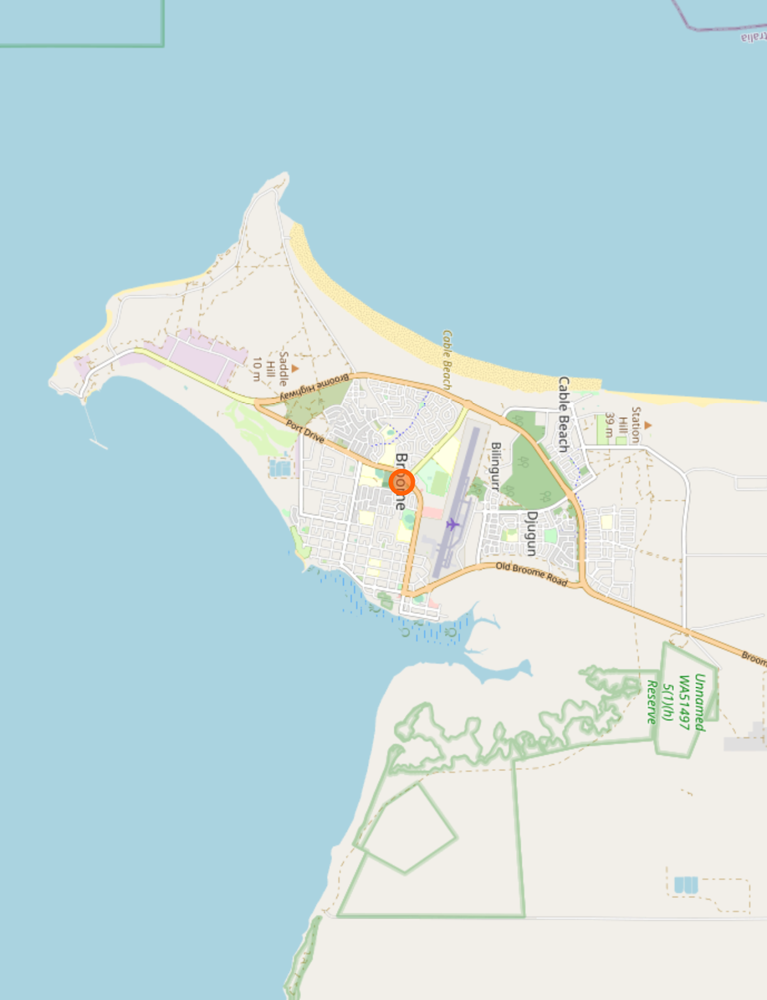
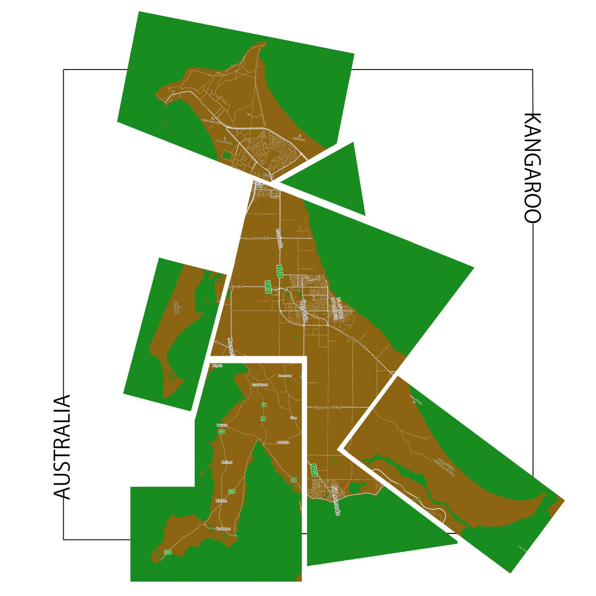
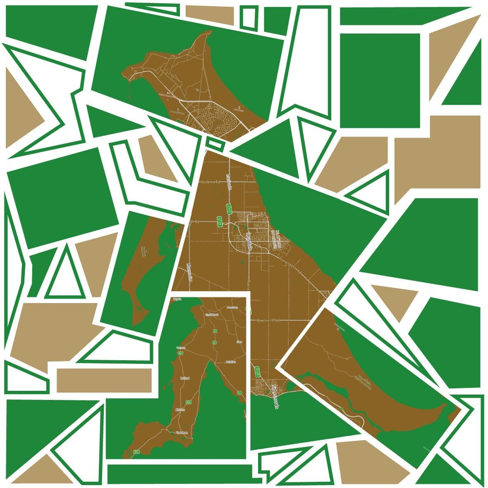
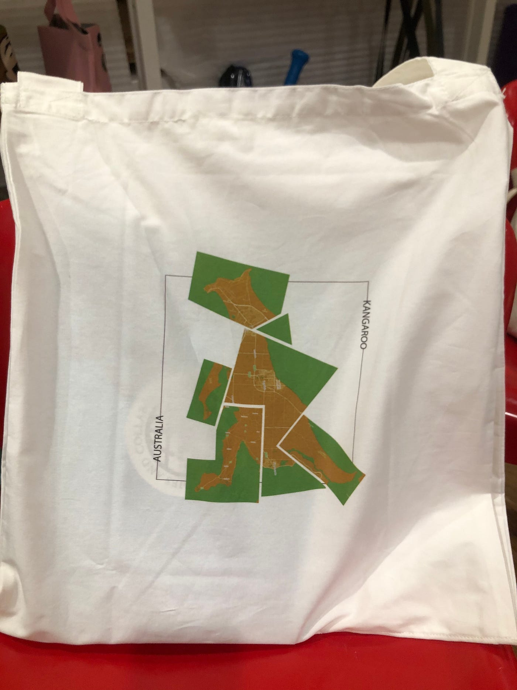
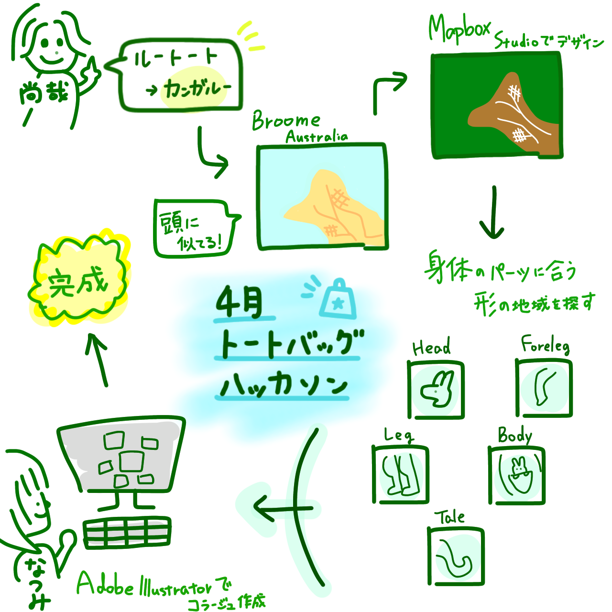

### ４月ルートートハッカソン

こんにちは、4年葉賀と3年植松です。

今回のハッカソンは2人1組のペアでMapbox Studio を使ってルートートーのトートーバッグの新しいデザインを提案するというものでした。

ルートートーのトートバッグはカンガルーのお腹のようなサイドポケット、通称ルーポケットが特徴です。またルートートーの名前もカンガルーの語尾のルーからとっているそうです。

その点に注目し、カンガルーに関係するデザインを作ることに決めました。

デザインアイデア模索中、オーストラリアにあるブルームという都市の地形がカンガルーの頭の形に見えるという事実を発見しました。そこでオーストラリア中のカンガルーに似た地形を集め、結合し、地形地図でカンガルーを作ることにしました。

Broome,Australia 制作する際のポイントとして自然を意識した緑と茶色の配色でデザインしました。

また前に進むことしかできないカンガルーの特徴から「前進あるのみ」ということで利用者の更なる飛躍と発展を願うという思いを込めました。

カンガルーの身体全ての地形地図収集後、Adobe Illustratorを用いてコラージュを完成させました。(以下画像)

作品の改善点としてカンガルーの形作りを重視しすぎたため、細部の地図が薄くなり地名がわからなくなってしまったという点が挙げられます。

このデザインをきっかけに、オーストラリアの地形やMapbox Studioに興味を持っていただけたら幸いです。

＜ 使用した各身体パーツは以下参照 ＞

> ・[head](https://studio.mapbox.com/styles/natsumiim/cl1rv814m000h15pe0ee34w36/edit/#13.12/-17.97632/122.20612/-97.3)

> Broome, Australia

> ・_[ body_](https://studio.mapbox.com/styles/natsumiim/cl1rv814m000h15pe0ee34w36/edit/#11.12/-38.152/144.5979/-97.3)

> Drysdale, Australia

> ・[foreleg](https://studio.mapbox.com/styles/natsumiim/cl1rv814m000h15pe0ee34w36/edit/#9.07/-25.2834/153.0784/-97.3)

> Great Sandy National Park, Australia

> ・[leg](https://api.mapbox.com/styles/v1/naoyaa/cl1qm4jhu00cg14nwpdifhge0.html?title=copy&access_token=pk.eyJ1IjoibmFveWFhIiwiYSI6ImNsMXFqeml0ejE1bWQzam10b2RoZHFrNjcifQ.shfDTmh_FOVM-vFy_y7l0Q&zoomwheel=true&fresh=true#6.78/-34.343/137.528/0/34)

> Yorketown, Australia

> ・ [tale](https://api.mapbox.com/styles/v1/naoyaa/cl1qm4jhu00cg14nwpdifhge0.html?title=copy&access_token=pk.eyJ1IjoibmFveWFhIiwiYSI6ImNsMXFqeml0ejE1bWQzam10b2RoZHFrNjcifQ.shfDTmh_FOVM-vFy_y7l0Q&zoomwheel=true&fresh=true#10.58/-34.9941/116.8049/7.5/23)

> Walpole Nornalup National Park, Australia

＜完成品＞

ハッカソン当日、デザインしたものが実際にトートバックに印刷されました(以下写真)。

＜グラレコ＞

＜発表用スライド＞

＜GitHubプロジェクト＞

[totebaghackathon · furuhashilab/Totebaghackathon-Naoya-Natsumi
You can't perform that action at this time. You signed in with another tab or window. You signed out in another tab or…github.com](https://github.com/furuhashilab/Totebaghackathon-Naoya-Natsumi/projects/1)

More from NAOYA UEMATSU
