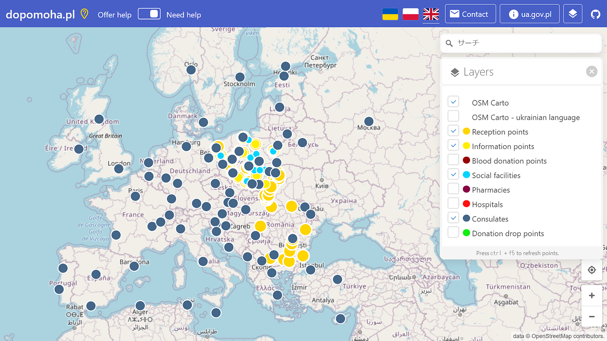
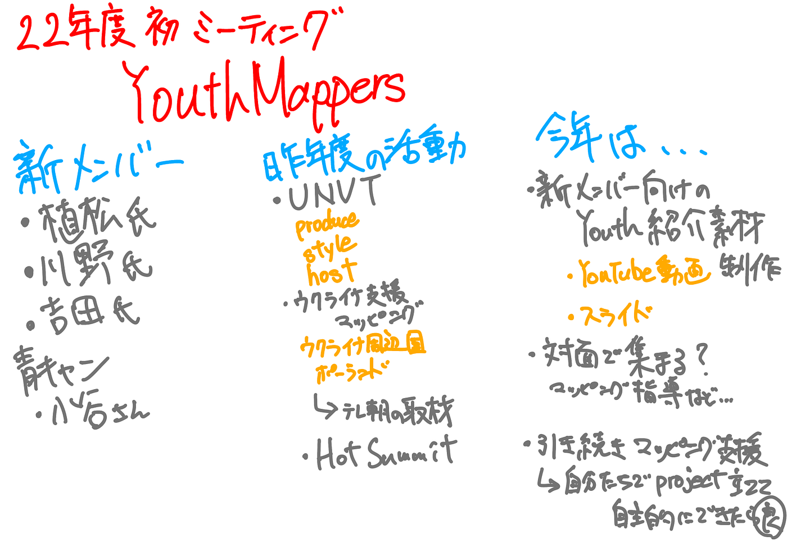

### YouthMappers AGUの春休みとこれから

こんにちは！4年の柴山です。

ゼミ生3年生の新しい仲間を迎え、新学期最初の週報をお送りします。

YouthMappers AGUは春休みの間も活発に活動を行いました！

> UNVT Online Workshop with HOT 2022

3/16日、アジアのOSM、HOTのコミュニティの方々向けにUNVTについてレクチャーを行いました。ゼミ生のメンバーとも協力しながら、UNVTとは何か、参加者の方々の地域ではどのように利用できるのかについて英語で伝えるということに挑戦しました。

発表準備を通してUNVTについての理解が深まったと同時に、アジア諸国の課題の発見やその解決について自分たちなりに考えることができました。今回参加いただいた国土地理院の藤村英範さんからもお褒めの言葉をいただき、更にUNVT利用の活発化に貢献していきたいと感じています。今後はハンズオン形式のワークショップを実施するために、まずはメンバーがUNVTのProduce、Style、Hostの操作ができるようになることを目標にしていきたいです。

UNVT Online Workshop with HOT 2022 発表スライド

> ウクライナ支援マッピング

2月末から現在進行形で行っているのがウクライナ支援マッピングです。この活動は、ロシアの攻撃から国外へ避難するウクライナ難民の移動や生活、その支援に貢献することを目的としています。

2月末~3月にかけてはポーランドのOSMコミュニティによって病院や国内の支援に関連する場所がまとめられた[dopomoha.pl](https://dopomoha.pl/en/?fbclid=IwAR3N5E_RCi0Dm4pHhYKo0MkOHjvKwPGbXSB2qQlVkZYqq1QD-eDoO4GZjmU#map=4.86/51.41/24.37)を基にマッピングを行いました。支援プロジェクトの初期段階から支援に参加し、地物やPOIの登録が徐々に増加していく光景を目の当たりにしました。

4月からはウクライナ南部に接する国、モルドバを集中的にマッピングしています。現在モルドバには[JICA](https://www.jica.go.jp/press/2022/20220405_22.html)のメンバーが支援活動をしているため、その基盤として地図情報が大いに役立つと考えられます。YouthMappers AGUや古橋研究室のメンバーでモルドバ国内の特定の地域を集中的にマッピングしていく方針です。

[HOT Tasking Manager
Tasking Manager is a the tool for coordination of volunteers and organization of groups to map on OpenStreetMap.tasks.hotosm.org](https://tasks.hotosm.org/projects/12405/)

これからはUNVTのレベルアップやウクライナ支援の継続を目指しつつ、[今年の方針](https://medium.com/furuhashilab/youthmappers-agu-2021-to-2022-9c1864f6e651?source=collection_home---1------3-----------------------)としていた海外マッパーやコミュニティとの交流も実現させたいです。現在はYouthMappers UCCとのWheelmapイベントを企画中です。

新しく加わった仲間たちと一緒に様々なことに挑戦していきます！

> グラレコ

