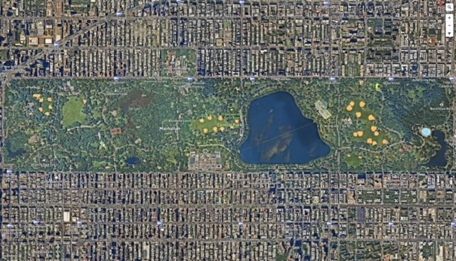
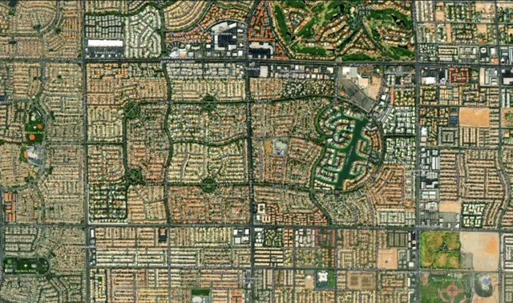
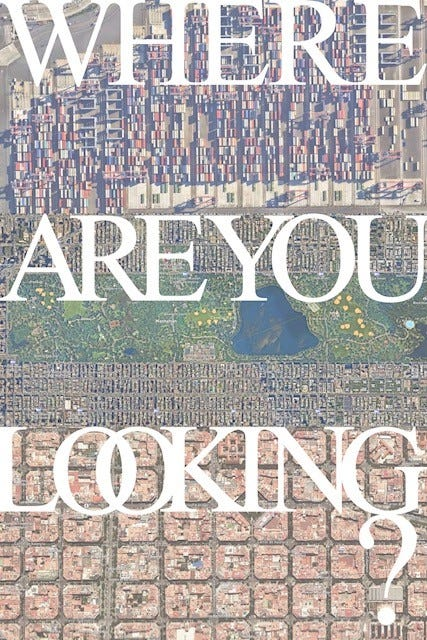
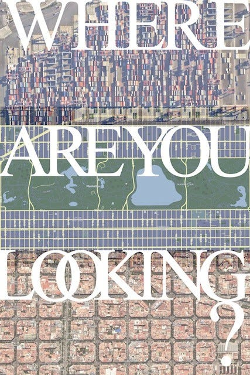
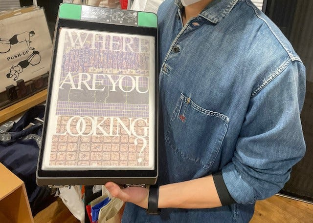
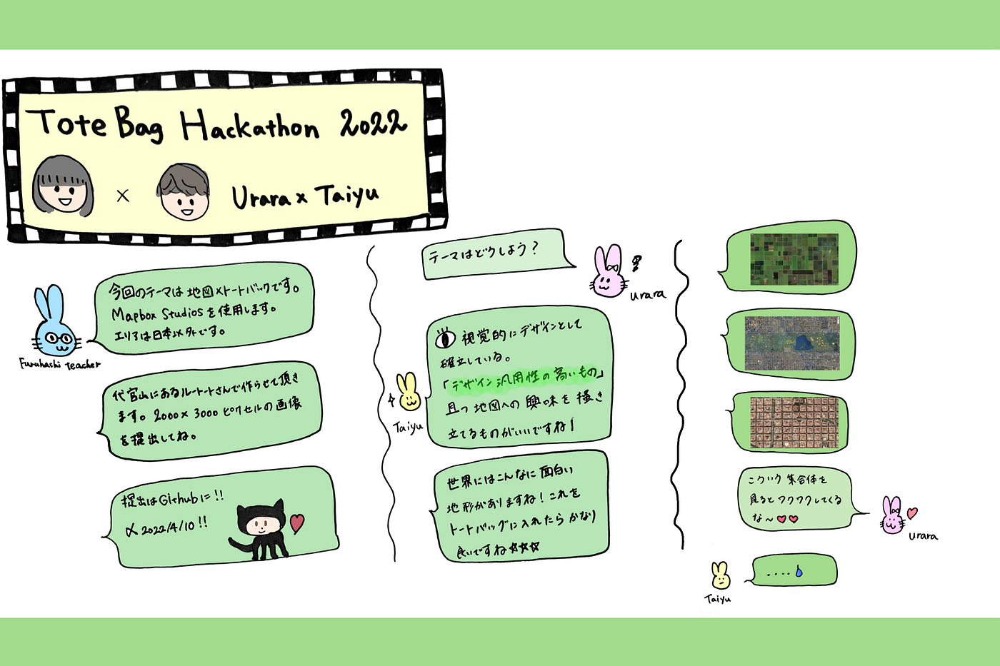

### トートバッグハッカソン小澤・長島

こんにちは！Taiyu ×Urara チームです！

4/12(火)に代官山のROOTOTEさんとトートバッグハッカソンを行いました！

現地ではMapboxさんとRICOHさんにも来ていただき、時間を忘れるほど盛り上がるワークショップに！

皆様、ありがとうございました。

ここからはTaiyu×Uraraチームのハッカソンで目指すものやコンセプトデザインなど、書き記していきます。

Q1: 今回のプロジェクトのコンセプトや目標は何だろうか。

A:

ルートートさんの目的：完全に他分野である「地図」だとか「空間情報」的なデザインと、トートバッグとの組み合わせがどうなるのかの調査

Mapboxさんと古橋ゼミの目的：トートバッグという汎用性が非常に高いものと地図を組み合わせる事で、地図だとか空間情報という認識的に馴染みのない分野に興味も持ってもらう、もしくは関心を持ってもらうキッカケ作りとして。

Q2:目指すべきものは？

A:デザイン的にも汎用性が高い（地図的な意味合いが強いだけじゃなく、視覚的なデザインとしても成立してる）、かつ地図•空間情報的な興味を掻き立てるデザインを！

まずはMapbox studiosで「純粋に視覚的に面白い衛生画像」を集め、この面白い画像はどこでしょう？的な感じのデザインに！⭐︎地図の初歩的な面白さで興味を惹けるようなデザイン

**試作品**

**最終決定**

あえてセントラルパークという文字を隠し、地図に対しての関心を生み出す導線を作りました。

文字が無いと地図感が無くなってしまいますが、デフォルトのままだと地図を見た際、「Central Park」と地名が書いてあり、そこで興味が完結してしまいます。

Mapbox studiosのラベル機能で「Central Park」の文字を消して、敢えてManhattanという文字を残す事で、地図アプリで調べる機会を生み出すことにも拘りを持っています！

重要な点は

トートバックとして持った時にお洒落であり使用できる、デザインとしている成立していること。

地図に対しての関心を惹き立てるようなデザイン→ただのデザインとして終わってしまうのではなく、地図への関心を生み出す導線としての要素が存在していること。

です。

### 完成！

トートバッグには白色が入らないという盲点が！！

しかし今回に関しては、生地色（白の生地)を利用して表現することが出来ました。

「地図上からお客さんに好きなエリアをいくつか選んでいただき、それを組み合わせてオリジナルのトートバッグを作るワークショップもできるね！」や「地図の面白さに改めて気づけた！」などのご意見もいただきました。

他のメンバーの発表も見て「こういう発想があったか！」「これはすごい…」とたくさん学ぶところが多く、今後の地図×トートバッグの将来性に魅力を感じました。

最後にはなりますが、このハッカソンを実現させてくださった古橋先生を始め全ての皆さまに感謝です。

ありがとうございました。

Githubレポジトリ

[furuhashilab/Totebaghackathon-Urara-Taiyu (github.com)](https://github.com/furuhashilab/Totebaghackathon-Urara-Taiyu)

スライド

[https://docs.google.com/presentation/d/1ROaIhVT3PWzlsHv97jjHZTF_RDiwEF5e7CzwXJUQNRU/edit](https://docs.google.com/presentation/d/1ROaIhVT3PWzlsHv97jjHZTF_RDiwEF5e7CzwXJUQNRU/edit)

グラレコ

