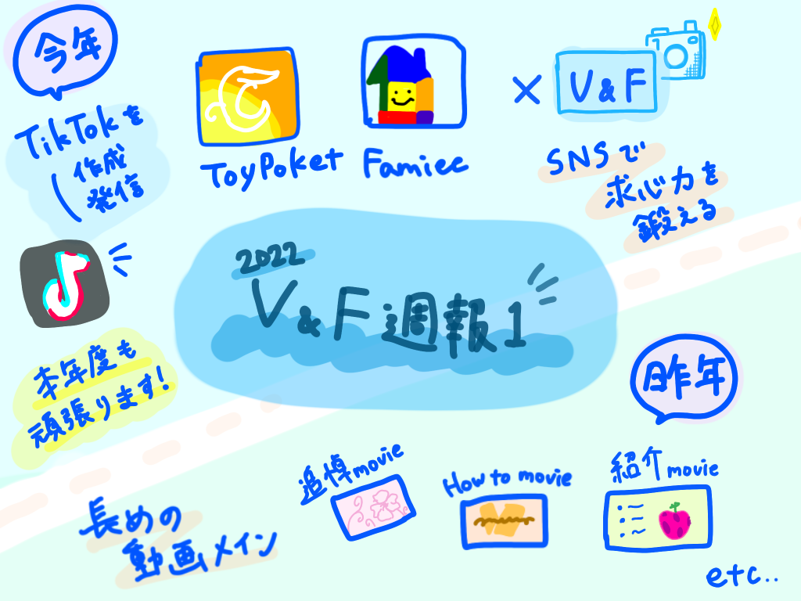

### V&F-週報1

こんにちは。V&F４年の葉賀なつみです。

> 今年度

今年のV&FはFamieeやToypoketのTiktokなどの動画編集を主な活動にする予定です。

またAdobeを使ったアニメーションもちょくちょく作っていこうと思います。

・Toypoket Tiktok [https://www.tiktok.com/@pokekon15sec?is_from_webapp=1&sender_device=pc](https://www.tiktok.com/@pokekon15sec?is_from_webapp=1&sender_device=pc)

・Famiee Tiktok [https://www.tiktok.com/@famiee_student?is_from_webapp=1&sender_device=pc](https://www.tiktok.com/@famiee_student?is_from_webapp=1&sender_device=pc)

> 春休み〜今週

Famieeで学生サポーターズ中心に学生向けのコミュニティを作ることになり、ミーティングを行いました。

SNS発信を充実させたいということで、作成する動画のアイデア出しをしました。

・結婚式の風習、家族の歴史

・プロポーズは男性から？女性から？

・同性婚に関する法律

今後はこれらのテーマを伝える動画を実際に作っていく予定です。

＜グラレコ＞

