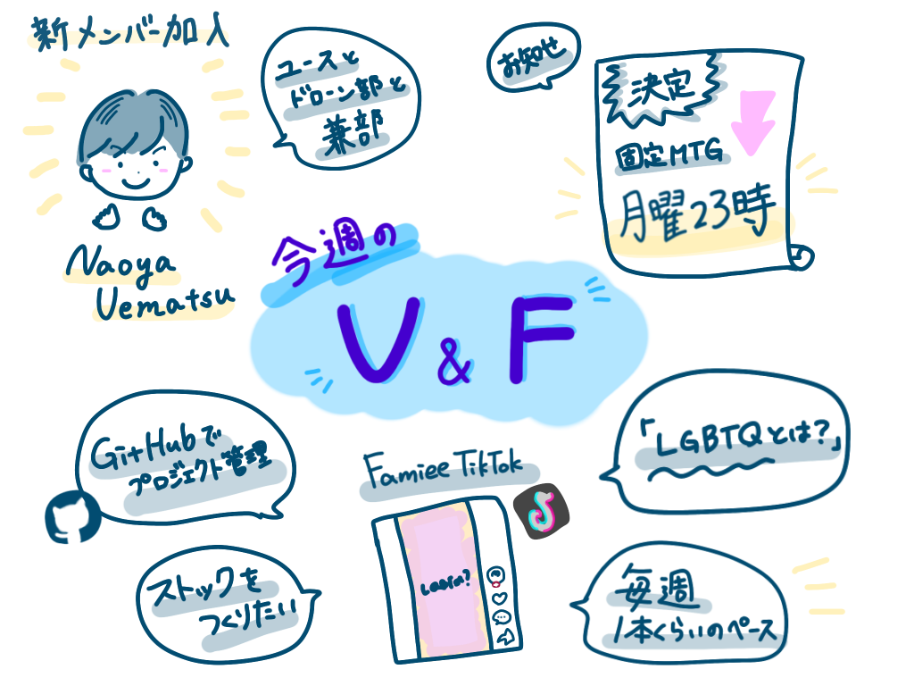

### V&F-週報2

こんにちは。４年の葉賀です。

今年度はメンバー１人かと思われた動画編集部V&Fですが、

３年生の植松が入ってくれたので、今後は２人３脚で頑張っていきます。

2022年のV&F初ミーティングは非常に簡潔に行われました。

初回なので、V&Fの説明と今年の活動内容を共有し、足並みを揃えました。また、互いのスケジュールを調整しながら定期ミーティングの日時を決定しました。

> 固定MTG

日時：月曜日 23時〜

形態：オンライン

今週はFamiee の TikTok 作成がスタートしました。

「15秒で考える家族。」というキャッチフレーズのもとFamiee関連の家族や結婚をテーマに、しばらくは週に１本程度を発信しつつ、ストックを作っていく予定です。

最初の投稿は「LGBTQとは？」にしました。

普段使っている動画編集アプリとは異なる TikTok 独自の機能を探りながらの作業は予想より難しく、これから使いこなせるように頑張っていこうと思います。

動画作成はGitHubでプロジェクト管理していきます。

[Tiktok · furuhashilab/2022V-F-Famiee
You can't perform that action at this time. You signed in with another tab or window. You signed out in another tab or…github.com](https://github.com/furuhashilab/2022V-F-Famiee/projects/1)

＜グラレコ＞

