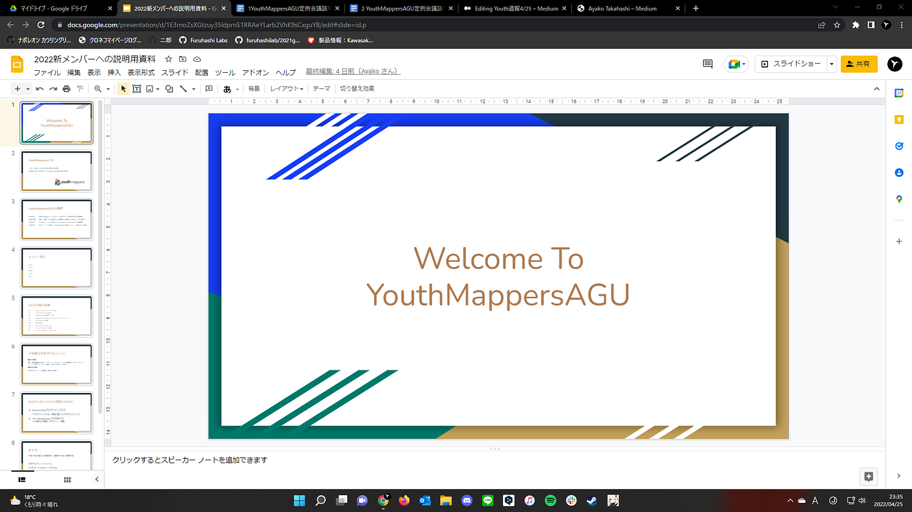
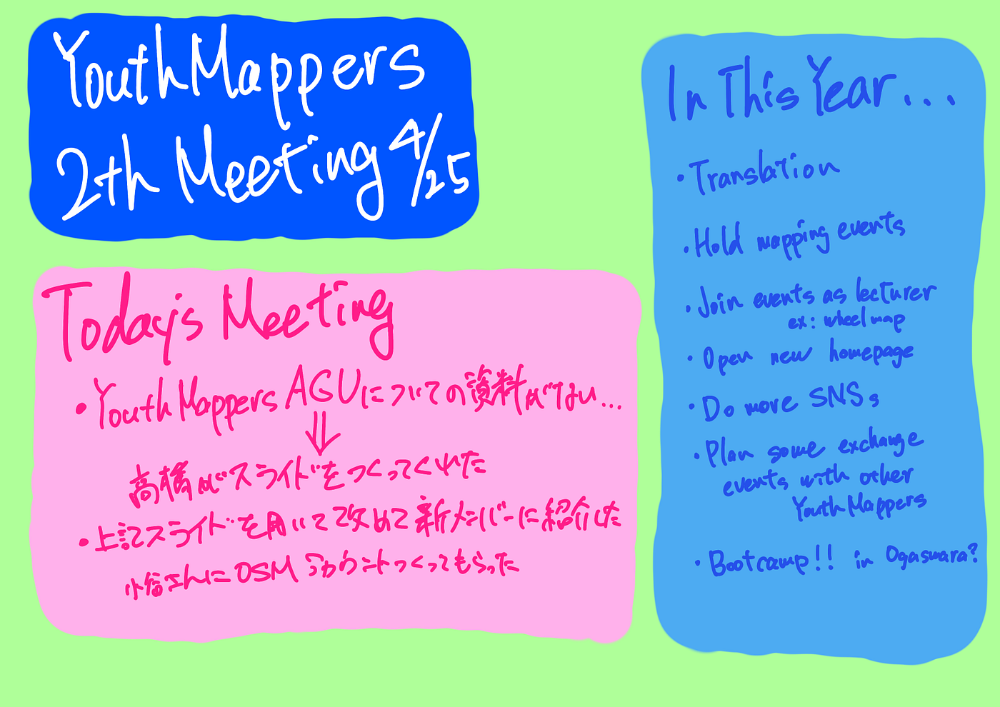

### Youth週報4/25

お疲れ様です。4年の鈴木です。

今週のミーティング週報をお送りいたします。

> _**本日のミーティング_**

・前回のミーティングにて我々YouthMappers AGUについて説明する資料が十分ではないことが明らかになりました。そこで先日、メンバーの高橋が簡単な[YouthMappers AGUの紹介スライド](https://docs.google.com/presentation/d/1E3rnoZsXGtzuy35ldprnS1RRAeYLarb2VhK9sCxguY8/edit?usp=sharing)を制作してくれました。

今回これを用いて改めて3年生と新メンバーの小谷さんに向けてYouthの紹介を行いました。YouthMappersの説明から始まり、これまでの活動内容と今後の方針についてが主な内容となっています。

また、マッピングに興味をもって参加してくださった小谷さんにはミーティングの最後にOSMのアカウントを制作していただき、簡単に概要の説明を行いました。

> _**改めて今後の方針_**

・Youth設立当初行っていた翻訳作業の再開

・マッピングイベントの企画と運営

・Wheel Map Mappathonのようにレクチャー係としてのイベント参加

・ホームページの開設、運営

・YouTube、Instagram、FacebookなどのSNS活動の充実

・海外支部との交流を含んだイベントの企画、運営

・合宿（小笠原いきたくね…？）

