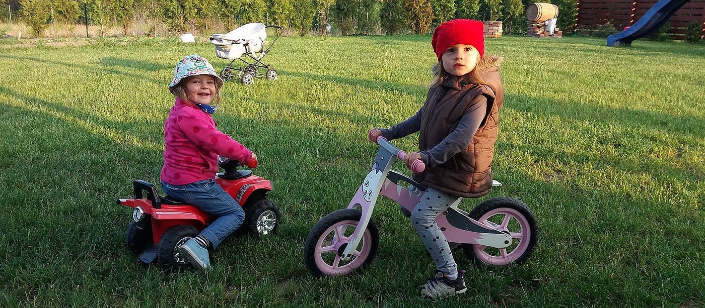

### 青学アドグル2022 始動！ DRONEBIRD隊員になろう。

青学には「**[アドバイザーグループ（通称：アドグル）**](https://www.aoyama.ac.jp/life/activity/adviser/)」という全学部・全学年共通の自主ゼミ制度があります。2021年度から古橋研究室もアドグル登録を行い、古橋研究室が取り組む災害時のドローン利活用やクライシスマッピング活動に参画したい学生を[随時受け入れ](https://github.com/furuhashilab/advisergroup)ています。

とくにドローンの操縦訓練は多くの学生が興味を持っているようですが、2022年度から参加条件に「**自分のドローンを所有すること**」を義務付けました。

理由は、2021年度受け入れた学生のほとんどが自分のドローンを所有していなかったことに起因します。

> **“自転車を練習するのに、自分の自転車を所有しないことはありえない”**

もちろん、最初に高価なドローンを所有する必要はありません。むしろ練習機としては5,000円前後で100g未満の安価なトイドローンのほうが上達が早いです。

まず、[航空法改正に合わせて2022年6月20日から、無人航空機登録制度が義務化](https://www.mlit.go.jp/koku/drone/)されます。これはドローンの重量が100g以上の機体全てが対象となります。屋外でのドローン操縦訓練を気軽に行いたいと考えた場合、この制度は初心者にとって足かせとなる可能性があります。まずは訓練用には100g未満の機体を用いて経験を積み、本格的にドローンを屋外で飛ばしたいと考えたときに、改めてどんな機体へステップアップすべきか考えれば良いと思います。

ちなみに、無人航空機登録制度は登録時に１機あたり最低890円以上の手数料納付が必要になります。100g未満機を選べばこのようなコストもかかりません。

[航空安全：無人航空機（ドローン・ラジコン機等）の飛行ルール - 国土交通省
大雨に伴う災害等の発生している地域では今後、捜索、救難活動の有人機が飛行する可能性があります。有人機の災害活動の妨げにならないよう、当該地域でのドローンの飛行は控えるなど、ご注意ください。…www.mlit.go.jp](https://www.mlit.go.jp/koku/koku_tk10_000003.html)

できるだけ安価な機体を選ぶことは、ドローンに搭載されるセンサーの数や性能の制限につながるので、結果として飛行が不安定になります。これは悪いようでいて、実は操縦の訓練をするには適度な難易度を提供する意味では利点と受け取るべきです。高価なドローンは高性能で多様な各種センサーによって非常に飛行が安定しています。練習機は不安定が当たり前と割り切って、できる限り安価なトイドローンを選ぶことで、万が一の事態でも機体をマニュアルで制御できる術を身につけることができます。

いくつか、代表的なトイドローンのリンクを貼っておきますので、興味がある人はまずこのあたりからチャレンジすると良いと思います。

[ドローン ミニドローン 初心者 こども向け 折りたたみ 小型 スピード調整可能 高度維持 ヘッドレスモード 360°回転 おもちゃ プレゼント ゴールド
説明： パッケージに含まれるもの：1 xドローン、1 xリモコン、1 x USB充電ケーブル、4 xスペアブレード、4x保護 カバー、1 xプロペラツール、1xマヌア 材質：ABSプラスチックおよび電子部品…amzn.to](https://amzn.to/3MwyDJD)

[4DRC ドローン こども向け ミニドローン 100g未満 収納パック3つのバッテリー飛行時間最大30分 赤外線感知モード…
ドローン こども向け ミニドローン 赤外線誘導センサー 自動回避障害機能 ジェスチャー制御 バッテリー3個付き 最大飛行時間21分 安定性 室内 ハンドコントロール 初心者 クリスマス 元日 プレゼント…amzn.to](https://amzn.to/3kd3hvs)

[ウランハブ ドローン こども向け 小型 室内ドローン 最大飛行時間21分 100g未満 放り投げ飛行 ヘッドレスモード 3段階スピード調節 360度フリップ 初心者 子供向け…
Amazon.co.jp: ウランハブ ドローン こども向け 小型 室内ドローン 最大飛行時間21分 100g未満 放り投げ飛行 ヘッドレスモード 3段階スピード調節 360度フリップ 初心者 子供向け…amzn.to](https://amzn.to/3vePuux)

[Holy Stone ドローン 100g未満 カメラ付き 小型 室内 こども向け 初心者 収納ケース付き モジュール化バッテリー3個 FPV リアルタイム 軌跡飛行モード 高度維持 ジェスチャー撮影…
Amazon.co.jp: Holy Stone ドローン 100g未満 カメラ付き 小型 室内 こども向け 初心者 収納ケース付き モジュール化バッテリー3個 FPV リアルタイム 軌跡飛行モード 高度維持 ジェスチャー撮影…amzn.to](https://amzn.to/3rSN56S)

もう一つ注意点としては、[操縦モードが「モード２」のものを選んでください](https://medium.com/furuhashilab/%E3%83%A2%E3%83%BC%E3%83%891%E3%81%A8%E3%83%A2%E3%83%BC%E3%83%892%E3%81%AE%E4%BB%81%E7%BE%A9%E3%81%AA%E3%81%8D%E6%88%A6%E3%81%84-92aa99ead2de)。昔からラジコン飛行機やヘリコプターを飛ばしてきた人は別ですが、はじめてドローンに触れる初心者にはモード２の操作体系のほうがいわゆるゲーム機のコントローラーと感覚が似ているため習得しやすいのではないかと感じています。

[モード1とモード2の仁義なき戦い
ドローン関係者が集まっている場で、時によっては、険悪な雰囲気になりかねない質問がある。medium.com](https://medium.com/furuhashilab/%E3%83%A2%E3%83%BC%E3%83%891%E3%81%A8%E3%83%A2%E3%83%BC%E3%83%892%E3%81%AE%E4%BB%81%E7%BE%A9%E3%81%AA%E3%81%8D%E6%88%A6%E3%81%84-92aa99ead2de)

トイドローン購入後の訓練の仕方などは、[谷＋１さん](https://twitter.com/taniplus1)が出版した「[トイドローン空撮＆テクニック究極マスターBOOK](https://amzn.to/3vO1AKn)」を参考にするのがおすすめです。

[トイドローン空撮&テクニック究極マスターBOOK (タツミムック)
おうち時間が増えた今、家族や友人と室内飛行&空撮を楽しもう…amzn.to](https://amzn.to/3MrV9De)

その他質問があれば、以下の [LINEオープンチャット](https://line.me/ti/g2/UIaFnxDSC-gq5jwGdq5urA)から質問してください。

[FuruhashiLab/DRONEBIRD
青山学院大学古橋研究室/災害ドローン救援隊DRONEBIRD 関係者用トークルームline.me](https://line.me/ti/g2/UIaFnxDSC-gq5jwGdq5urA)

具体的な[アドグルの参加方法](https://github.com/furuhashilab/advisergroup)も貼っておくので参考に！！！

既に、2022年前期のアドグル参加申込みは4/18に終わりましたが、後期 9月16日(金)~9月22日(木)にも追加の申込みが可能です。ドローンの操縦訓練などは定期的に行っていますので、正式なアドグル参加手続き前からでも希望者は [LINEオープンチャット](https://line.me/ti/g2/UIaFnxDSC-gq5jwGdq5urA)から連絡してくれれば随時受け入れします。

> 思い出してほしい。大好きな映画の作戦会議シーン。そこにはいつも頼れる地図がある。もしも大きな自然災害が起きた時、地図が手に入らなかったらどうするだろうか。そもそも地図がなかったら…

> 2010年のハイチ地震以降、古橋は世界中のあちこちでこのような経験をしてきました。残念なことに、誰もが当たり前に使うはずの地図は、作られた瞬間に古くなるという宿命を持っています。ましてや、大きな災害で、建物が全壊してしまったり、道路が通行止めになったり、東日本大震災のように津波で街全体が破壊されてしまうことを我々は2011年東日本大震災で目の当たりにしました。”イマ”という現実を、できるだけ迅速に地図に反映させ、その地図を救援や復旧、復興支援にあたる多くの方々に提供します。そのために空撮用のドローンを使いこなし、自分たちの街の姿を自分の手で撮影し、情報を迅速に共有する技術を学ぶ実践的なアドグルです。毎月1回、相模川や埼玉県横瀬町などの各地フィールドでドローンの操縦訓練と最先端のクライシスマッピングの技術を学びます。また最近は地図作成以外に動画撮影用カメラとして活用する学生も増えてきているため、地図作成だけでなく動画編集なども積極的に最新技術を取り入れ始めています。

[GitHub — furuhashilab/advisergroup: 青山学院大学の交流の場「アドグル：アドバイザーグループ」として古橋研究室用リポジトリです。
青山学院大学全学生の交流の場「アドグル：アドバイザーグループ」 古橋研究室用リポジトリです。 参加希望者は LINEオープンチャット「FuruhashiLab/DRONEBIRD」 からJOINしてください。…github.com](https://github.com/furuhashilab/advisergroup)
