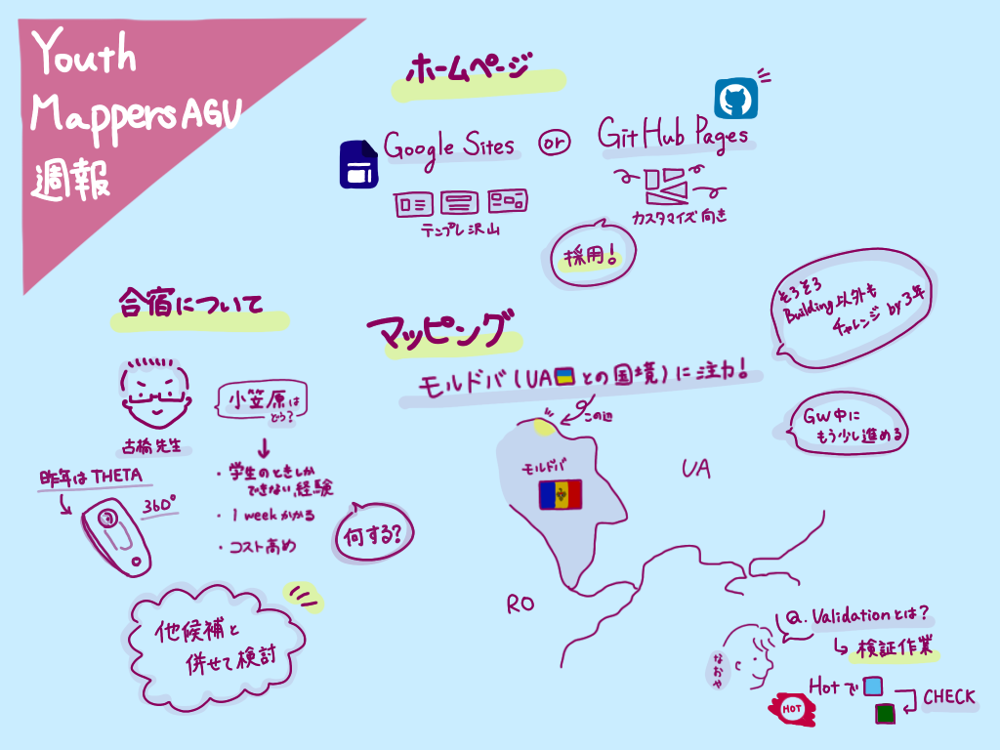
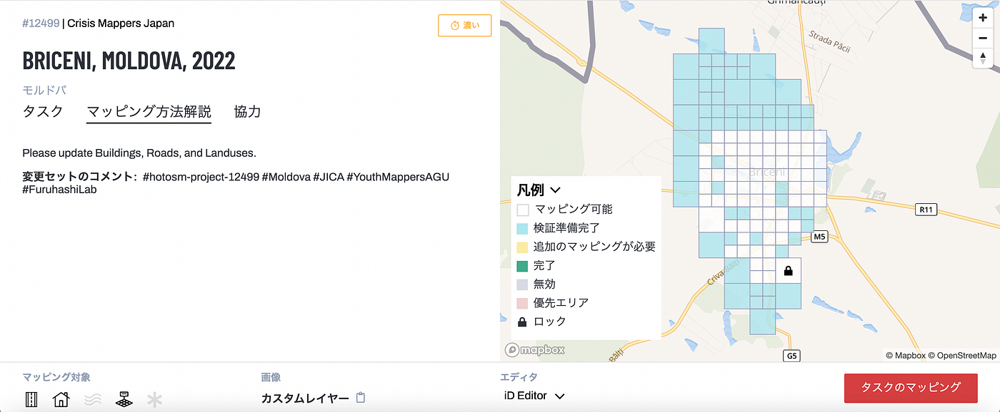
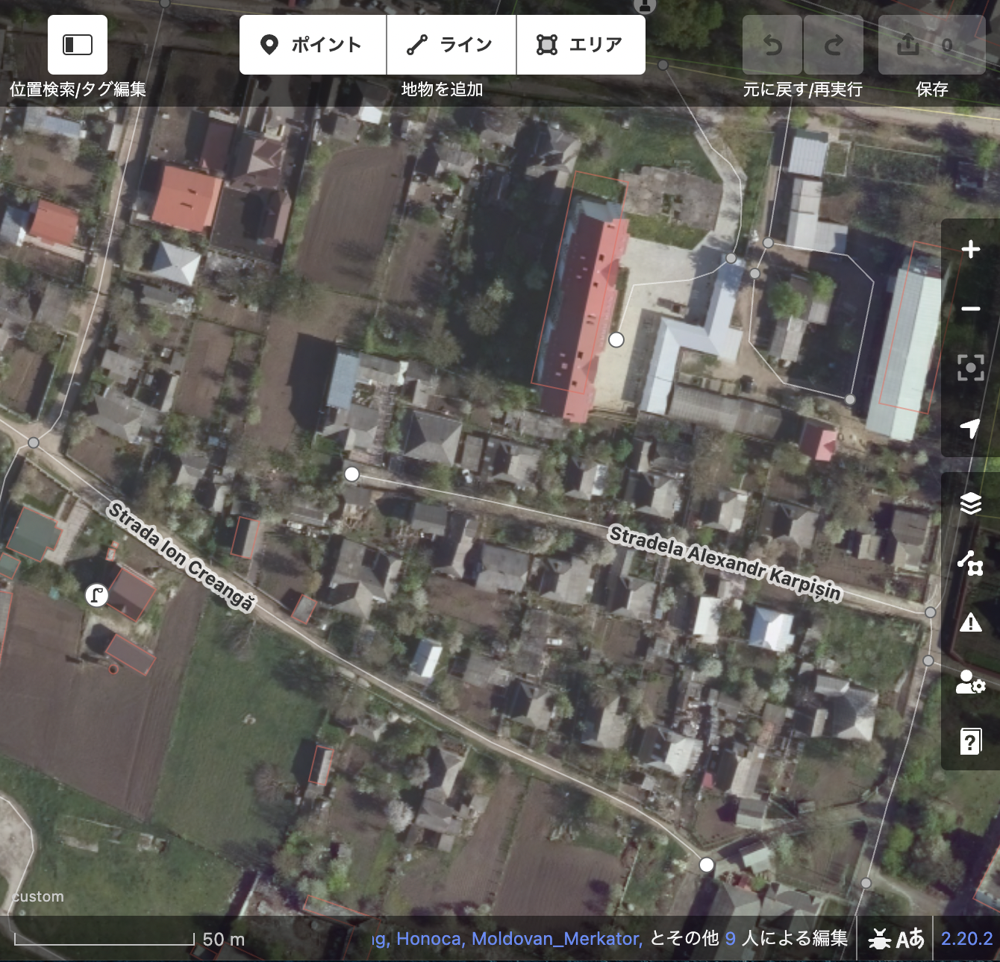

### Youth週報 5/2

こんにちは！

4年の菊池です。

まず合宿について、先週先生からアドバイスいただいた内容をもとに再検討しています。小笠原に行って何をするかが決まっていないので、そこも考慮しつつ、別の候補地も考えていければと思います！

次にYouthMappersAGUのウェブサイトについてです。Github Pagesでの制作にチャレンジすることにしました。自由度が高い分、難易度も高いので勉強しつつ制作していきたいと思います！

最後はモルドバのマッピングについてです。ウクライナ国境沿いをマッピングしてきましたが、建物はかなり進んできました。今後は3年生にも道などのマッピングに挑戦してもらおうと思います！

今週からブリチェニのプロジェクトが始まりました。まだマッピングの余地があるのでGWや空き時間を利用して進めていきたいと思います。

マッピングの状況を確認すると、建物、道路、畑などまだまだ十分とは言えません。Youth以外の学生もぜひマッピングしてください！

