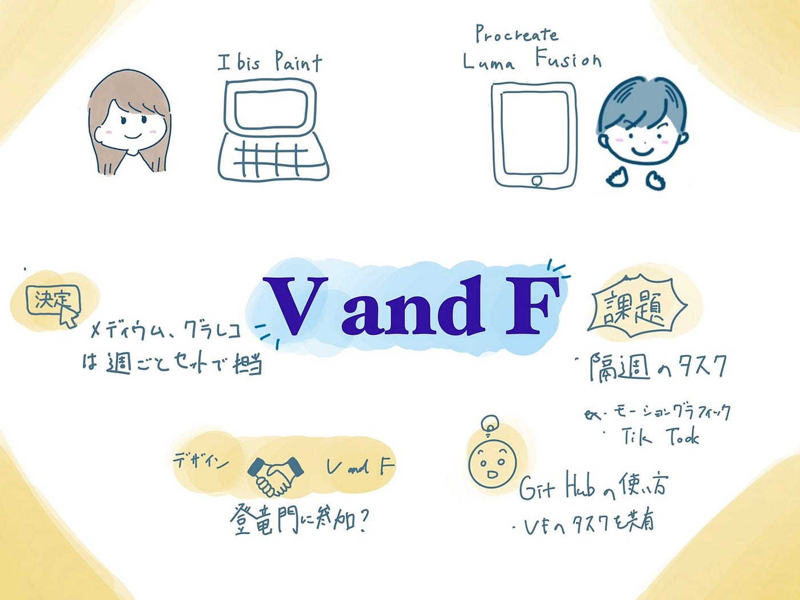

### V＆F-週報３

こんにちは。 3年の植松です。

まず私ごとではありますがV&F 部に正式に入部し、これから頑張っていこうという気合を込めて12.9インチのiPad pro を購入しました。

本当に便利です！！！！！ ただ財布へのダメージは重大な模様、、、

今までイラストや動画編集とは無縁の生活を送ってきており、どのアプリを使うべきかわからなかったため部内唯一の先輩であるなつみさんやインターネット上での評判をもとにメインに使うアプリを２つきめました。

**グラレコ** Procreate ￥1220

**動画編集** Luma Fusion ￥3680

・・・

今回のMTGではより具体的に今後の活動について話し合いました。

> _**決定事項_**

メディウム、グラレコ、発表は週ごとに交互に担当

> _**今後の予定_**

デザイン部とのコラボ

登竜門で紹介されているコンペティションに我々V and Fとデザイン部合同で挑戦するという話が話題に上がりました。

Famineの活動をメイン活動にしないことを決めたため毎週のタスクを決定する。

例: 簡単な動画作り。 モーショングラフィック。 TikTok。

MTGの中でなつみさんにGitHub の使い方を簡単に教えてもらいました。まずはGitHub にふれ、なれることが重要とのことなので積極的に使っていきたいです。また自分は動画編集についての知識が乏しいため、スキル向上のためにYouTubeやなつみさんを通じて勉強していきたいと考えています。

＜グラレコ＞

