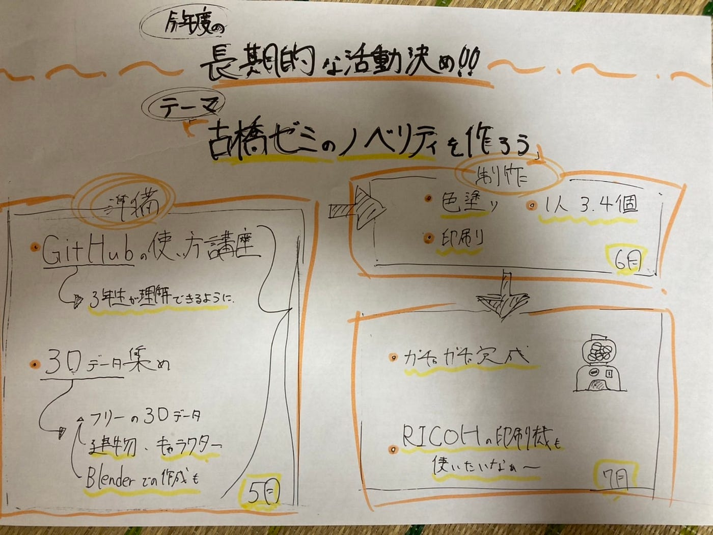

### デザ部週報

こんにちは(*^^*)

デザイン部です！

MT で今年度のデザイン部の長期的な活動を決定しました。

1 、古橋ゼミの3年生に向けたGithub講習をデザイン部が開催します✨これからGithubを使う3年生にレクチャーする会

2、研究室にあるガチャガチャの中身を作ります！！！

3、先生がRICOHの印刷機を買ったかも、？！笑

「古橋ゼミのノベルティを作ろう企画」

### 1、3年生に向けたGithub講習会

古橋ゼミでは必須のGithubの使い方をまだ知らない3年生が多いと見込んで、デザイン部が率先してGithubの使い方を教えようという企画です。

4年生といえど実はGithubについて知らないこともあるかもしれないので、お互いが学び合うという意味で開催したいと思います♪

(進み具合:現在3年生に日程調整をしてもらっているところです。)

### 2、研究室にあるガチャガチャを完成させます！

これは長島うららの2021年ゼミ論をイメージしていただければわかりやすいと思います。自分でブレンダーなどを駆使して3Dデータを作っても良いし、フリー素材をお借りして(あくまでゼミ内、個人の使用範囲で)印刷して作ろうという活動です♪

データ探し、印刷して、色塗りをするところまでしたいと考えています。ガチャガチャのカプセルに入っている「ミニブック」も各自で作っても面白いという意見が出ました。デザイン部が研究室のガチャガチャに生命を宿します！笑

(進み具合: お手隙に1人3.4個(個数自由)自分で作りたいデータを調べてslackで共有します。)

### 3、「古橋ゼミのノベルティを作ろう企画」

先生がRICOHの印刷機を購入したという噂が。

古橋ゼミのノベルティを今年度は作れたらいいなという意見が出ました。

(進み具合:これは1.2の活動が終わったらやろうと思っています。)

今年度は一つのことを長〜く深く活動します。

全オンラインじゃなくて、会える日は一緒に研究室で印刷したりします！

グラレコ

