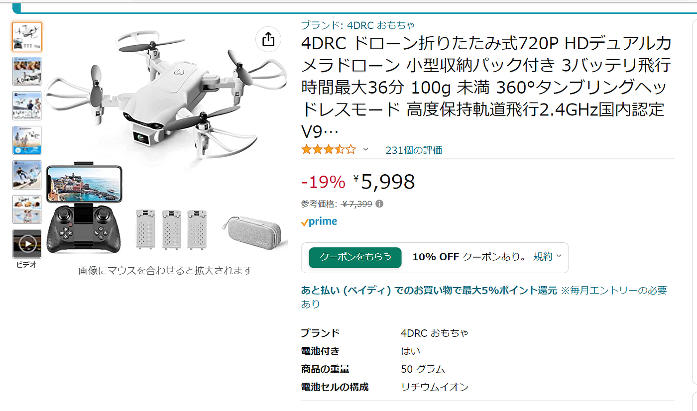
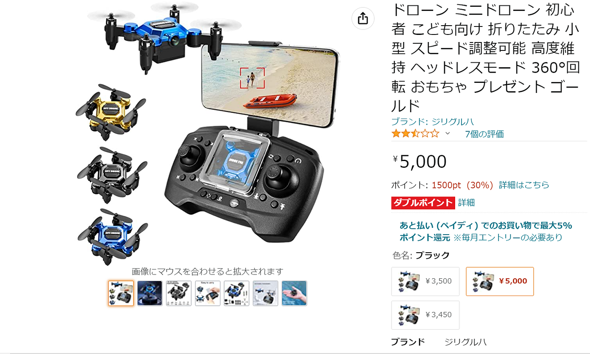
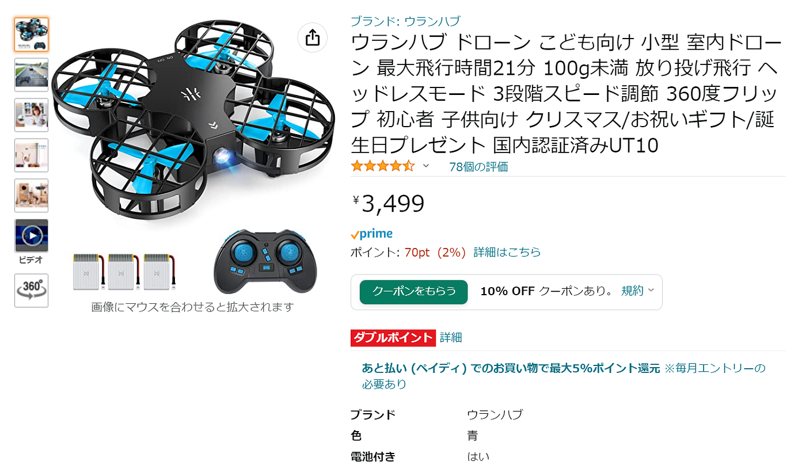
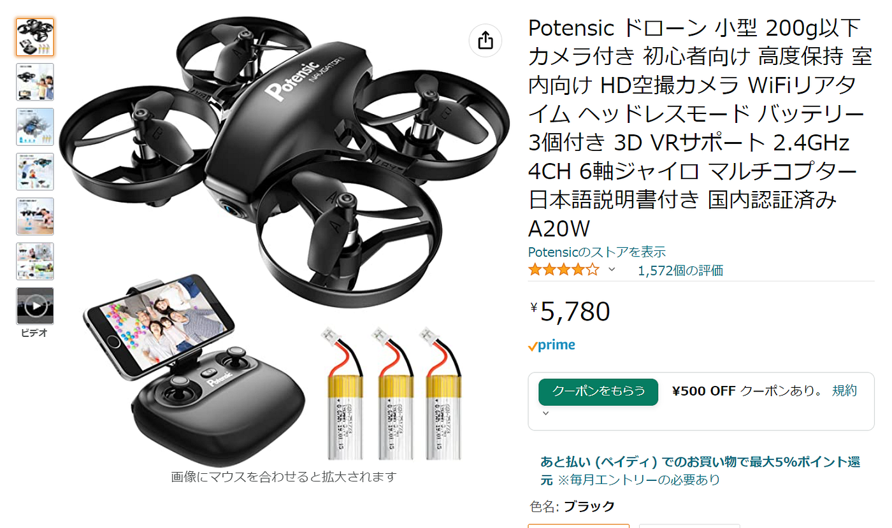
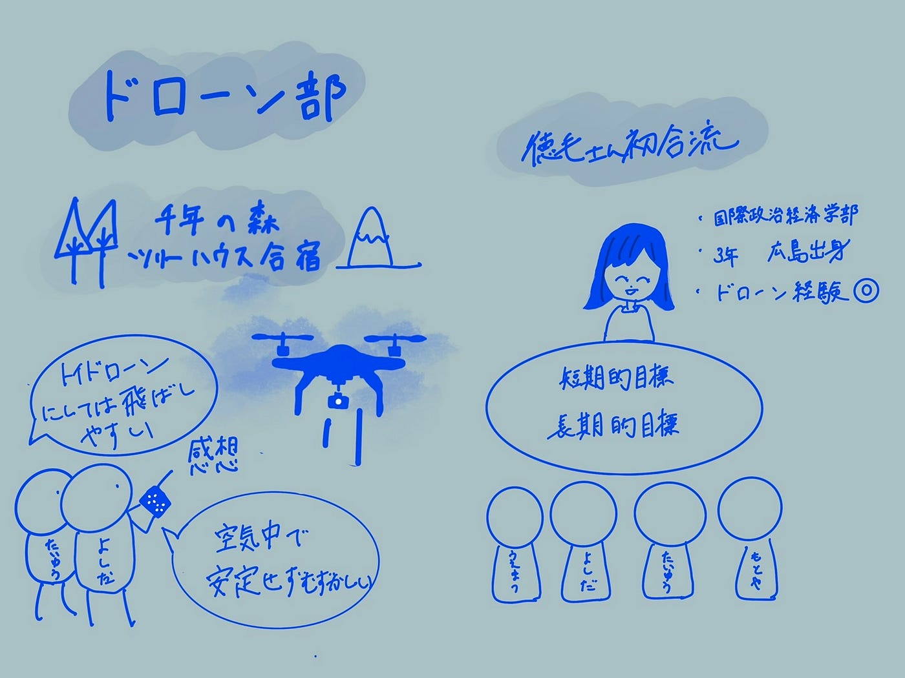

### 【ドローン部】週報２

こんにちは。三年の吉田です。

前回のゼミでは古橋先生からどのようなドローンを買うべきかのアドバイスをいただきました。ポイントとしては、「まずは100g**未満**であるもの・5000円前後かそれ以下であるもの・モード2の機能が備わっているもの」等がありました。これらを受け、メンバーは最終的にこの4つのドローンを買いました！

[吉田ドローン](https://www.amazon.co.jp/dp/B08MW4FW6V/ref=cm_sw_r_awdo_4Q7S81TXTAJMKC524JJT)

[なおやドローン](https://www.amazon.co.jp/%E3%83%9F%E3%83%8B%E3%83%89%E3%83%AD%E3%83%BC%E3%83%B3-%E3%81%93%E3%81%A9%E3%82%82%E5%90%91%E3%81%91-%E3%82%B9%E3%83%94%E3%83%BC%E3%83%89%E8%AA%BF%E6%95%B4%E5%8F%AF%E8%83%BD-%E3%83%98%E3%83%83%E3%83%89%E3%83%AC%E3%82%B9%E3%83%A2%E3%83%BC%E3%83%89-360%C2%B0%E5%9B%9E%E8%BB%A2/dp/B09P687Z55?keywords=%E3%83%8A%E3%83%8E%E3%83%89%E3%83%AD%E3%83%BC%E3%83%B3&qid=1650984806&sr=8-5&th=1&linkCode=sl1&tag=mapconcierge-22&linkId=9f811abdf8991420eeb39e123c26fb22&language=ja_JP&ref_=as_li_ss_tl&psc=1#)

[もとやドローン](https://www.amazon.co.jp/%E3%82%A6%E3%83%A9%E3%83%B3%E3%83%8F%E3%83%96-%E6%9C%80%E5%A4%A7%E9%A3%9B%E8%A1%8C%E6%99%82%E9%96%9321%E5%88%86-%E3%83%98%E3%83%83%E3%83%89%E3%83%AC%E3%82%B9%E3%83%A2%E3%83%BC%E3%83%89-3%E6%AE%B5%E9%9A%8E%E3%82%B9%E3%83%94%E3%83%BC%E3%83%89%E8%AA%BF%E7%AF%80-%E5%9B%BD%E5%86%85%E8%AA%8D%E8%A8%BC%E6%B8%88%E3%81%BFUT10/dp/B09KMR7126?__mk_ja_JP=%E3%82%AB%E3%82%BF%E3%82%AB%E3%83%8A&crid=37MNDUC2DRMUS&keywords=%E3%83%94%E3%83%83%E3%82%B3%E3%83%AD+drone&qid=1650937857&refinements=p_n_price_fma:5457071051&rnid=5457067051&s=toys&sprefix=%E3%83%94%E3%83%83%E3%82%B3%E3%83%AD+drone,aps,250&sr=1-5&linkCode=sl1&tag=mapconcierge-22&linkId=1c36991852e2dfae86b321191b16b148&language=ja_JP&ref_=as_li_ss_tl)

[小澤ドローン](https://www.amazon.co.jp/dp/B07BXKGV7Q/ref=cm_sw_r_cp_api_i_dl_VS3EZAFKCT94XDFYQZ3G?_encoding=UTF8&psc=1)

吉田以外の3人は前回のアドバイスを受け、それぞれより軽く安価なドローンを購入しました。ドローンが届き次第、練習を積み上達を目指します！

> _**ドローンを飛ばした感想_**

また、先日ツリーハウス合宿があったので、すでにドローンが届いていた小澤と吉田が空き時間でドローンを飛ばしてみました！

小澤ドローンはトイドローンにしては比較的飛ばしやすく安定していたのに対し、吉田ドローンはなかなか空中で安定せず、操縦が難しかったです。ドローンを飛ばしているうちに垂直・平行移動は出来るようになってきましたが、旋回やロールオーバー、速度をあげて操縦するなどがまだ出来ていないので今後空いている時間でSTMキット等を使いつつ、ドローン操縦の訓練をし、技術を磨いていきます。

そして合宿では国際政治経済学部3年の徳毛さんと初合流しました！ドローンの会社にインターンに行っており、ドローンについての知識や経験が豊富とのことなので、徳毛さんにも教えてもらいつつ、目標を明確に定めて協力して活動していきたいと考えています。

