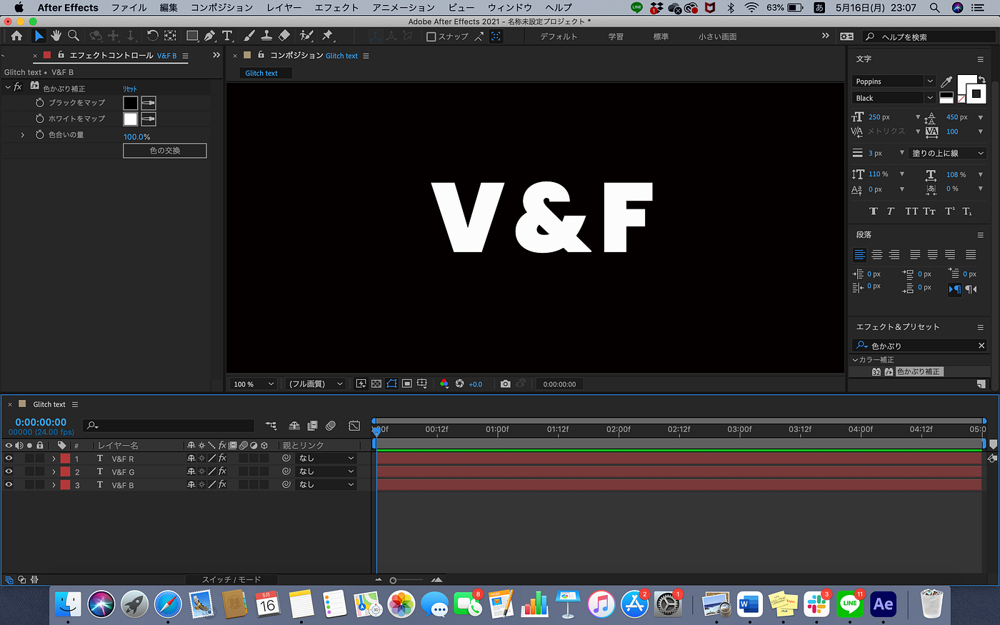
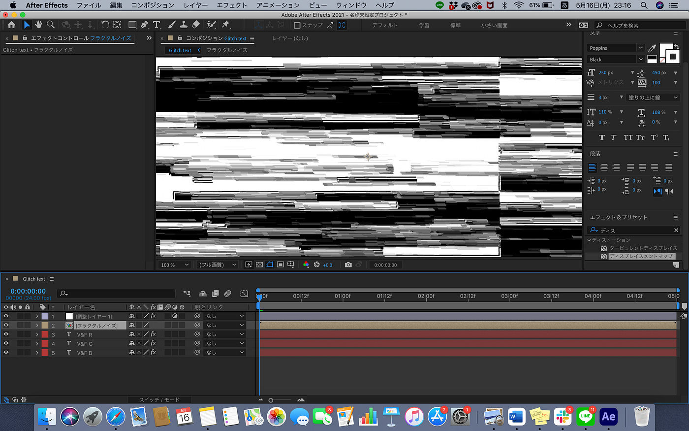
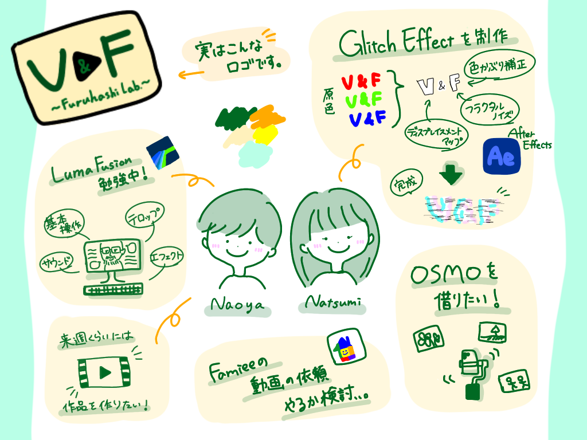

### V&F-週報４

こんにちは。４年の葉賀です。

今週のV&Fの活動をレポートしていきます。

先週はメンバーで教えあったり共有したりが中心でしたが、今週は基本的に個人作業でした。

３年植松は新しく購入したLuma Fusionに慣れるために、基本操作等を学んでいます。

今後は動画編集部的活動をするべく、また７月頃に予定されているハッカソンに向けて、Luma Touch の動画(下リンク)を参考にチュートリアルを進めていく予定です。

一方葉賀は、久しぶりに Adobe After Effects を触りました。

画像が乱れたようなグリッチエフェクトを作りました(下動画)。

[Glitch text_1.mp4
Edit descriptiondrive.google.com](https://drive.google.com/file/d/1yVBvlbgAOxBeaLhqAm_n8FOwrfbphSAQ/view?usp=sharing)

大まかな制作手順は以下の通りです。

１. 無地のコンポジションに各配色のテキストを作り、色かぶりの補正のエフェクトをかけます。

２. 次にフラクタルノイズというエフェクトを別に作成し、ノイズの大きさや種類を目的に近い形にカスタマイズします。同時に１秒間にどのくらい数値が変わるかなども設定していきます。

３. ディスプレイスメントマップという歪めるエフェクトを先程のノイズにかけ、こちらも歪みの大きさを設定します。

４. 複数のテキストの位置を少しずつずらします。→完成

グリッチというとくすんだ赤と青などのイメージがありますが、最近個人的にTikTokを使っているという理由でそれを意識した色付けがしてあります。

今回はブランクで忘れた機能やエフェクト等を思い出しつつの作業になったので、あまり複雑でないものを作ってみました。

アニメーションやエフェクトを今後もどんどんインプットしてスキルアップに努めたいと思います。

来週以降V&Fは素材撮影をしていく予定なので、研究室のOSMOを借りようと考えています。今どこにあるんでしょう。。

<グラレコ>

