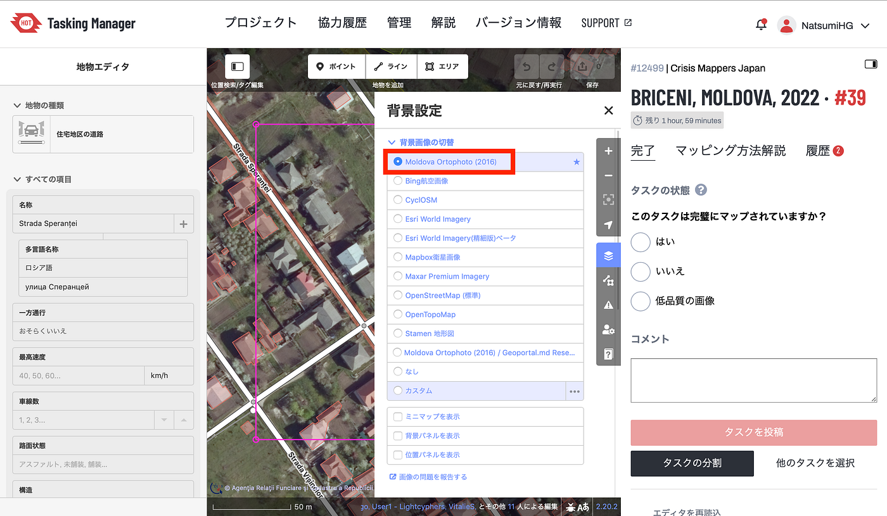
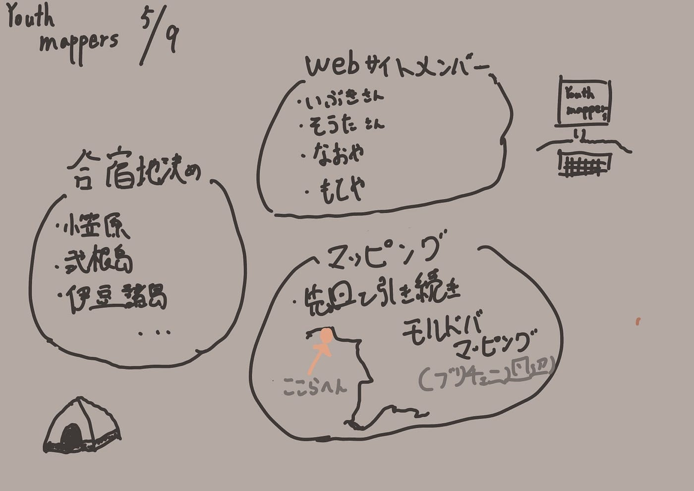

### Youth週報5/9–16

こんにちは。

今週は４年葉賀が週報を担当します。

前日までツリーハウス合宿があったため、参加してきたメンバーはエネルギーを使い切って疲れた様子でしたが、定例ミーティングは欠かしません。

流石は古橋ゼミ生ですね！

本日の定例ミーティングでは以下の内容が話し合われました。

・合宿地について

・WEBサイト制作チーム作り、予定決め

・モルドバマッピングについて

> **合宿地について**

小笠原諸島をはじめ、式根島・伊豆諸島などの複数の意見が出ています。

来週までにその他の案を各自リサーチしてきて、3年生の予定もききながら検討していきます。

> **WEBサイト制作チーム作り、予定決め**

メインのチームメンバーはいぶき・もとや・なおや・そうたになりました。他メンバーも適宜参加しますが、基本的にはこの４名が中心となり進めていきます。

以前に授業等でWEBサイト制作経験があるメンバーも数名おり、スキルを十分に活かしてくれそうです。

> **モルドバマッピングについて**

これまで、モルドバのウクライナ国境付近のプロジェクトを進めていましたが、マッピングによる透明性はロシアにとっての利益になってしまわないかという懸念が浮上しました。

一先ず、古橋先生が専門家に相談する予定です。

また、現在Youthは同国ブリチェニ周辺のプロジェクトを優先的に取り組んでいます。

プロジェクトリンク：[https://tasks.hotosm.org/projects/12499](https://tasks.hotosm.org/projects/12499)

こちらのプロジェクトでは、マッピング時にデフォルトで設定されている衛星写真の撮影時期が2016年と少し古いので、極力最新の画像と併せて確認するようにしています。

マッピングを行ううえで重要な情報の正確さや新しさを保てるように、確認を怠らないようにしていきたいと思います。

YouthMappersAGUは、今後も引き続きマッピング作業を進めていきます。

<グラレコ>

