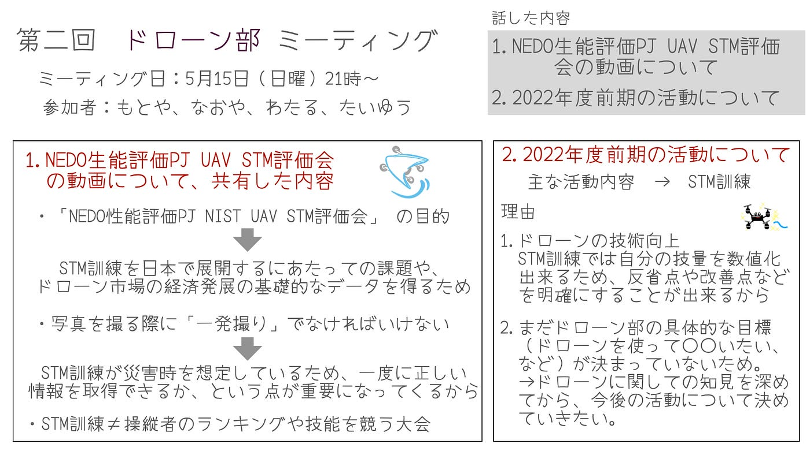

### ドローン部週報

5月１５日

こんにちは、３年の川野です。

ようやく、ドローン部全員が自分のドローンを手にすることが出来ました！👏ありがとうございます！

週報の内容

・先日先生から送られたNEDO性能評価PJ NIST UAV STM評価会 の動画について。

・ドローン部がなぜSTM訓練を行うか。

です。

今回の動画視聴により、STＭ訓練について多少理解が進んだと思います。そこでこの訓練を行う上で大切な二点を、まとめてみました。

１，技能を競う大会ではないという点

２，写真は一発撮りでなくてはいけない

という事です。

「NEDO性能評価PJ NIST UAV STM評価会」 の目的として、STM訓練を日本で展開するにあたっての課題や、ドローン市場の経済発展の基礎的なデータを得るために行われたそうです。

なので、STM訓練が操縦者のランキングや技能を競う大会のようなものではないということが分かりました。

また、写真を撮る際に「一発撮り」でなければいけません。それはSTM訓練が災害時を想定しているため、一度に正しい情報を取得できるか、という点が重要になってくるからです。

こうした点を踏まえ、なぜ僕たちドローン部がSTM訓練をするのかについても話し合いました。

まずドローンの技術向上が目的となっています。STM訓練では自分の技量を数値化出来るため、反省点や改善点などを明確にすることが出来ると思うからです。

また、ドローンに関しての知識が足りないため、どういうことをやりたいか、何をやれるかがまだ分かりません。なのでSTM訓練を行い、ドローンの技術や知識を深めていこうと思います。その一歩目として、簡易STMキットの作成から始めていきたいと思います。

（古橋先生、作り方を教えてください、よろしくお願いします！）

グラレコ

