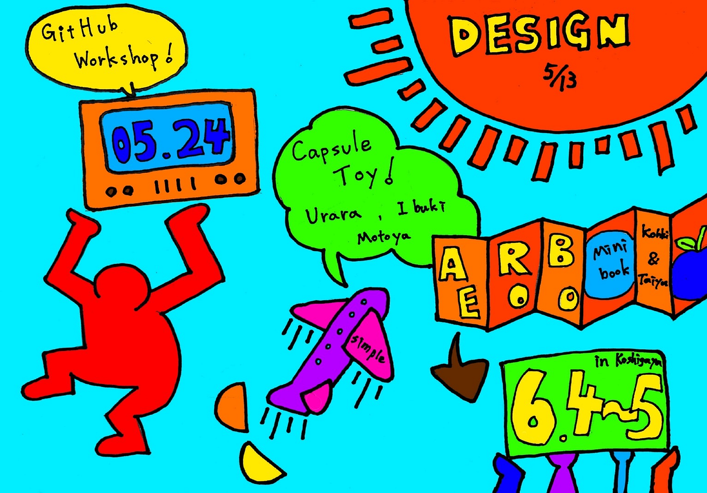

### 越谷防災フェス２０２２用ガチャ

こんにちは。デザイン部です。

1 、古橋ゼミの3年生に向けたGithub講習をデザイン部が開催します✨

これからGithubを使う3年生にレクチャーする会

→今月中にやるということで調整中です♪

2、研究室にあるガチャガチャの中身を作ります！！！
→古橋先生からのご依頼を受け、6/4.5に越谷市のレイクタウンで開催される越谷防災フェス2022のドローンワークショップで子どもたちに回してもらうガチャガチャを製作中です。

ガチャガチャは今回時間がないためにエアロボウィングの1つのみ、カラーバリエーションを多く導入し子供たちに楽しんでもらえるようなガチャガチャを目指しています。

私のゼミ論で制作したエアロボウィングの3Dデータは家庭用3Dプリンター(なおかつガチャガチャのカプセルに入るサイズ)では綺麗に印刷できませんでした。
今回はそのデータをシンプルに改良し、印刷できるものにします。

ミニブック製作も行い、カラーバリエーションだけでなく、エアロボウィングについての詳細についても記したいと思っています。(先生がエアロセンスに許可を取って下さったからこそできることですね!ありがとうございます。)

今後はデータ班、ミニブック製作班、印刷班、色塗り班に分かれて進めていきます。

グラレコ こうき

