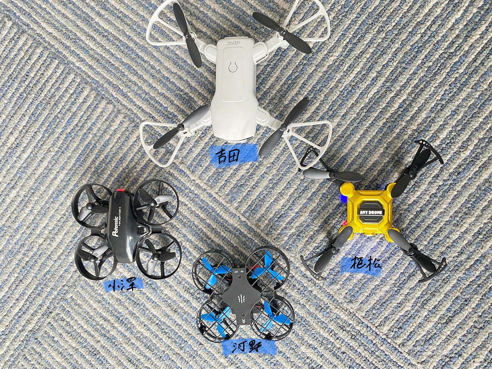
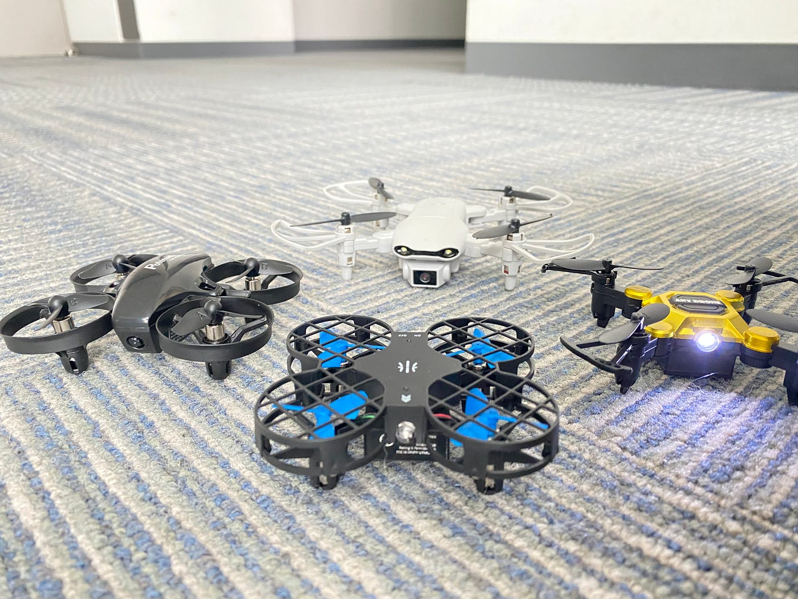
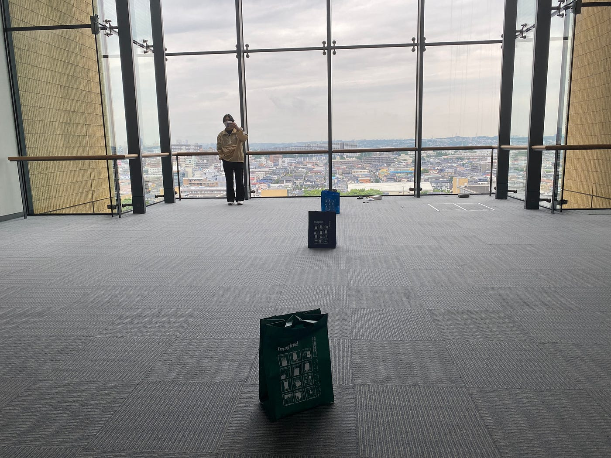
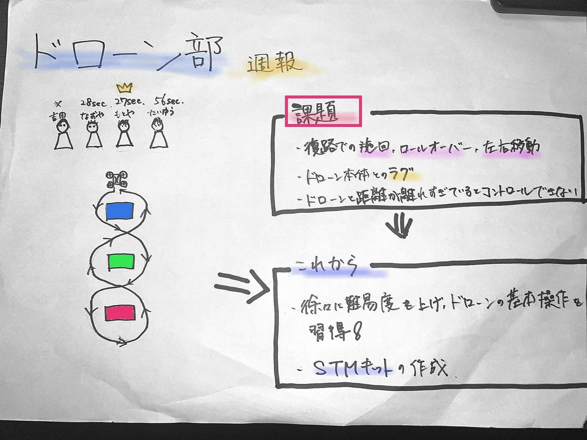

### ドローン部 週報 4

こんにちは 。3年植松です。

今週初めてドローン部4人のドローンが揃いました！！

見た目では吉田のドローンのサイズが一番大きいです。機体が大きい為か操縦を安定させるのに一番苦労しているように感じました。総じて皆だいぶ運転が安定してきたように思います。

> **タイムトライアル**

まずは初回なので簡単な自作コースを作り、タイムトライアルを行いました。

写真のように障害物を置き、ジグザクで往復し、決められたところに着地するという内容です。

> **結果**

植松 28秒

川野 27秒 👑

小澤 56秒

吉田 充電切れ

> **感想**

往路は自分の向いている向きとドローンの向きが同じで操縦しやすいですが復路になるとドローンと自分の向きが反対になるので左右の移動の操作が難しくなるように感じました。

これは植松自身の感想ですがリモコンの操作からドローン本体がその動きを開始するまでに大きなラグがあるように感じました。これからはそのラグも考慮しながら操作していきたいと感じました。

次週もドローンの基本操作の練習頑張ります！！！！

＜グラレコ＞

